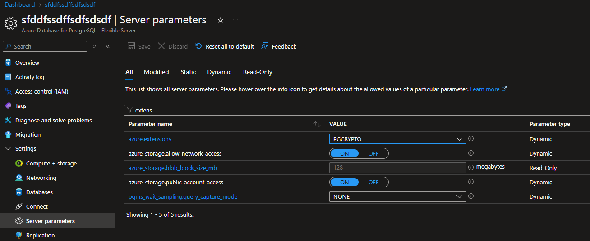
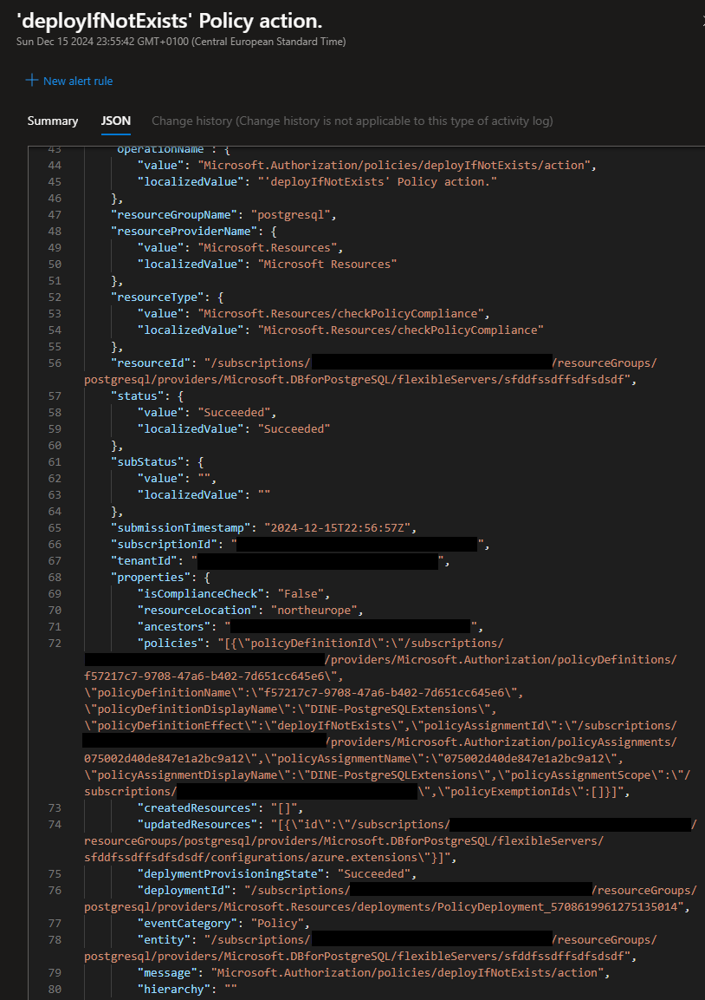
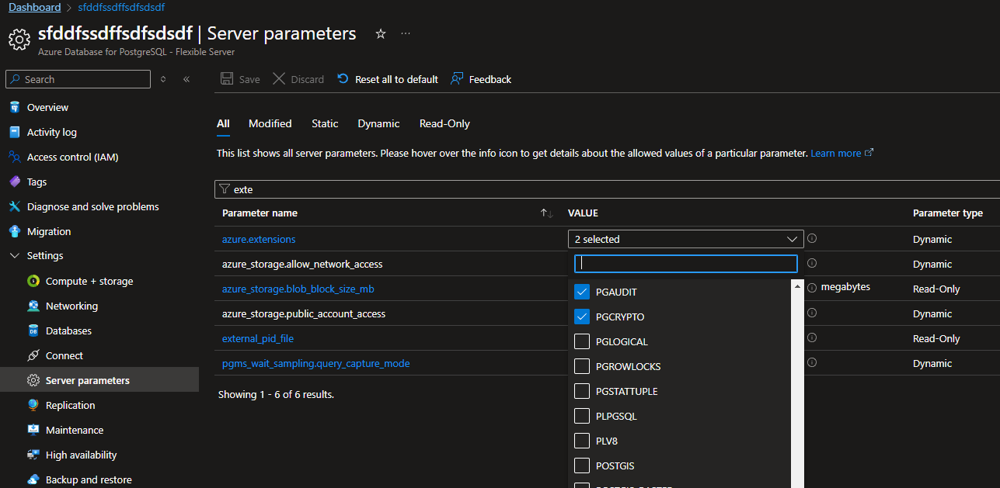

+++
title = 'Fortgeschrittene Azure Policy Techniken #1: Arrays erweitern mittels DINE'
date = 2024-12-15T18:45:03+08:00
draft = false
categories = ["Technologie","recommendation"]
featuredImage = "/images/azure_policy_1.webp"
tags = ["azure"]


+++

Dies ist der erste Beitrag einer Reihe, in der wir einige fortgeschrittenere Azure-Policy-Techniken vorstellen, die nicht allzu häufig im Rampenlicht stehen, aber in bestimmten Situationen äußerst hilfreich sein können.

Ist Ihnen schon aufgefallen, dass bei Verwendung einer DINE-Policy (DeployIfNotExists), um eine Eigenschaft eines bestehenden Ressourcenobjekts zu aktualisieren, und diese Eigenschaft eine Liste (bzw. ein "Array") ist, die bestehende Liste durch die in der DINE-Policy konfigurierte Liste überschrieben wird? Dieses Verhalten ist logisch, wenn man bedenkt, was eine DINE-Policy eigentlich tun soll — eine Ressource mithilfe einer Vorlage (bzw. eines Templates) aktualisieren.

Aber was, wenn Sie eine Liste **erweitern** möchten, anstatt sie zu überschreiben? Beispiele, in denen dieses Verhalten wünschenswert sein könnte:
- Bei einem PostgreSQL Flexible Server die Liste der zulässigen Erweiterungen (Whitelist) ergänzen
- Bei Ressourcen mit einer IP-basierten Netzwerk-Whitelist diese aktualisieren, ohne bereits konfigurierte Einstellungen zu löschen
- Wenn Sie einer Ressource Tags hinzufügen möchten (beachten Sie jedoch, dass hierfür auch **Modify**-Richtlinien verwendet werden können, anstatt DINE)

Nachdem wir einige Anwendungsfälle gesehen haben, stellt sich die Frage: Wie können wir Eigenschaften, die Sammlungen statt Einzelwerte darstellen, aktualisieren? Die kurze Antwort lautet: Durch **gekoppelte Deployments**, bei denen wir uns zunutze machen, dass Deployments **Outputs** liefern können.

Wie im nachfolgenden Beispiel für die Aktualisierung von PostgreSQL-Flexible-Server-Extensions zu sehen ist, verwenden wir innerhalb der DINE-Policy zwei Deployments: eins, welches die Ressource im jetzigen Status liest, ohne sie zu aktualisieren, aber dabei die aktuellen Ressourcendaten als Output ausgibt, und eine weitere, die diesen Output nutzt, um die Ressource zu aktualisieren. Die Idee dabei ist, die pgaudit-Erweiterung zu einer bereits vorhandenen Liste von erlaubten Erweiterungen hinzuzufügen.

```
{
    "properties": {
        "displayName": "DINE-UpdateExtensions",
        "description": "Deploy if not exist, add pgaudit to flexible server extensions",
        "parameters": {
            "effect": {
                "type": "String",
                "allowedValues": [
                    "auditIfNotExists", 
                    "deployIfNotExists"
                ]
            }
        },
        "policyRule": {
            "if": {
                "allOf": [
                    {
                        "field": "type",
                        "equals": "Microsoft.DBforPostgreSQL/flexibleServers"
                    },
                    {
                        "field": "Microsoft.DBforPostgreSQL/flexibleServers/state",
                        "equals": "Ready"
                    }
                ]
            },
            "then": {
                "effect": "[parameters('effect')]",
                "details": {
                    "type": "Microsoft.DBforPostgreSQL/flexibleServers/configurations",
                    "name": "azure.extensions",
                    "existenceCondition": {
                        "field": "Microsoft.DBforPostgreSQL/flexibleServers/configurations/value",
                        "contains": "pgaudit"
                    },
                    "deployment": {
                        "properties": {
                            "mode": "incremental",
                            "parameters": {
                                "resourceName": {
                                    "value": "[field('fullName')]"
                                },
                                "resourceGroupName": {
                                    "value": "[resourceGroup().name]"
                                }
                            },
                            "template": {
                                "$schema": "https://schema.management.azure.com/schemas/2015-01-01/deploymentTemplate.json#",
                                "contentVersion": "1.0.0.0",
                                "parameters": {
                                    "resourceName": {
                                        "type": "string",
                                        "defaultValue": "[field('fullName')]"
                                    },
                                    "resourceGroupName": {
                                        "type": "string",
                                        "defaultValue": "[resourceGroup().name]"
                                    }
                                },
                                "variables": {
                                    "deploymentGetName": "[concat('PGExtensions-Get-', parameters('resourceName'))]",
                                    "deploymentUpdateName": "[concat('PGExtensions-Update-', parameters('resourceName'))]"
                                },
                                "resources": [
                                    {
                                        "type": "Microsoft.Resources/deployments",
                                        "apiVersion": "2020-06-01",
                                        "name": "[variables('deploymentGetName')]",
                                        "properties": {
                                            "mode": "Incremental",
                                            "template": {
                                                "$schema": "https://schema.management.azure.com/schemas/2015-01-01/deploymentTemplate.json#",
                                                "contentVersion": "1.0.0.0",
                                                "resources": [],
                                                "outputs": {
                                                    "serverExtensions": {
                                                        "type": "object",
                                                        "value": "[reference(resourceId(parameters('resourceGroupName'), 'Microsoft.DBforPostgreSQL/flexibleServers/configurations', parameters('resourceName'), 'azure.extensions'), '2021-06-01', 'Full')]"
                                                    }
                                                }
                                            }
                                        }
                                    },
                                    {
                                        "type": "Microsoft.Resources/deployments",
                                        "apiVersion": "2020-06-01",
                                        "name": "[variables('deploymentUpdateName')]",
                                        "properties": {
                                            "mode": "Incremental",
                                            "expressionEvaluationOptions": {
                                                "scope": "inner"
                                            },
                                            "parameters": {
                                                "extensions": {
                                                    "value": "[reference(variables('deploymentGetName')).outputs.serverExtensions.value.properties.value]"
                                                },
                                                "serverName": {
                                                    "value": "[parameters('resourceName')]"
                                                }
                                            },
                                            "template": {
                                                "$schema": "https://schema.management.azure.com/schemas/2015-01-01/deploymentTemplate.json#",
                                                "contentVersion": "1.0.0.0",
                                                "resources": [
                                                    {
                                                        "type": "Microsoft.DBforPostgreSQL/flexibleServers/configurations",
                                                        "apiVersion": "2021-06-01",
                                                        "name": "[concat(parameters('serverName'), '/azure.extensions')]",
                                                        "properties": {
                                                            "value": "[concat(parameters('extensions'), ',pgaudit')]",
                                                            "source": "user-override"
                                                        }
                                                    }
                                                ],
                                                "parameters": {
                                                    "extensions": {
                                                        "type": "string"
                                                    },
                                                    "serverName": {
                                                        "type": "string"
                                                    }
                                                },
                                                "outputs": {}
                                            }
                                        }
                                    }
                                ]
                            }
                        }
                    }
                }
            }
        }
    }
}


```

In diesem Beispiel habe ich einen neuen Server erstellt und dann nur die pgcrypto-Erweiterung ausgewählt. Wie man sehen kann, ist momentan nur diese Extension erlaubt:



Dann habe ich eine neue Richtlinie basierend auf der vorhergehenden Definition erstellt, zu meiner Subscription zugewiesen (und mit einer UAMI mit Contributor-Rechten über den Server assoziiert). Nachdem ich eine Remediationsaufgabe erstellt habe, können wir sehen, dass die Policy ausgeführt wurde und die pgaudit-Erweiterung zu der Liste der erlaubten Erweiterungen hinzugefügt wurde:



Ich hoffe dieser Artikel war hilfreich und bis zum nächsten Mal!
