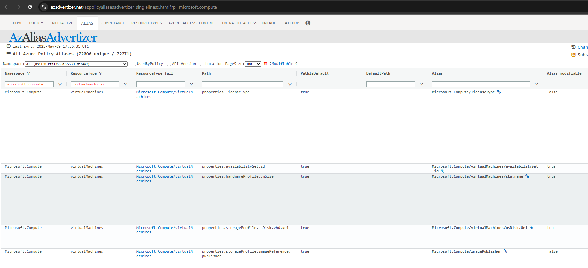

+++
title = 'Fortgeschrittene Azure Policy Techniken #3: Von Endpunkten und Subresourcen'
date = 2025-05-11T12:50:03+08:00
draft = false
categories = ["technology","recommendation"]
featuredImage = "/images/azure_policy_3.webp"
tags = ["azure"]

+++

Im dritten Teil dieser Serie möchte ich erklären, wie wir feststellen können, wann eine Azure Richtlinie (Policy) tatsächlich eingesetzt *werden kann* bzw. eingesetzt *werden sollte*, um unsere vorgegebenen Ziele zu erreichen.

Zunächst in Erinnerung gerufen: Azure Policy arbeitet, indem es mit der Azure Resource Manager-API (ARM) kommuniziert. Daraus ergibt sich bereits die erste Einschränkung: Möchten wir ein Verhalten regulieren, das nicht über die ARM-API erreichbar ist, scheidet eine Policy als Mittel aus. Dazu zählen zum Beispiel
- Datenebene-Beschränkungen (etwa das Verhindern von Benutzer- oder Schema-Änderungen in Datenbanken wie MSSQL oder PostgreSQL)
- Betriebssystemebene-Beschränkungen (z. B. das Unterbinden der manuellen Anlage von Root-Konten)

Ein praktisches Beispiel: Wir können per DeployIfNotExists-Policy die Erweiterung pg_audit auf Azure-PostgreSQL-Instanzen auf eine Whitelist setzen, aber wir können die Erweiterung nicht selbst aktivieren – dafür bedarf es eines Datenbankbefehls (sprich: jemand mit ausreichenden Rechten meldet sich an und führt CREATE EXTENSION pg_audit aus). Möglich ist hingegen, per DINE-Richtlinie ein zusätzliches Admin-Konto zur Sammlung der Administratoren hinzuzufügen; dadurch wird das Konto in der Datenbank angelegt.

Arthur Conan Doyle ließ einst seinen berühmten Detektiv sagen: *„Wenn wir das Unmögliche ausschließen, muss das, was übrig bleibt – so unwahrscheinlich es auch ist – die Wahrheit sein.“* Bedeutet das also,dass alles, was im Licht des ARM-API steht, sich durch eine Policy steuern lässt? **Leider nein**.

Nicht alle Objekte sind gleich: Während Hauptressourcen allein existieren können, ist der Lebenszyklus von Teil- oder Kind-Ressourcen untrennbar an die Elternressource gebunden. Einige dieser Kind-Objekte lassen sich dennoch adressieren (meist muss dabei auch die Elternressource referenziert werden, damit die Azure-API sie finden kann) – IP-Konfigurationen oder Ressourcentags zum Beispiel. Andere wiederum sind nicht ansprechbar.

Selbst bei adressierbaren Ressourcen kann nicht jede Eigenschaft von jeder Policy-Art bearbeitet werden. Manche Felder sind nur lesbar, andere lediglich mit Modify-Effekt veränderbar. Hinzu kommen mögliche Abhängigkeiten: Manches Vorhaben sprengt den Rahmen einer Richtlinie, weil mehrere Schritte über diverse Ressourcen hinweg in einer bestimmten Reihenfolge nötig wären.

Nachdem nun die Theorie aus dem Weg ist, was bedeutet das für uns in der Praxis? Wie sollen wir die Erstellung einer neuen Richtlinie angehen?

1. Prüfen, ob es bereits eine **[integrierte Richtlinie](https://learn.microsoft.com/en-us/azure/governance/policy/samples/built-in-policies)** oder ein Template im **[offiziellen Repository](https://github.com/Azure/azure-policy)** gibt, welches unseren Use-Case abdeckt und konsultieren sie auch **[azadvertizer](https://www.azadvertizer.net)** (eine unabhängige, nicht von Microsoft betreute aber äußerst nützliche Website)
2. Suchmaschine oder KI-Assistent (z. B. Copilot) bemühen: Vielleicht hat jemand anders dieselbe Anforderung schon gelöst und dokumentiert
3. Nichts gefunden? Dann selbst bauen. Ausgehend von der offiziellen ARM- bzw. API-Dokumentation der Zielressource – nehmen wir hier alss Beispiel eine virtuelle Maschine – prüfen wir, welche Eigenschaften potenziell exponiert sind und wie das Objekt strukturiert ist.
4. Anschließend navigieren wir zu [azadvertizer](https://www.azadvertizer.net) und klicken dort auf **Aliases**. Nun können wir noch entsprechende Filter setzen, z. B. Namespace: Microsoft.Compute und ResourceType: virtualMachines. Dies zeigt uns dann eine List von Pfaden, Aliases und Zusatzinfos:

5. Da wir nun die Richtlinienstruktur kennen sowie Informationen darüber haben, welche Eigenschaften modifizierbar sind, müssen wir anschließend die folgenden Fragen beantworten:
- Sind die für unser Vorhaben benötigten Pfade überhaupt von der Policy-Engine adressierbar?
- Welcher Effekt ist passend, um unsere Ziele zu erreichen (Deny, Modify, DeployIfNotExists)?
- Wie muss die Richtlinie aufgebaut sein (wenn wir eine Unterresource ansteuern wollen, müssen wir erst die Elternressource addressieren, etc.)?
6. Basierend auf unseren Antworten für die obigen Fragen können wir entweder komplett von Null anfangen oder wir kopieren einfach eine bestehende Policy für denselben Ressourcentyp und passen das Template dann an. AI kann hier auch sehr nützlich sein, aber am besten füttert man sie mit den vorher recherchierten Fakten (Struktur, änderbare Felder), um Halluzinationen zu vermeiden und den Qualitätsgehalt der Antworten zu optimieren.
7. Richtlinie bereitstellen, zuweisen und einen standardisierten Testplan erstellen – mindestens ein Szenario für eine neu erstellte Ressource und eines für eine bereits vorhandene. Ein Muster:
  - **Kontext**: Scope und Business Case der Richtlinie (also welchen Mehrwert sie bietet), Beschreibung der Änderungen
  - **Voraussetzungen**:  z. B. Contributor-Rechte und Policy-Zuweisung auf Subscription-Ebene
  - **Schritte zum Reproduzieren**: Welche Schritte müssen absolviert werden, um den Testcase auszuführen?
  - **Erwartetes Verhalten**: Welche Ereignisse wir als Resultat der ausgeführten Testschritte erwarten, z.b. die Richtlinie blockt die Ressourcenerstellung (Deny) oder es werden Änderungen an einer Resource vorgenommen (Modify, DeployIfNotExist)
  - **Beobachtetes Verhalten**: Welche Ereignisse wir als Resultat der ausgeführten Testschritte tatsächlich gesehen haben
  - **Teststatus**: Resultat des Tests, meistens "BESTANDEN" oder "FEHLGESCHLAGEN"
  - **Testnachweise**: Nachweise wie Screenshots oder Activity-Log-Exporte
  
Tipp: Bei manueller Remediation unbedingt das Kästchen „Resource state refresh“ aktivieren, sonst greift DINE womöglich nicht. Scope bei Bedarf auf eine Subscription begrenzen. Geduld: Bis zu 10 Minuten, bis die Ausführung im Activity Log auftaucht und die Compliance-Ansicht aktualisiert ist.

Voilà – damit habt ihr eine neue Policy von Grund auf erstellt und gründlich getestet. Ausgezeichnete Arbeit!
