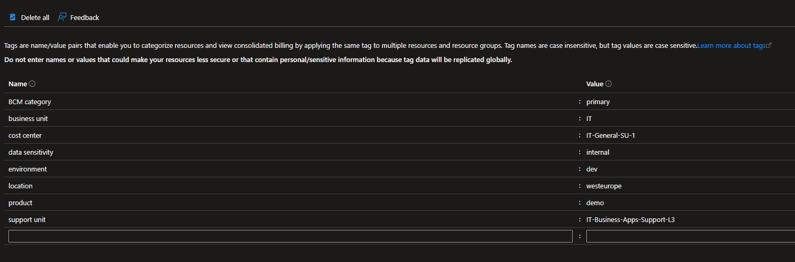

+++
title = 'Fortgeschrittene Azure Policy Techniken #4: Effektbegrenzung von Policies durch Scopes und Tags'
date = 2025-08-07T18:45:03+08:00
draft = false
categories = ["technology","recommendation"]
featuredImage = "/images/azure-policy-4.webp"
tags = ["azure"]


+++

Hallo zusammen! Heute möchte ich ein starkes, aber oft übersehenes Feature von Azure Policy ins Rampenlicht rücken: Resource Tags. Obwohl weit verbreitet, wird selten ihr volles Potential ausgeschöpft – insbesondere wenn es um das präzise Abgrenzen von Policy-Geltungsbereichen (oder Scopes) geht. Was haben Azure Resource Tags also mit Policies zu tun, fragen Sie sich vielleicht? Die kurze Antwort: Da Tags sowohl als Meta-Ressourcen wie auch als untergeordnete Ressourcen betrachtet werden können – und für jede Azure-Ressource sowie jedem Service verfügbar sind – eignen sie sich perfekt für eine hochpräzise Begrenzung des Policy-Geltungsbereiches.

Tatsächlich müssen wir Policies dafür zweifach einsetzen: Erstens, um ein vordefiniertes Set an obligatorischen Tags durchzusetzen, sowie die erlaubten Werte für diese Tags zu begrenzen. Zweitens, um den Geltungsbereich von Policies entlang dieser Tag-Zuordnungen festzulegen.

Aber warum brauchen wir diese Technik überhaupt, wenn wir Richtlinien bereits auf Management-Group-, Subscription- oder Resource-Group-Ebene scopen können und sogar Ausnahmen für bestimmte Ressourcen oder Resource Groups definieren dürfen? Zum Zeitpunkt dieses Artikels haben wir folgende Optionen, um den Wirkungsbereich einer Policy einzuschränken:

- **Scope**: Management Group, Subscription, Resource Group
- **Exclusions**: Liste von Resource Groups oder Ressourcen, die die Policy ignoriert
- **Resource selectors:** zusätzliche Filter nach ResourceType(s), ResourceLocation(s) oder resourceWithoutLocation (z.B. Proxy-Ressourcen)
- **Policy rule**: Ressourcentyp, Standort und andere exponierte Eigenschaften

Wir sehen also: Azure bietet bereits eine ganze Reihe von Stellschrauben, um das Zielgebiet einer Policy zu begrenzen. Ein genauerer Blick zeigt zudem, dass wir Exclusions und Resource Selectors auch direkt in der Policy Rule abbilden könnten – aber übersichtlicher und einfacher wird es, wenn wir dafür die dedizierten Felder nutzen.

Schauen wir uns ein Szenario aus der Praxis an: Wir wollen eine Policy erstellen, die den Zugriff per Access Key bei Storage Accounts deaktiviert – allerdings nur für Subscriptions, die als „Produktion (also "production") gekennzeichnet sind, und nur für Applikationen, die vertrauliche Daten verarbeiten und speichern. Gleichzeitig soll unsere HR-App aus taktischen Gründen von der Richtlinie ausgenommen werden … wie legen wir hier den Scope fest? Natürlich könnten wir verschachtelte Management Groups verwenden, aber in solch einer mehrdimensionalen Situation wären diese schwer zu pflegen und zu starr für unsere Anforderungen.

Tags bieten uns hier einen eleganten Weg, eine zusätzliche Ebene für das Scoping einzuziehen – ohne jedes Mal manuell das Scope anpassen oder die Struktur der Management Groups verändern zu müssen. Letztere sollten ohnehin die Organisationsstruktur widerspiegeln und daher eher stabil bleiben. Mit Tags lassen sich außerdem Änderungen sehr leicht ausrollen – ein Thema, das ich in einem späteren Beitrag ausführlicher behandeln werde. Beispiel: Sie könnten eine neue Policy-Version (v2) nur auf Subscriptions mit dem Tag „dev“ anwenden, während die alte Version (v1) weiterhin bei allen anderen (also nicht-"dev" Subscriptions) aktiv bleibt. Das ist eine einfache, risikoarme und gleichzeitig wirksame Methode, um Änderungen in produktiven Umgebungen einzuführen.

Falls dir das alles noch etwas abstrakt vorkommt, keine Sorge, ich demonstriere das gleich noch anhand eines praktischen Beispiels. Kehren wir zurück zu unserem alten Bekannten Fabricorp. Der Kunde teilt uns mit, dass er ein Joint Venture mit ACME Inc. startet und dafür eine neue, eigenständige Azure-Umgebung benötigt. Wir sollen den Tenant und die ersten Subscriptions einrichten – und noch wichtiger: ein Security- und Compliance-Baseline-Design aufsetzen.

# Schritt 1: Tagging-Strategie festlegen

Natürlich ist das Einrichten einer neuen Umgebung (Tenant, Subscriptions, Netzwerk, Sicherheit, Monitoring usw.) ein komplexes Unterfangenund es gibt bereits umfassende Dokumentation, z.B. das [Microsoft Cloud Adoption Framework for Azure](https://learn.microsoft.com/en-us/azure/cloud-adoption-framework/). Deshalb will ich hier nicht in alle Details gehen, sondern mich auf die methodische Nutzung von Azure Resource Tags konzentrieren.

Das Zuweisen von Tags an unsere Ressourcen und Metaressourcen (z.B. Resource Groups oder Subscriptions) erlaubt es uns, sie entlang mehrerer Dimensionen zu kategorisieren.

Typische Einsatzszenarien für Tags:
- **environment**: Zugehörige Umgebung, z.B. dev, test, staging, prod
- **application / product association**: z.B. Sales-App, CRM, HR-Tools
- **business unit / OE:** Verantwortliche Geschäftseinheit / Business Unit, z.B. Sales, HR, IT
- **emergency contacts / responsible operations team**: Kontakt im Störungsfall, etwa ein Mailpostfach, Teams-Channel oder Support-Team
- **cost center / billing code**: Wohin sollen die Kosten intern verrechnet werden?
- **data sensitivity:** Vertraulichkeitsstufen wie public, internal, confidential, secret
- **BCM information**: Primär-/Sekundärstandort, aktiv oder passiv, weitere Notfallinfos
- **location(s)**: Primärer Standort der Ressourcen oder Netzwerke, die in der Resource Group oder Subscription verfügbar sind; wichtig etwa, wenn RBAC-Rollen zentral verwaltet oder Hub-and-Spoke-Netzwerke genutzt werden.

So könnte also eine Resource Group aussehen, wenn eine durchdachte Tagging-Strategie konsequent durchgesetzt wird:


# Schritt 2: Policies erstellen, um die Tagging-Strategie durchzusetzen

Nachdem wir die Zusammensetzung unserer Tagging-Strategie definiert haben, müssen wir sicherstellen, dass sie auch konsistent angewandt wird. Die Umsetzung umfasst mehrere Aspekte:

- Dokumentieren der obligatorischen Tags in den relevanten Architekturdokumenten oder internen Wikis
- Anpassen interner IaC-Templates (ARM, Bicep, Terraform) sowie CI/CD-Deployment-Pipelines, sodass Tags standardmäßig gesetzt werden – dies ist besonders wichtig in automatisierten Subscription-Erstellungs-Pipelines (also Pipelines, die automatisch neue Subscriptions erstellen und konfigurieren)
- Erstellung von Policies, die sicherstellen, dass (1) keine Ressource ohne die verpflichtenden Tags erstellt werden kann und die für die spezifischen Tags gesetzten Werte zulässig sind (deny), und (2) verpflichtende Tags automatisch vererbt werden, falls sie nicht explizit gesetzt wurden (modify)

## Verhindern der Erstellung von Ressourcen ohne verpflichtende Tags

Mit einer Policy wie der folgenden lässt sich unterbinden, dass eine Resource Group oder Ressource erstellt wird, wenn ein erforderliches Tag fehlt oder ein unerlaubter Wert gesetzt wurde (z. B. erlauben wir nur „dev“ und „prod“ als Umgebungswerte, damit unser Ressourcenbestand einheitlich bleibt).
```
{
  "properties": {
    "displayName": "Deny-RGMissingEnvTag",
    "description": "Prevents the creation of a resource group without a valid environment tag",
    "parameters": {
      "allowedEnvValues": {
        "type": "Array",
        "metadata": {
          "displayName": "allowedEnvValues",
          "description": "List of acceptable values for the environment tag"
        }
      }
    },
    "policyRule": {
      "if": {
        "allOf": [
          {
            "field": "type",
            "equals": "Microsoft.Resources/subscriptions/resourceGroups"
          },
          {
            "not": {
              "field": "tags['environment']",
              "in": "[parameters('allowedEnvValues')]"
            }
          }
        ]
      },
      "then": {
        "effect": "deny"
      }
    },
    "versions": [
      "1.0.0"
    ]
  }
}
```

## Tags von der Subscription zur Resource Group (oder von der Resource Group zur Ressource) vererben

Der nächste Schritt ist es, eine automatische Tag-Vererbung von der Subscription-Ebene auf die Ebenen darunter einzuführen (also Resourcengruppen und Resourcen). Dieser Schritt ist optional, allerdings funktioniert das gesamte Setup nur dann zuverlässig, wenn wir sicherstellen können, dass unbefugte Personen die Tags auf Subscription-Ebene nicht verändern können. Im Idealfall erlauben wir die Erstellung neuer Subscriptions ausschließlich programmatisch (z. B. über Self-Service-Automatisierungspipelines für Subscriptions mithilfe von Blueprints, Deployment Stacks oder individuellen IaC-Templates) und nur für ausgewähltes, autorisiertes Personal (z. B. Ops- oder SRE-Teams).

Das Etablieren einer Tag-Vererbung erleichtert den Applikationsteams die Arbeit, da sie die obligatorischen Tags, die wir zuvor definiert haben, nicht selbst angeben müssen. Stattdessen werden diese – soweit möglich – automatisch von der Subscription-Ebene vererbt. Mit einem Policy-Template wie dem untenstehenden lässt sich das leicht umsetzen:

```
{
  "properties": {
    "displayName": "Modify-InheritTagFromSubToRG",
    "description": "Enforces inheritance of tags from subscription to resource groups",
    "parameters": {
      "nameOfTag": {
        "type": "String",
        "metadata": {
          "displayName": "nameOfTag",
          "description": "Name of target tag, e.g. environment"
        }
      }
    },
    "policyRule": {
      "if": {
        "anyOf": [
          {
            "allOf": [
              {
                "field": "type",
                "equals": "Microsoft.Resources/subscriptions/resourceGroups"
              },
              {
                "field": "[concat('tags[', parameters('nameOfTag'), ']')]",
                "exists": false
              }
            ]
          },
          {
            "allOf": [
              {
                "field": "type",
                "equals": "Microsoft.Resources/subscriptions/resourceGroups"
              },
              {
                "value": "[resourceGroup().tags[parameters('nameOfTag')]]",
                "notEquals": "[subscription().tags[parameters('nameOfTag')]]"
              }
            ]
          }
        ]
      },
      "then": {
        "effect": "modify",
        "details": {
          "conflictEffect": "audit",
          "roleDefinitionIds": [
            "providers/microsoft.authorization/roleDefinitions/b24988ac-6180-42a0-ab88-20f7382dd24c"
          ],
          "operations": [
            {
              "operation": "addOrReplace",
              "field": "[concat('tags[', parameters('nameOfTag'), ']')]",
              "value": "[subscription().tags[parameters('nameOfTag')]]"
            }
          ]
        }
      }
    },
    "versions": [
      "1.0.0"
    ]
  }
}
```

# Step 3: Tagging-Strategie nutzen, um den Geltungsbereiche von Policies einzugrenzen

Nachdem wir nun die verpflichtenden Tags definiert, durchgesetzt und die Vererbung eingerichtet haben, können wir diese Tags als Grundlage verwenden, um den Geltungsbereich unserer Policies zu bestimmen. Ein Beispiel: Wir möchten keinen öffentlichen Zugriff auf Blobs in Storage Accounts erlauben – außer sie liegen in einer Entwicklungsumgebung ("Dev"-Umgebung). Für diese machen wir eine Ausnahme, da unsere internen Richtlinien dort die Nutzung öffentlicher Daten (etwa öffentlicher Dokumente oder synthetischer Testdaten) zulassen.

```
{
  "properties": {
    "displayName": "Deny-SAPublicAccessNonDev",
    "policyType": "Custom",
    "mode": "All",
    "description": "Denies public access on storage accounts unless the environment tag is explicitly set to 'dev'.",
    "metadata": {
      "version": "1.0.0",
      "category": "Storage"
    },
    "policyRule": {
      "if": {
        "allOf": [
          {
            "field": "type",
            "equals": "Microsoft.Storage/storageAccounts"
          },
          {
            "field": "tags['environment']",
            "notEquals": "dev"
          },
          {
            "field": "Microsoft.Storage/storageAccounts/allowBlobPublicAccess",
            "equals": true
          }
        ]
      },
      "then": {
        "effect": "deny"
      }
    }
  }
}
```

Wie bereits erwähnt, lässt sich diese Vorlage ganz einfach erweitern und zwar um beliebige weitere Tags, wie etwa data sensitivity, product, OE oder andere spezialisierte Kategorien. Und das ist im Wesentlichen die Kurzfassung, wie wir Policies nutzen können, um eine stringente und durchdachte Tagging-Strategie umzusetzen **und** die Tags gleichzeitig als präzises Werkzeug für das Policy-Scoping einzusetzen. Im nächsten Beitrag gehe ich tiefer darauf ein, wie wir Policies versionieren und kontinuierlich in einer komplexen Enterprise-Umgebung ausrollen können.