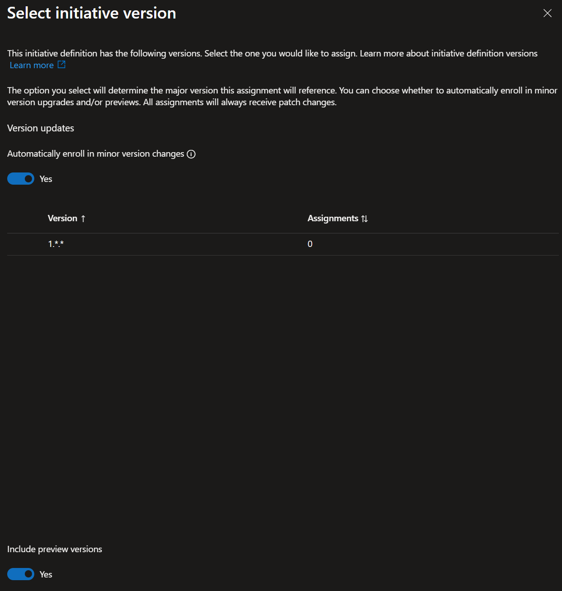

+++
title = 'Fortgeschrittene Azure Policy Techniken #5: Versionierung und Rollout'
date = 2026-01-20T18:45:03+08:00
draft = false
categories = ["technology","recommendation"]
featuredImage = "/images/azure-policy-5.webp"
tags = ["Azure"]

+++

Nach dem initialen Erstellen eines ersten Richtlinienkatalogs hört die Arbeit leider noch nicht auf. Auch wenn Sie (hoffentlich) über ein solides Set an Initiativen, Richtlinien und Zuweisungen verfügen, das sicherstellt, dass alle Komponenten Ihre grundlegenden Sicherheits- und Compliance-Anforderungen erfüllen, erfordern neue Entwicklungen weiterhin Ihre Aufmerksamkeit und regelmäßige Anpassungen Ihrer Policies – ausgelöst durch neue Bedrohungen, neue Cloud-Angebote oder Änderungen an der Struktur Ihrer Cloud-Ressourcen und -Services.

Wenn Sie *integrierte* Richtlinien verwenden, haben Sie Glück: Microsoft übernimmt deren Wartung und Weiterentwicklung, da sie Teil des *Secure by Default*-Paradigmas sind. Natürlich gehören die Ressourcen weiterhin Ihnen – und genau deshalb werden auch die Richtlinien selbst versioniert. Microsoft überprüft und aktualisiert diese zwar regelmäßig, doch ob und wann eine neue Version angewendet wird, liegt bei Ihnen. Andernfalls könnten Änderungen an der Policy-Definition Probleme verursachen (etwa wenn plötzlich TLS 1.3 erzwungen wird, wohingegen eine Ihrer Legacy-Applikationen nur TLS 1.2 unterstützt).

Gerade *DINE*-Richtlinien, welche automatisch Änderungen an den von ihnen betroffenen Ressourcen vornehmen, oder *Deny*-Richtlinien, die Updates an nicht konformen Ressourcen verhindern, wären äußerst problematisch, wenn sie ohne Vorwarnung und Validierung automatisch ausgerollt werden würden. Allerdings erlaubt Azure es Ihnen, sich bei der Zuweisung einer integrierten Initiative optional automatisch für Versionsupdates für geringere Versionen zu registrieren, sodass diese ohne weiteres Zutun angewendet werden. Doch wie genau funktionieren Versionierung und Rollout bei integrierten Richtlinien?

# Versionierung von integrierten Richtlinien

Seit Juli 2024 verfügen Azure Built-in-Policy-Initiativen und einzelne Policy-Definitionen über ein Versionsfeld, das sowohl über das Portal als auch über die API nutzbar ist. Sind mehrere Versionen einer Policy verfügbar, werden diese vollständig aufgelistet und Sie können gezielt auswählen, welche Version verwendet werden soll. Zusätzlich lässt sich festlegen, ob Updates von *Nebenversionen* automatisch übernommen werden sollen und ob Vorschauversionen berücksichtigt werden sollen. Nebenversionen enthalten in der Regel keine inkompatiblen Änderungen und gelten daher als unkritisch, während *Hauptversionen* vor der Zuweisung sorgfältig geprüft werden sollten.

In der Praxis müssen Sie beim Zuweisen einer Policy lediglich die gewünschte Version angeben:

Sind mehrere Versionen verfügbar, zeigt der Dialog alle unterstützten Versionen an:

Wie bereits erwähnt, können Sie sich optional für die automatische Anwendung von Nebenversions-Updates entscheiden und festlegen, ob Vorschau-Versionen eingeschlossen werden sollen:

Auch wenn die meisten aktiv gepflegten integrierten Richtlinien inzwischen Versionierungs-Metadaten bereitstellen, gilt: Nicht jede ältere Policy-Definition bietet aktuell mehrere auswählbare Versionen.

Weitere Informationen finden Sie in der [offiziellen Ankündigung](https://techcommunity.microsoft.com/blog/azuregovernanceandmanagementblog/public-preview-announcement-azure-policy-built-in-versioning/4186105) oder in dieser kurzen [Video-Demonstration](https://www.youtube.com/watch?v=eejdoDgofZ8).

# Versionierung bei benutzerdefinierten Richtlinien

Integrierte Richtlinien sind natürlich nur ein Teil des Gesamtbilds – sehr wahrscheinlich werden Sie nicht um die Erstellung benutzerdefinierter Richtlinien herumkommen, um Ihre Sicherheits- und Compliance-Ziele zu erreichen. Die Frage lautet also, wie wir mit der Versionierung bei dieser Art von Richtlinien vorgehen.

Im Gegensatz zu integrierten Richtlinien bietet Azure Policy bei benutzerdefinierten Definitionen nativ keine semantischen Versionen. Das zwingt uns dazu, auf alternative Methoden zurückzugreifen.

Zunächst müssen wir sicherstellen, dass klar ist, welche Versionen einer Richtlinie existieren. Man könnte diese Information in der Policy selbst hinterlegen, etwa im Kommentarbereich oder über ein benutzerdefiniertes Tag, da Policy-Namen nicht einzigartig sein müssen (also mehrere Richtlinien mit dem gleichen Namen existieren können). Davon würde ich jedoch abraten, da sich unterschiedliche Versionen so auf den ersten Blick nur schwer erkennen lassen. Eine einfache Alternative ist, die Version (oder zumindest die Hauptversion) direkt in den Policy-Namen aufzunehmen, zum Beispiel **Deny-SAPublicAccess-V1**. Wenn Sie mit vielen Versionen rechnen, lässt sich das Namensschema auch um Neben- und Unterversionen erweitern, etwa **Deny-SAPublicAccess-V1.1**.

Wenn Sie Ihre Umgebung bewusst schlank halten möchten, können Sie auch einen Blau/Grün-Ansatz verfolgen. In diesem Modell bleibt die aktuell aktive Richtlinie **Deny-SAPublicAccess**, während die überarbeitete Version z.B. als **Deny-SAPublicAccess-New** eingeführt wird. Nach erfolgreichem Test und Rollout wird die ursprüngliche Definition mit dem validierten Inhalt (also des Inhalts der neuen Richtlinie) aktualisiert und die temporäre Richtlinie wieder entfernt oder zumindest die Zuweisung aufgehoben – bis zur nächsten Iteration.

*Wichtiger Hinweis: Achten Sie darauf, Ihren Richtlinienkatalog sauber zu halten, also die Anzahl an Policy-Definitionen und Assignments möglichst gering zu halten. Je mehr Policies existieren, desto langsamer können bestimmte Operationen werden (z. B. das Laden der Richtlinien-Liste) und desto unübersichtlicher wirkt die Umgebung. Behalten Sie daher nur Richtlinien, die momentan aktiv sind oder in absehbarer Zeit benötigt werden.*

Ein weiterer wichtiger Punkt: Policies sollten immer über CI/CD-Pipelines mithilfe von Infrastructure-as-Code-Templates (ARM oder Bicep) ausgerollt werden. Der oben beschriebene Ansatz mit versionsbasierter Namenskonvention und dem Aufräumen nicht mehr genutzter Policies funktioniert nur dann sauber, wenn sich Definitionen und Assignments in einem Repository befinden. So lassen sich frühere Versionen und die jeweiligen Änderungen nachvollziehen – und ein detaillierter Audit-Trail bleibt erhalten.

Zweitens müssen wir sicherstellen, dass unterschiedliche Policy-Versionen nicht überlappend zugewiesen sind. Wie Scoping bei Azure Policies funktioniert, habe ich in einem [früheren Blogartikel](https://www.cloudandcabernet.com/de/technologie/azure-policy-4/) ausführlich beschrieben.

# Rollout einer neuen Richtlinienversion

Für den eigentlichen Rollout müssen wir lediglich unseren Namensansatz mit der Scoping-Strategie kombinieren:

1.  Zunächst rollen wir die neue Richtliniendefinition aus, zum Beispiel **Deny-SAPublicAccess-V2**

2.  Anschließend stellen wir sicher, dass die ursprüngliche Policy – in unserem Beispiel **Deny-SAPublicAccess-V1** – so gescoped ist, dass sie in unseren Development- (oder Test-)Subscriptions nicht aktiv ist

3. Danach weisen wir **Deny-SAPublicAccess-V2** umgekehrt zu, also aktiv für die Development-Subscriptions, jedoch nicht für andere Subscriptions

4. Nun können wir unsere Testfälle in den Development-Subscription(s) ausführen, für die **Deny-SAPublicAccess-V2** gilt, und prüfen, ob die Änderungen den gewünschten Effekt haben

5. Nach erfolgreichem Test, Verifikation und Dokumentation entfernen wir die Zuweisung von **Deny-SAPublicAccess-V1** und erweitern den Scope von **Deny-SAPublicAccess-V2** auf alle Nicht-Development-Subscriptions (also denselben Scope wie zuvor bei Version 1). Optional kann die Policy-Definition der Version 1 anschließend gelöscht werden.

Dies ist eine mögliche Vorgehensweise, um einen klar strukturierten SDLC-Prozess für Azure Policies zu etablieren. Als Randbemerkung sei erwähnt, dass es sich bewährt hat, Änderungen zwischen Versionen im Kommentarbereich der Policy zu dokumentieren – oder noch besser: eine zentrale interne Dokumentationsseite für alle benutzerdefinierten Richtlinien und deren Versionen zu pflegen und diese in der Richtliniendefinition zu verlinken. Das erleichtert erheblich das Verständnis, was geändert wurde und aus welchem Grund.

Ich hoffe, dieser Artikel war hilfreich für Sie – und wünsche viel Erfolg beim nächsten Policy-Rollout.
