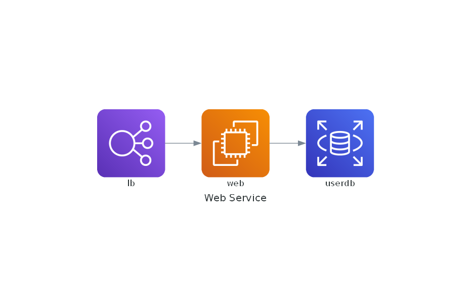
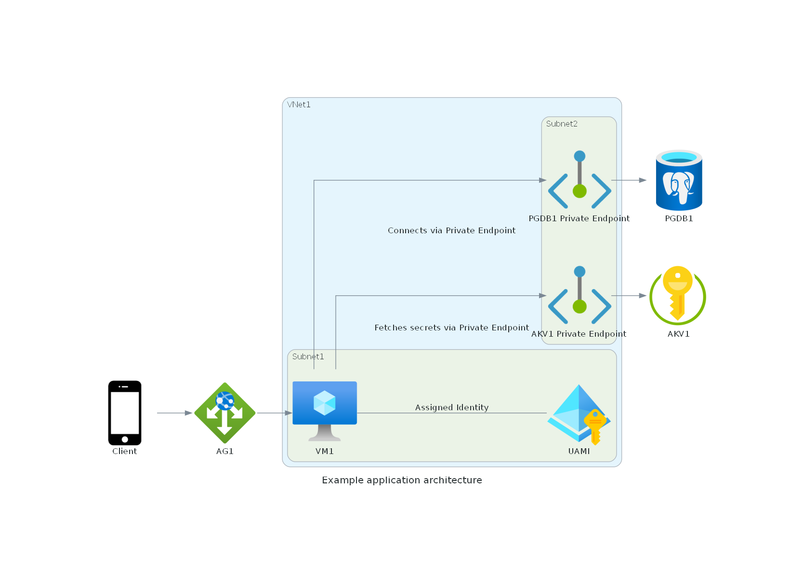

+++
title = 'Diagram as Code'
date = 2024-12-25T19:00:03+08:00
draft = false
categories = ["technology"]
featuredImage = "/images/diagram_as_code.webp"
tags = ["ai","copilot"]


+++

Kommunikation ist eine der wichtigsten Fähigkeiten eines guten Solution Architects.
Nicht nur sollte man in der Lage sein, fundierte, sichere und performante Software-Designs zu erstellen – man muss diese auch den Stakeholdern klar und verständlich vermitteln können.

Um komplexe Lösungen zu visualisieren, sind Diagramme ein praktisches Werkzeug. Es gibt eine Vielzahl von Softwarelösungen, die genau dafür entwickelt wurden – die bekanntesten sind wahrscheinlich Microsoft Visio und Enterprise Architect.

Obwohl Visio grundsätzlich brauchbar ist, kann die Benutzeroberfläche manchmal umständlich sein und es ist nicht immer leicht, die Diagramme *genau richtig* aussehen zu lassen. Was also tun, wenn die Deadline drängt, man aber trotzdem eine ansprechende und klare visuelle Darstellung des Designs erstellen möchte? Hier kommen Mingrammer **Diagrams** und **ChatGPT** ins Spiel.

# Mingrammer Diagrams
## Was ist das und wie schneidet es im Vergleich zu Alternativen ab?
[Mingrammer diagrams](https://diagrams.mingrammer.com/) ist eine Python-Bibliothek, die Diagramme als Code (DaC) bereitstellt. Damit reiht es sich in die Riege von **Mermaid.js** und **PlantUML** ein, die ebenfalls den Einsatz von Code / Markup-Sprachen zur Definition von Diagrammen ermöglichen.
Die Hauptunterschiede zwischen diesen Tools liegen in ihrer Syntax, den unterstützten Diagrammtypen und der Optik (also den visuellen Elementen, der Art der Verbindungslinien, Farben etc.). Jedes dieser Tools hat seine Stärken und Schwächen. Nach einigen persönlichen Experimenten bevorzuge ich Mermaid.js für Use-Case- und Flow-Diagramme und Mingrammer Diagrams für Architektur- und Lösungsdesigns.

Es gab drei Gründe die für Diagrams im Vergleich zu den anderen Tools sprachen:
- Es bietet spezifische Stencils für viele verschiedene Cloud-Ökosysteme wie **Azure**, **AWS** oder **GCP**. Dadurch können Anbieter-spezifische Diagramme erstellt werden, anstatt nur generische
- Es ist relativ einfach einzurichten und zu verwenden
- Die DaC-Sprache ist klar und prägnant

## Einrichten von Mingrammer Diagrams – so geht’s:
Mingrammer ist relativ leicht einzurichten. Unter Windows sollten Sie sicherstellen, dass Python in Version 3.7 oder höher installiert ist, zusammen mit **Graphviz**, das von der Diagrams-Bibliothek zur Erstellung von Grafiken verwendet wird. Die Schritte lassen sich wie folgt zusammenfassen:
1. Laden Sie [Graphviz](https://graphviz.gitlab.io/download/) herunter, entpacken Sie das Archiv und fügen Sie (sofern es nicht in einen Standard-Programmordner entpackt wird) den Pfad zu graphviz/bin der Windows-Umgebungsvariable *PATH* hinzu.
2. Installieren Sie die Python-Bibliothek Diagrams
```
py -m pip install diagrams
```
3. Erstellen Sie eine neue Diagrams-Python-Datei, z.B. example.py

```
# diagram.py
from diagrams import Diagram
from diagrams.aws.compute import EC2
from diagrams.aws.database import RDS
from diagrams.aws.network import ELB

with Diagram("Web Service", show=False):
    ELB("lb") >> EC2("web") >> RDS("userdb")
```

Nun müssen sie lediglich die Python-Datei ausführen und schon sollte die Diagramm-Bilddatei im gleichen Ordner erstellt werden.
```
py .\example.py
```



# ChatGPT
So now that we set up Diagrams, we have two options:
- learn the Diagram as Code language and create the images manually
- use a natural language prompt in ChatGPT so the AI helps us translate our requirements into code instead

Given that a good solution architect is always busy, let's opt for option 2 and get our mighty AI overlords to do the heavy lifting. 
Let's assume the following example:
- we have an **application** running on an **Azure Virtual Machine** called *VM1* (e.g. a Java application)
- the Virtual Machine has a **User Assigned Managed Identity (UAMI)** assigned to it
- the application connects to an **Azure PostgreSQL Flexible Server** database named *PGDB1* as data layer using the UAMI (which is added as EntraID admin on the flexible server)
- the VM is in *Subnet1* of our **Virtual Network** *VNet1*, the database has a **Private Endpoint** in *Subnet2*, also located in *VNet1*
- we have an **Application Gateway** *AG1* in front of *VM1* to enable access from outside our intranet
- the application uses its managed identity to fetch secrets from an **Azure Key Vault** *AKV1*

# Kombinieren von ChatGPT und Diagrams
Sobald wir unser Design dokumentiert haben, lässt es sich ganz einfach in einen ChatGPT-Prompt übersetzen. Für dieses Beispiel werde ich ChatGPT 4o verwenden.
Wir werden den Prompt in zwei Teile aufteilen, da es sein kann, dass ChatGPT Schwierigkeiten hat, alle Klassennamen korrekt zu erfassen. Es hat sich als effektiver erwiesen, die Überprüfung in einem zweiten Schritt durchzuführen, anstatt alle Anweisungen in einem einzigen Prompt zu kombinieren.

## Prompt 1
```
Ich möchte die Python-Bibliothek Diagrams verwenden, um ein Azure Solution Architecture Diagramm zu erstellen. Bitte helfen Sie mir, den passenden Code zu generieren. Ich möchte Folgendes darstellen:  
- Wir haben eine **Anwendung**, die auf einer **Azure Virtual Machine** namens *VM1* läuft (z.B. eine Java-Anwendung).  
- Die Virtual Machine hat eine **User Assigned Managed Identity (UAMI)** zugewiesen, die aus Azure Active Directory stammt.  
- Die Anwendung verbindet sich zur **Azure PostgreSQL Flexible Server**-Datenbank *PGDB1* als Datenhaltungsschicht unter Verwendung der UAMI (die als EntraID-Administrator auf dem Flexible Server hinzugefügt wurde).  
- Die VM befindet sich in *Subnet1* unseres **Virtual Network** *VNet1*, während die Datenbank einen **Private Endpoint** in *Subnet2* besitzt, der sich ebenfalls in *VNet1* befindet.  
- Vor *VM1* befindet sich ein **Application Gateway** *AG1*, um den Zugriff von außerhalb unseres Intranets zu ermöglichen.  
- Die Anwendung verwendet ihre Managed Identity, um Geheimnisse aus einem **Azure Key Vault** *AKV1* abzurufen, der ebenfalls einen **Private Endpoint** in *Subnet2* besitzt.  
- Zeigen Sie einen Client, der sich über *AG1* von außerhalb (dem öffentlichen Internet) mit der Anwendung verbindet.  

Als Namen für die Elemente verwenden Sie bitte ausschließlich die von mir angegebenen Namen wie *VM1* und *AG1* ohne zusätzliche Worte oder Beschreibungen. Der Name des Diagramms soll *Example application architecture* lauten. Bitte stellen Sie sicher, dass Verbindungen zu Ressourcen mit Private Endpoints zunächst zu diesen Private Endpoints geleitet werden, sofern die Zielressource über einen solchen verfügt.  

```


## Prompt 2
```
Bitte überprüfen Sie die exakten Klassennamen für alle Ressourcen, wie sie auf der offiziellen Diagrams.mingrammer-Website aufgeführt sind:: https://diagrams.mingrammer.com/docs/nodes/azure und https://diagrams.mingrammer.com/docs/nodes/generic . Verallgemeinern oder pluralisieren Sie nicht. Verwenden Sie beispielsweise ApplicationGateway anstelle von ApplicationGateways. Seien Sie so detailorientiert und präzise wie möglich. Bitte korrigieren Sie eventuelle Fehler, die Sie finden.
```

&nbsp;
Unter Benutzung dieser Prompts hat ChatGPT für mich den folgenden Code generiert:
```
from diagrams import Diagram, Cluster, Edge
from diagrams.azure.network import ApplicationGateway, VirtualNetworks, Subnets, PrivateEndpoint
from diagrams.azure.compute import VM
from diagrams.azure.database import DatabaseForPostgresqlServers
from diagrams.azure.security import KeyVaults
from diagrams.azure.identity import ManagedIdentities
from diagrams.generic.device import Mobile

with Diagram("Example application architecture", show=False):
    client = Mobile("Client")

    with Cluster("VNet1"):
        with Cluster("Subnet1"):
            vm1 = VM("VM1")
            uami = ManagedIdentities("UAMI")
            vm1 - Edge(label="Assigned Identity") - uami

        with Cluster("Subnet2"):
            pgdb1_endpoint = PrivateEndpoint("PGDB1 Private Endpoint")
            akv1_endpoint = PrivateEndpoint("AKV1 Private Endpoint")

    app_gateway = ApplicationGateway("AG1")
    database = DatabaseForPostgresqlServers("PGDB1")
    keyvault = KeyVaults("AKV1")

    client >> app_gateway >> vm1
    vm1 >> Edge(label="Connects via Private Endpoint") >> pgdb1_endpoint >> database
    vm1 >> Edge(label="Fetches secrets via Private Endpoint") >> akv1_endpoint >> keyvault
```

&nbsp;
Kopiert man diesen nun wiederum in eine Pythondatei und führt diese aus, wird das folgende Bild generiert:


Es ist wichtig anzumerken, dass der gleiche Prompt nicht notwendigerweise konsistent den gleichen Code generiert und das ChatGPT manchmal die Klassennamen nicht korrekt ausgibt (z.B. plural statt singular oder nicht-existente Klassennamen) aber in diesem Fall kann dies einfach bemängeln und den Bot um eine korrigierte Version bitten.

Alles in allem sind die produzierten Diagramme vielleicht nicht ganz so hübsch und aufgeräumt wie jene, die man manuell mit Visio (oder anderen Tools) erstellen kann, doch in Anbetracht des geringen Aufwands, sind die Resultate durchaus beeindruckend. Ein weiterer Bonus ist, dass man so schon eine schriftliche Beschreibung der Architektur hat, welche einfacher zu speichern, versionieren und teilen ist und zudem auch der Barrierefreiheit dient (z.B. als Audiobeschreibung für sehbeeinträchtigte Personen).

Frohes Diagrammentwerfen!