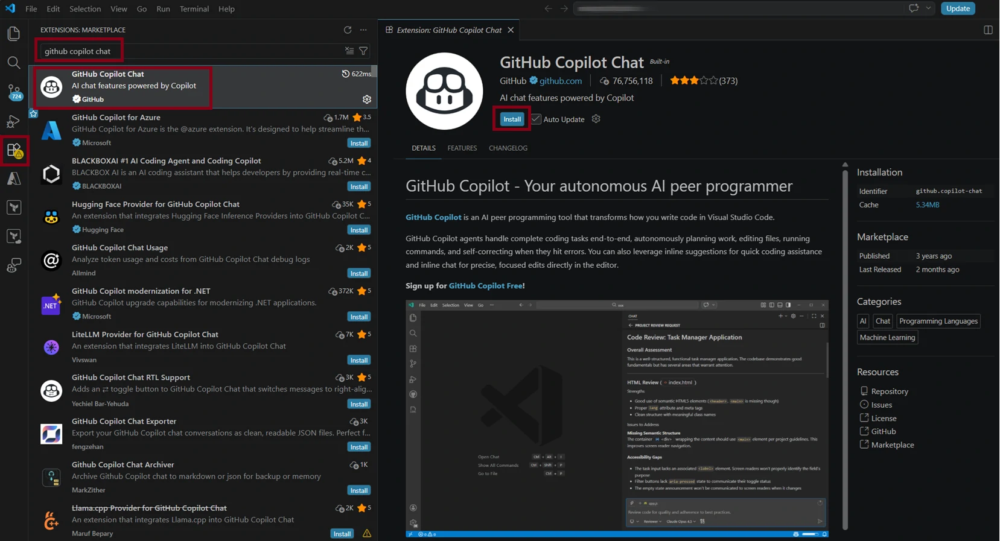
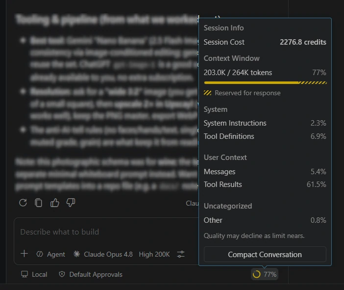

+++
title = 'GitHub Copilot + VS Code: Nicht nur für Softwareentwickler'
date = 2026-07-16T18:45:03+08:00
draft = false
categories = ["technologie",]
featuredImage = "/images/gh-copilot-vs-code.webp"
tags = ["azure", "technologie", "KI"]

+++

Künstliche Intelligenz entwickelt sich nach wie vor in rasantem Tempo, weshalb Prognosen oft schwierig sind. Eine neuere Entwicklung, mit der ich nicht gerechnet hatte, war allerdings, dass auch Fachbereiche außerhalb der IT damit beginnen würden, Visual Studio Code und GitHub Copilot für sich zu entdecken. Doch genau das beobachte ich zunehmend bei Microsoft und anderswo: Während viele Menschen weiterhin eifrig Microsoft 365 Copilot, Work IQ oder das neue Microsoft Scout nutzen, gewinnt VS Code auch unter Führungskräften, Fachanwendern und sogar Menschen aus Marketing oder Personalwesen an Bedeutung.

Was steckt hinter diesem plötzlichen und durchaus unerwarteten Wandel? In diesem Beitrag möchte ich dieser Frage nachgehen und einen kurzen Überblick über die Möglichkeiten von VS Code und GitHub Copilot geben sowie aufzeigen, was diese Kombination für eine Vielzahl von Anwendungsfällen so attraktiv macht.

# Visual Studio Code

Beginnen wir mit Visual Studio Code. Da sich dieser Beitrag an ein breites Publikum und nicht nur an „Techies“ richtet, zunächst ein kurzer historischer Abriss: Noch im alten Jahrtausend – genauer gesagt 1997 – veröffentlichte Microsoft Visual Studio, eine *integrierte Entwicklungsumgebung* beziehungsweise Integrated Development Environment (IDE). Hinter dieser etwas hochtrabenden Bezeichnung verbirgt sich ein Programm, das Softwareentwickler beim Schreiben, Testen und Debuggen von Code unterstützt und in der Regel umfassende Funktionen für bestimmte Programmiersprachen und Frameworks bereitstellt.

Ein IDE hebt beispielsweise die Syntax des Codes hervor, schlägt gültige Befehle vor und bietet spezielle Debugging-Funktionen, mit denen Entwickler Probleme früher erkennen und effizienter beheben können – neben zahlreichen weiteren hilfreichen Werkzeugen. Visual Studio war besonders optimiert für die Entwicklung von Windows-Anwendungen und später generell für alle Software auf Basis von Microsoft-Technologien wie .NET und den Programmiersprachen der C-Familie  (z.B. C, C++, C#).

Meinem Eindruck nach genoss Visual Studio stets einen etwas gemischten Ruf. Es ist zweifellos leistungsfähig und verfügt über eine treue Anhängerschaft, kann je nach installierten Workloads und Komponenten jedoch auch langsam und aufgebläht werden (und so zum Beispiel viel Speicherplatz und Arbeitsspeicher beanspruchen). Fairerweise muss man allerdings sagen, dass viele IDEs mit demselben Problem zu kämpfen haben.

Als sich die Softwareentwicklung über klassische Desktop-Anwendungen hinaus auf Webdienste, Public-Cloud-Umgebungen, Container, Linux-Systeme, Automatisierung, Infrastructure as Code und zahllose Skriptsprachen ausweitete, wurde der Bedarf an einem schlankeren, reaktionsschnelleren und flexibleren Editor immer deutlicher. All diese Szenarien in Visual Studio hineinzuzwängen, wäre weder aus Performance- noch aus Marketingsicht unbedingt die beste Idee gewesen.

Um dieses breitere Anforderungsspektrum abzudecken, veröffentlichte Microsoft 2015 eine vollständig neue Anwendung namens Visual Studio Code, kurz VS Code. In einem Schritt, der damals viele überraschte, stellte Microsoft auch den zugrunde liegenden Quellcode als Code - OSS unter einer Open-Source-Lizenz zur Verfügung. Seitdem hat sich VS Code zu einem der zentralen Entwicklungswerkzeuge von Microsoft entwickelt und sowohl innerhalb als auch außerhalb des Unternehmens weit verbreitet.

Seine Attraktivität verdankt VS Code vor allem seiner breiten Plattformunterstützung und seiner enormen Erweiterbarkeit. Die Anwendung läuft unter Windows, Linux und macOS; über `vscode.dev` steht außerdem eine schlankere browserbasierte Version zur Verfügung. Entwickler können Erweiterungen erstellen, die zusätzliche Programmiersprachen, Werkzeuge und Integrationen oder sogar vollständig neue Arbeitsabläufe in die Anwendung einbinden.

## VS Code installieren

Die Installation von Visual Studio Code ist denkbar unkompliziert. Du kannst das Installationsprogramm von der [offiziellen Website](https://code.visualstudio.com/) herunterladen oder – abhängig vom verwendeten Betriebssystem – einen der gängigen Paketmanager wie `winget`, Chocolatey, Homebrew oder `apt` verwenden.

Während man nach der Installation sofort loslegen kann, ist es wichtig zu betonen, dass das Programm sein eigentliches Potenzial erst durch das umfangreiche Ökosystem aus Erweiterungen entfaltet. Je nach Rolle oder Aufgabenprofil kannst du Erweiterungen zahlreicher etablierter Unternehmen wie Microsoft, Oracle oder Google sowie unabhängiger Entwickler installieren. Dazu gehören beispielsweise Erweiterungen, die Texte automatisch formatieren und hervorheben, mit Cloud-Diensten interagieren, statische Codeanalysen durchführen, wiederkehrende Aufgaben automatisieren, Verbindungen zu Datenbanken herstellen oder KI-Funktionen ergänzen.

Es ist die letztgenannte Kategorie, mit der ich mich genauer befassen möchte, insbesondere mit GitHub Copilot und den weitergehenden Agentenfunktionen, die in VS Code integriert sind.

# GitHub Copilot

Trotz des gemeinsamen Namens ist GitHub Copilot nicht einfach nur eine GitHub-spezifische Variante des allgemeinen Microsoft-Copilot-Chatbots. Es handelt sich um ein eigenständiges Produkt von GitHub, das bei Aufgaben in Code-Repositories, Editoren, Terminals und zunehmend auch in universell einsetzbaren Workspaces unterstützen soll.

Da GitHub in erster Linie eine Plattform für Softwareentwicklung ist und unter anderem Quellcode-Repositories, Issue-Tracking, Projektmanagement sowie Continuous Integration und Delivery bereitstellt, wurde GitHub Copilot ursprünglich für die Softwareentwicklung optimiert. Damit gehört es im weiteren Sinne zur selben Werkzeugklasse wie OpenAI Codex, Claude Code und andere agentenbasierte Entwicklungsassistenten.

GH Copilot bietet Tarife für Einzelpersonen und Organisationen. Der kostenloser Tarif bietet eine gute Option für erste Experimente. Tarife wie Pro, Pro+ und Max bieten größere Kontingente an KI-Credits sowie Zugriff auf eine breitere Auswahl an Modellen und Funktionen. Unternehmen können stattdessen Copilot Business oder Copilot Enterprise nutzen. Für den Einstieg musst du lediglich ein [GitHub-Konto](https://github.com/signup?ref_cta=Sign+up&ref_loc=header+logged+out&ref_page=%2F&source=header-home) erstellen und dich anmelden.

Sobald dein Konto eingerichtet ist, lässt sich GitHub Copilot ohne großen Aufwand in VS Code einrichten. Öffne einfach den Bereich für Erweiterungen, suche nach der GitHub-Copilot-Erweiterung und installiere sie. In neueren Versionen kann es auch sein, dass die Erweiterung bereits standardmäßig aktiviert ist.



Bewege anschließend einfach den Mauszeiger über das Copilot-Symbol in der Statusleiste, wähle **Enable AI Features** und melde dich mit deinem GitHub-Konto an. Damit bist du startklar. Eine ausführlichere Anleitung zur Einrichtung findest du [hier](https://code.visualstudio.com/docs/setup/copilot).

Ein Aspekt, der GH Copilot besonders attraktiv macht, ist die stetig wachsende Auswahl an Modellen verschiedener Anbieter. Einige davon sind speziell für Programmieraufgaben optimiert, andere für allgemeinere Einsatzbereiche. Abhängig von deinem Tarif und dem aktuell verfügbaren Modellkatalog findest du dort beispielsweise Anthropics Claude mit Varianten wie Opus und Sonnet, OpenAIs GPT, Googles Gemini und Microsofts eigenes MAI.

Von vielen Modellen stehen außerdem mehrere Versionen zur Verfügung, darunter in der Regel die jeweils neueste und teilweise auch kleinere Mini-Varianten. Durch die Wahl eines geeigneten Modells lässt sich die Zahl der verbrauchten KI-Credits reduzieren und damit auch die Kosten besser kontrollieren. Für Nutzer, die diese Entscheidung nicht selbst treffen möchten, bietet GitHub Copilot außerdem eine automatische Modellauswahl. Bei kostenpflichtigen Tarifen hat diese derzeit den zusätzlichen Vorteil, dass sich die jeweils anfallenden Modellkosten um weitere 10 Prozent reduzieren.


Je nach verwendeter Oberfläche und Modell kann VS Code Informationen zum aktuellen Kontextfenster und zur Auslastung der Sitzung anzeigen. In deinem GitHub-Konto findest du außerdem eine Übersicht über den Verbrauch deiner KI-Credits.



Längere Sitzungen erfordern dennoch ein gewisses Maß an Disziplin. Selbst wenn ein Modell technisch ein sehr großes Kontextfenster unterstützt, können alte Unterhaltungen, Protokolle, Dokumente und wiederholte Werkzeugausgaben den Kontext so überladen, dass es dem Agenten zunehmend schwerfällt, wichtige Informationen von unwichtigen Informationen zu sondieren.

Es gibt keinen allgemeingültigen Prozentwert, ab dem jedes Modell plötzlich zu „vergessen“ beginnt. Die Qualität der Ergebnisse kann jedoch nachlassen, sobald eine Sitzung zu unübersichtlich wird oder relevante Anweisungen unter anderen Informationen begraben werden – häufig lange bevor sich das Kontextfenster der magischen 100% Marke nähert. Bei längeren Projekten ist es daher oft sinnvoller, den Agenten eine kompakte Übergabezusammenfassung erstellen zu lassen, wichtige Entscheidungen in Dateien des Workspaces festzuhalten und anschließend in einer neuen Sitzung fortzufahren.

Eine weitere gute Möglichkeit, die Modelle zuverlässig an deinen persönlichen Präferenzen auszurichten, sind benutzerdefinierte Anweisungsdateien wie `claude.md` oder `copilot-instructions.md`. Dabei handelt es sich um einfache Textdateien im Markdown-Format, die du im Stammverzeichnis deines Workspaces ablegst. Die Datei `copilot-instructions.md` gehört dabei in einen Unterordner namens `.github`. Der Agent erkennt diese Dateien automatisch und passt sein Verhalten entsprechend an. Ein Beispiel für eine solche Datei findest du hier:

```
# Copilot-Anweisungen für Max

## Über mich
- Ich bin Senior Cloud Architect und Cloud Consultant mit fundiertem Wissen in den Bereichen Infrastruktur, Daten und KI
- Ich bin erfahren – antworte direkt und überspringe Erklärungen für Einsteiger
- Verwende Fachbegriffe ohne Einschränkungen

## Kommunikationsstil
- Verwende KEINE Emojis – halte alle Antworten sachlich und professionell
- Gib mir immer nur EINEN Schritt auf einmal – greife nicht vor
- Gib mir zuerst das Gesamtbild beziehungsweise einen Überblick und gehe anschließend ins Detail

## Ton
- Professionell, präzise und direkt
- Kein unnötiges Drumherum

## Wenn etwas schiefläuft
- Wenn etwas nicht funktioniert, erkläre zuerst, was schiefgelaufen ist und weshalb, bevor du es behebst

## Niemals
- Keine Textwände
- Teile Befehle wie curl nicht auf mehrere Zeilen auf; bevorzuge Einzeiler

## Zusätzlicher Kontext
- Gib dich nicht als Mensch aus, täusche keine Gefühle vor und versuche nicht, mir nach dem Mund zu reden
- Entschuldige dich nicht; weise lediglich sachlich auf ein Problem hin, wenn dies angebracht ist
- Triff keine Annahmen, ohne sie zu prüfen oder bestätigen zu lassen
```

Schon für sich genommen kann GitHub Copilot mit Dateien in deinem VS-Code-Workspace arbeiten, Dokumente erstellen und verändern, Skripte schreiben, Befehle ausführen und vollständige Anwendungen entwickeln. Das ist selbst dann nützlich, wenn das Endergebnis keine Software sein soll. Ein Agent kann beispielsweise einen Ordner voller Besprechungsnotizen in strukturierte Markdown-Dokumente überführen, Daten aus regelmäßig wiederkehrenden Berichten extrahieren, Dateien zwischen verschiedenen Formaten konvertieren oder eine kleine Anwendung erstellen, die eine repetitive administrative Aufgabe übernimmt.

Aktuelle Agentenmodi können größere Vorhaben zudem in kleinere Aufgaben zerlegen, spezialisierte Subagenten einsetzen und ihre eigenen Ergebnisse schrittweise überprüfen und verbessern. Den größten Schritt über den lokalen Workspace hinaus ermöglichen jedoch Erweiterungen und das Model Context Protocol.

## Der Turbolader: Model Context Protocol

Während Erweiterungen den Funktionsumfang von VS Code selbst vergrößern, erfüllt das Model Context Protocol, meist mit MCP abgekürzt, eine ähnliche Aufgabe für KI-Agenten. Es ermöglicht der innerhalb einer Sitzung laufenden KI, mit externen Werkzeugen zu interagieren, und erweitert ihre Möglichkeiten dadurch erheblich.

Fügen wir zum Beispiel einen kurzen Text in das Chatfenster von GitHub Copilot ein und bitten den Agenten, ihn zusammenzufassen. Diese Aufgabe kann das Modell direkt erledigen, da das Zusammenfassen von Text zu seinen grundlegenden Fähigkeiten gehört und kein externer Dienst erforderlich ist.

Möchten wir die eben erstellte Zusammenfassung jedoch an einen Kollegen senden, sieht die Situation etwas anders aus. Das Modell weiß nicht automatisch, welchen E-Mail-Dienst wir verwenden, wer der Empfänger ist oder auf welche Weise es auf unser Postfach zugreifen darf. Ein geeigneter MCP-Server kann dem Agenten die erforderlichen E-Mail-Funktionen zur Verfügung stellen und es ihm ermöglichen, die Nachricht über eine authentifizierte Verbindung zu versenden.

Der MCP-Server fungiert somit als kontrollierte Zwischenschicht. Er teilt dem Agenten mit, welche Aktionen zur Verfügung stehen, welche Informationen dafür benötigt werden und wie der externe Dienst angesprochen werden muss. Der Agent entscheidet, wann ein Werkzeug aufgerufen werden soll, während der Server die eigentliche Kommunikation mit dem Zielsystem übernimmt.

Doch es kommt noch besser: GitHub Copilot kann uns auch dabei helfen, MCP-Server zu installieren und zu konfigurieren. Anstatt zunächst recherchieren zu müssen, welcher MCP-Server der richtige ist und wie er konfiguriert wird, kann uns die KI einen Großteil dieser Arbeit abnehmen und die meisten erforderlichen Einrichtungsschritte automatisch ausführen – sofern wir dies zulassen.

Denn hier liegt einer der wichtigsten Vorbehalte: Bei den meisten Aktionen, etwa dem Zugriff auf Dateien, Anwendungen oder Dienste, bittet der Agent um unsere Zustimmung. Dabei gilt es genau hinzusehen, denn es gibt zwar ein Pendant zu Googles berüchtigter „Auf gut Glück!“-Schaltfläche, doch ich würde dringend davon abraten, dem Agenten pauschal Vollzugriff zu gewähren. Jede Anfrage sollte sorgfältig geprüft werden, bevor wir sie genehmigen. So abgedroschen der Spruch auch sein mag: Aus großer Macht folgt große Verantwortung. Wer GH Copilot die Möglichkeit gibt, Dateien zu löschen oder ungeprüfte E-Mails zu versenden, geht erhebliche Risiken ein. Also: Vertrauen ist gut, Kontrolle ist besser.

Wenden wir uns wieder den erfreulicheren Seiten zu: MCP ermöglicht umfassende Integrationen mit zahlreichen weitverbreiteten Plattformen. Dazu gehören beispielsweise:

* **GitHub MCP Server:** ermöglicht den Zugriff auf Repositories, Dateien, Pull Requests, Issues, Workflows und weitere GitHub-Funktionen
* **Playwright MCP:** erlaubt dem Agenten, einen Browser zu steuern, mit Webanwendungen zu interagieren und Benutzeroberflächen tatsächlich zu überprüfen, statt lediglich davon auszugehen, dass der generierte Frontend-Code funktioniert
* **Azure MCP Server:** stellt Werkzeuge zur Untersuchung und Verwaltung unterstützter Azure-Ressourcen und -Dienste bereit
* **Microsoft Work IQ MCP:** verbindet kompatible Agenten unter Berücksichtigung der jeweiligen Zugriffsrechte mit Informationen und Werkzeugen aus Microsoft 365, darunter E-Mails, Besprechungen, Dokumente, Teams-Daten und weiterer Arbeitskontext
* **Dataverse MCP:** ermöglicht kompatiblen Agenten das Lesen und Ändern von Dataverse-Tabellen und -Datensätzen, einschließlich der von Power Apps und Dynamics 365 verwendeten Daten
* **Google-Workspace-MCP-Server:** ermöglichen den Zugriff auf unterstützte Google-Workspace-Dienste wie Gmail, Drive, Docs, Sheets und Chat, wobei sich mehrere dieser Funktionen noch in der Developer Preview befinden
* **Atlassian Rovo MCP:** verbindet kompatible Agenten mit Produkten wie Jira, Confluence, Jira Service Management, Compass und Bitbucket
* **Salesforce Hosted MCP Servers:** stellen kompatiblen Clients Salesforce-Daten, Abfragen, Flows, Apex-Aktionen und weitere Plattformfunktionen zur Verfügung
* **ServiceNow MCP Servers:** stellen klar geregelte ServiceNow-Werkzeuge und -Aktionen für Workflows in Bereichen wie IT Service Management, HR und kundenspezifischen Anwendungen bereit

Dabei ist zu beachten, dass täglich neue MCP-Server hinzukommen. Darüber hinaus kannst du eigene Server entwickeln und Modellen dadurch über eine kontrollierte und dokumentierte Schnittstelle den Zugriff auf interne oder proprietäre Anwendungen ermöglichen.

### Anwendungsfälle

Zusammengenommen bedeuten diese Möglichkeiten, dass sich GitHub Copilot in VS Code für weit mehr als die Softwareentwicklung einsetzen lässt. Mögliche geschäftliche Anwendungsfälle sind unter anderem:

* Workshop-Transkripte, Besprechungsnotizen und Diskussionen in Zusammenfassungen, Maßnahmen, Entscheidungen und nächste Schritte überführen und die entsprechenden Einträge anschließend direkt in einem Aufgabenmanagementsystem anlegen
* unübersichtliche Berichte oder Tabellen bereinigen, indem Daten dedupliziert, normalisiert und neu strukturiert werden
* relevante Erkenntnisse gewinnen, indem unterschiedliche Datenquellen wie Dokumente, Tabellen, Transkripte oder Präsentationen analysiert und miteinander in Beziehung gesetzt werden
* automatisch Zusammenfassungen, Briefings oder Präsentationen erstellen
* kleine interne Werkzeuge für Aufgaben entwickeln, die andernfalls wiederholte manuelle Arbeit erfordern würden

# Welches Werkzeug eignet sich wann?

## Was unterscheidet es von Microsoft 365 Copilot?

Gegenüber Microsoft 365 Copilot bietet GitHub Copilot in VS Code mehrere wichtige Vorteile:

* direkter Lese- und Schreibzugriff auf Dateien in einem klar abgegrenzten Workspace
* Zugriff auf zusätzliche Anwendungen, APIs und Datenquellen über Erweiterungen und MCP-Server
* die Möglichkeit, Skripte oder vollständige Programme zu schreiben und auszuführen, um Abläufe konsistent und wiederholbar zu verarbeiten
* direkte Integration mit Git und anderen Versionsverwaltungssystemen
* eine große Auswahl an Modellen verschiedener Anbieter
* deutlich mehr Kontrolle über Anweisungen, Werkzeuge, Projektstruktur und Ausführungsumgebung
* bessere Unterstützung für Aufgaben, die viele Dateien, mehrere Verarbeitungsschritte oder wiederholte Prüfungen umfassen

Angenommen, eine Abteilung erhält jeden Monat eine Reihe von Umfragen oder Verträgen und muss daraus jeweils dieselben Informationen extrahieren. Microsoft 365 Copilot kann möglicherweise einzelne Dokumente analysieren oder dich bei der Konzeption des Ablaufs unterstützen. GitHub Copilot kann darüber hinaus jedoch ein Skript oder eine Anwendung erstellen, die die Informationen konsistent extrahiert, das Ergebnis in einer festgelegten Struktur ablegt, validiert und jede Änderung protokolliert.

Microsoft 365 Copilot bleibt dennoch ausgesprochen nützlich. Durch die direkte Integration mit Outlook, Teams, Word, Excel, PowerPoint und SharePoint ist es für alltägliche Produktivitätsaufgaben innerhalb dieser Anwendungen meist bequemer. Es ist in der Regel die bessere Wahl, wenn wir einen E-Mail-Verlauf zusammenfassen, ein bereits in Word geöffnetes Dokument verbessern, eine Tabelle interaktiv analysieren oder eine Präsentation erstellen möchten, ohne dafür einen separaten Workflow aufzubauen.

VS Code in Kombination mit GitHub Copilot wird hingegen attraktiver, sobald die Aufgabe komplex, dateizentriert, iterativ oder technisch ist oder dauerhaft wiederholbar gemacht werden soll. Es geht also nicht darum, dass eines der beiden Produkte grundsätzlich leistungsfähiger wäre, sondern darum, dass sie unterschiedliche Arbeitsumgebungen bieten.

## Wie fügt es sich in die übrige KI-Werkzeuglandschaft ein?

* **Im Vergleich zu allgemeinen KI-Assistenten wie ChatGPT, Gemini oder Perplexity:** GitHub Copilot eignet sich besser für dateizentrierte, mehrstufige und wiederholbare Workflows, während allgemeine Assistenten meist bequemer für kurze Recherchen, Brainstorming und isolierte Fragen sind
* **Im Vergleich zu agentenbasierten Arbeitsumgebungen wie Cursor oder Claude Code:** GitHub Copilot profitiert von den ausgereiften Ökosystemen rund um VS Code und GitHub, während konkurrierende Werkzeuge teilweise ein konsequenter KI-zentriertes Nutzungserlebnis oder eine engere Abstimmung auf einen bestimmten Modellanbieter bieten
* **Im Vergleich zu ständig verfügbaren persönlichen KI-Assistenten wie OpenClaw oder Microsoft Scout:** GitHub Copilot eignet sich besser für gezielte, projektbezogene Arbeit in einem kontrollierten Workspace, während persönliche Agenten eher für dauerhafte, proaktive Unterstützung über Anwendungen, Geräte und Kommunikationskanäle hinweg ausgelegt sind

# Fazit

VS Code und GitHub Copilot mögen auf den ersten Blick noch immer wie Werkzeuge wirken, die ausschließlich für Softwareentwickler gedacht sind. Diese Auffassung greift jedoch zunehmend zu kurz.

Ein moderner VS-Code-Workspace kann Dokumente, Tabellen, Transkripte, Vorlagen, Anweisungen, Skripte und strukturierte Geschäftsdaten ebenso selbstverständlich enthalten wie Quellcode. GitHub Copilot kann diese Inhalte gemeinsam verarbeiten, während Erweiterungen und MCP-Server die Interaktion mit externen Werkzeugen und Diensten ermöglichen. Darüber hinaus erlaubt diese Kombination nicht nur die Arbeit mit solchen Artefakten, sondern auch ein methodisches und nachvollziehbares Vorgehen: Ergebnisse können versioniert und vollständige Workflows mithilfe von Code umgesetzt werden.

Diese Kombination wird Microsoft 365 Copilot, allgemeine KI-Assistenten oder autonomere Produkte wie Microsoft Scout nicht ersetzen. Sie bietet vielmehr einen hochgradig konfigurierbaren Mittelweg: strukturierter und wiederholbarer als eine gewöhnliche Unterhaltung mit einem Chatbot, zugleich jedoch gezielter und besser kontrollierbar als ein ständig aktiver autonomer Agent.

Das macht sie besonders interessant für Analysten, Architekten, Führungskräfte, Berater, Marketing- und HR-Fachleute – und generell für alle Menschen in wissensintensiven Berufen, deren Arbeit den Umgang mit komplexen Informationen, wiederkehrenden Prozessen oder zahlreichen miteinander verzahnten Werkzeugen erfordert. Hier schließt sich der Kreis: VS Code wurde zwar ursprünglich als Entwicklungswerkzeug konzipiert, doch KI ermöglicht heute weit mehr Menschen, selbst Dinge zu entwickeln – in gewisser Weise sind wir heute also alle Entwickler.
