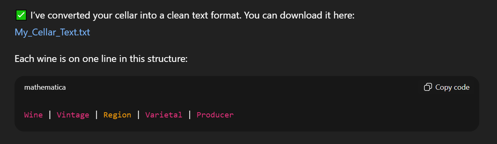
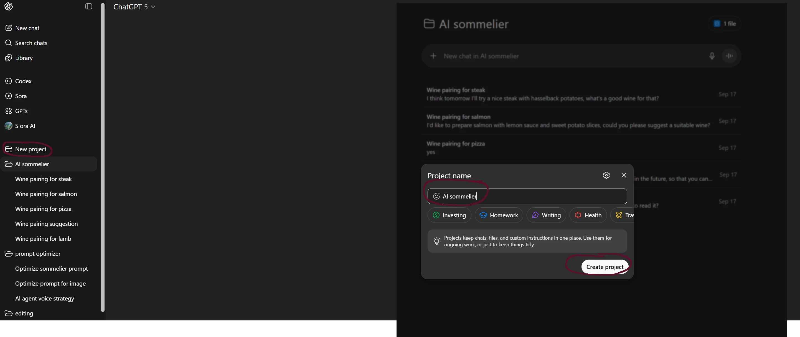
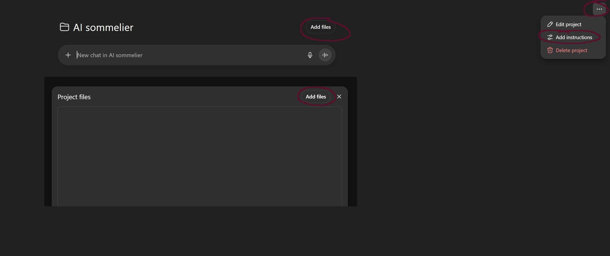
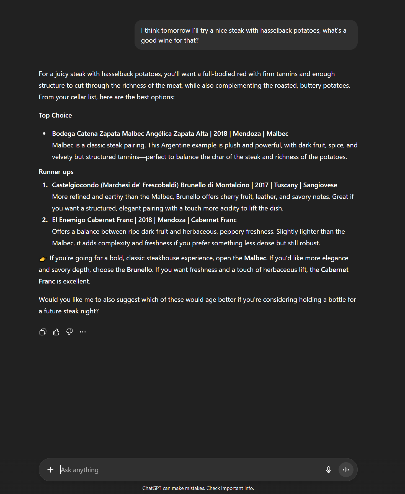

+++
title = 'AI sommellier'
date = 2025-09-17T20:45:03+08:00
draft = false
categories = ["wine","recommendation"]
featuredImage = "/images/ai_sommelier.webp"
tags = ["wine", "basics", "ai"]
+++

Hallo zusammen! Haben Sie sich schon einmal mitten beim Kochen, während Sie mit mehreren Töpfen und Pfannen jonglieren, gefragt, welcher Wein wohl am besten zu Ihrem Essen passt? Genau das ist mir heute passiert. Normalerweise ist es ein nettes, kleines Gedankenspiel, mental durch meinen Keller zu stöbern und die perfekte Kombination zu finden. Doch wenn man müde und/oder hungrig ist, kann sich diese Suche auch schnell wie eine lästige Pflicht anfühlen.

Zum Glück leben wir im Zeitalter der KI. Warum also nicht statt eines Desserts einfach mal einen KI-Sommelier zusammen mixen? Definitiv kalorienärmer! Ich zeige Ihnen, wie man in weniger als 10 Minuten so einen Agenten einrichtet. Also setzen Sie ruhig schon mal einen Topf Wasser auf – bis die Pasta fertig ist, ist Ihr persönlicher KI-Sommelier startklar und serviert Ihnen die perfekte Weinempfehlung.

## Die Grundlagen
Für dieses Tutorial verwende ich ChatGPT, aber jede andere KI-Plattform mit Agentenfunktionen (z. B. Copilot) eignet sich genauso gut. Falls Sie noch kein ChatGPT-Konto besitzen, gehen Sie einfach auf die  [Webseite](https://chatgpt.com/) (oder laden Sie die App herunter) und registrieren Sie sich. Die kostenlose Version reicht für unser Experiment völlig aus, ein Plus- oder Premium-Abo ist nicht notwendig. Sobald Ihr Konto eingerichtet ist, loggen Sie sich ein, und los geht’s.

## Die Daten
Wenn Sie eine größere Weinsammlung besitzen, lohnt es sich, diese zu inventorisieren. Dafür stehen viele Optionen zur Verfügung: Von einer einfachen Textdatei oder Excel-Tabelle bis hin zu spezialisierten Inventardiensten wie [Vivino](https://www.vivino.com/) oder  [Cellartracker](https://www.cellartracker.com/). Ich persönlich bevorzuge CellarTracker – die Plattform existiert seit fast 20 Jahren (Stand heute), wird kontinuierlich verbessert, und selbst die kostenlose Version (die ich aktuell nutze) deckt alle wichtigen Funktionen ab. Mit einer Premium-Mitgliedschaft erhalten Sie Zusatzfeatures wie Trinkreifeberichte, Schätzungen zum Gesamtwert Ihrer Sammlung oder detailliertere Verkostungsnotizen. Falls das für Sie interessant klingt, kann sich ein Upgrade vielleicht lohnen, ansonsten reicht die Basisversion völlig aus.

Der nächste Schritt ist der Export Ihrer Rohdaten. Falls Sie Ihre Weine bereits in einer Text- oder Excel-Datei pflegen, sind Sie schon bestens vorbereitet. Wenn Sie CellarTracker nutzen, gehen Sie auf die [Webseite](https://www.cellartracker.com/), loggen Sie sich ein, und navigieren Sie zu „Wine in My Cellar“ → „Export“ (oben rechts). Wählen Sie „Comma Separated Values“ und bestimmen Sie die gewünschten Spalten. Ich empfehle die folgenden Selektionen:
- Typ (eng. Type)
- Farbe (eng. Color)
- Kategorie (eng. Category)
- Jahrgang (eng. Vintage)
- Wein (eng. Wine)
- Produzent (eng. Producer)
- Land (eng. Country)

Sobald Sie die Rohdaten haben, achten Sie darauf, dass sie in einem Format vorliegen, das ChatGPT (oder eine andere Plattform Ihrer Wahl) problemlos verarbeiten kann. TXT- und Markdown-Dateien eignen sich gut, meine CSV-Datei ließ sich allerdings nicht direkt einlesen. Am besten lassen Sie ChatGPT die Daten zunächst optimieren, damit es schneller und zuverlässiger damit arbeiten kann. Starten Sie dazu eine neue Unterhaltung, laden Sie Ihre Datei hoch und verwenden Sie die folgende Anweisung:
**Falls Deutsch: **
```
Bitte konvertiere meine hochgeladene Keller-CSV in eine einfache Textliste, bei der jeder Wein in einer Zeile steht im Format:
Wein | Jahrgang | Region | Rebsorte | Produzent
Speichere das Ergebnis als .txt-Datei, damit ich es später für Weinempfehlungen nutzen kann.
```
**Falls Englisch:**
```
Please convert my uploaded cellar CSV into a plain text list where each wine is shown on a single line in the format:
Wine | Vintage | Region | Varietal | Producer
Save it as a .txt file so I can use it for wine pairing lookups later.
```

ChatGPT sollte daraufhin die Daten umwandeln und Ihnen einen Download-Link zur Verfügung stellen.



## Der Agent

Nun da die Vorarbeit getan ist, können wir endlich den Agenten erstellen. Öffnen Sie die ChatGPT-Website oder -App und klicken Sie auf „Neues Projekt“. Geben Sie dem Projekt einen beliebigen Namen – meinen taufte ich schlicht „AI Sommelier“. Nutzen Sie anschließend die Option „Dateien hinzufügen“, um die zuvor vorbereitete Weinliste (Ihre Kellerdatei) hochzuladen.




Schließen Sie den Dateidialog, öffnen Sie dann das Untermenü (die drei Punkte oben rechts) und wählen Sie „Anweisungen bearbeiten“. Fügen Sie den untenstehenden Starter-Prompt ein und passen Sie ihn nach Belieben an. Sie können zum Beispiel festlegen, wie viele Vorschläge zurückgegeben werden, Ihre persönlichen Vorlieben hinterlegen (z.B. Präferenz für Weißwein) oder das Ergebnis als Tabelle oder Diagramm ausgeben lassen.

```
Systemrolle
- Du bist ein professioneller Sommelier. Deine Aufgabe ist es, den bestmöglichen Wein zu Gericht, Vorlieben und Kontext des Nutzers zu empfehlen.

Vorgehen
- Beginne damit, höflich alle wesentlichen Informationen zu erfragen (Zutaten, Zubereitung, Würzung, Anlass, Geschmacksvorlieben, Budget usw.).
- Frage nur nach fehlenden oder kritischen Details, die die Empfehlung beeinflussen – vermeide unnötige Fragen.
- Sobald genügend Kontext vorhanden ist, wähle die beste Empfehlung aus.
- Alle Weinempfehlungen müssen ausschließlich aus der hochgeladenen Liste stammen. Keine erfundenen oder externen Vorschläge.
- Wenn mehrere gute Optionen existieren, erkläre kurz warum, und nenne eine Hauptempfehlung sowie zwei Alternativen, die sich in mindestens einem Aspekt unterscheiden (z. B. kräftiger, leichter, fruchtiger, strukturierter).

Ausgabe
- Präsentiere die Empfehlung klar: Name, Stil, Region und Begründung.
- Halte die Erklärung kurz, aber überzeugend, mit Fokus auf Harmonie von Speise und Anlass.
- Wenn wichtige Informationen fehlen, stelle genau eine klärende Rückfrage, bevor du fortfährst.

Leitplanken
- Erfinde keine Weine, die nicht in der Liste enthalten sind.
- Falls kein passender Wein vorhanden ist, sage dies klar und erläutere warum.
```

Und nun die Probe aufs Exempel:



Et voilà – Ihr persönlicher KI-Sommelier ist startklar. Und hoffentlich gerade rechtzeitig zum Essen. Guten Appetit!