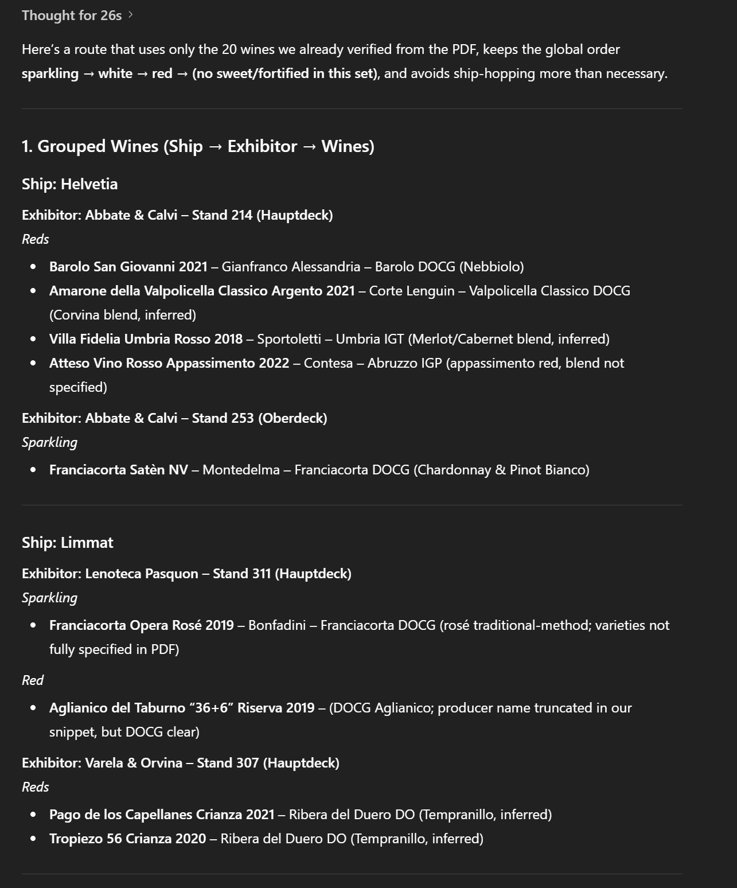

+++
title = 'AI basierter Weinmessenführer'
date = 2025-12-06T11:45:03+08:00
draft = false
categories = ["wine","recommendation"]
featuredImage = "/images/ai_wine_tour_guide.webp"
tags = ["Wein", "Grundlagen", "KI"]
+++

*Vorbemerkung: Dieser Artikel wurde ursprünglich in Englisch verfasst und anschließend übersetzt, die Prompts wurden jedoch im Englischen belassen.*

Agentic AI – oder kurz *Agents* – sind derzeit in aller Munde. Wie ich bereits in meinem [vorherigen Beitrag]() gezeigt habe, können sie ausgesprochen hilfreich sein, wenn es darum geht, Daten schnell und unkompliziert zu analysieren, einzuordnen und daraus genau die Erkenntnisse zu gewinnen, nach denen man sucht.

Nachdem mein Weinkeller bereits importiert war, begann ich mich zu fragen, was mein kleiner KI-Helfer sonst noch für mich tun könnte. In Zürich finden jedes Jahr mehrere größere Weinmessen statt (mehr dazu in meinem Artikel [hier](), doch diese so zu navigieren, dass man möglichst vielfältige und interessante Weine degustiert, gestaltet sich oft schwierig. Natürlich kann man einfach unvorbereitet hineinschlendern und sich entspannt von Stand zu Stand treiben lassen (oder eben dorthin, wo gerade etwas Platz ist). Wenn man jedoch gezielt Weine entdecken möchte, die genau den eigenen Geschmack treffen – oder echte Neuheiten sucht – kommt man nicht darum herum, den Katalog sorgfältig zu studieren und eine Route zu planen. Andernfalls rennt man schnell wie ein kopfloses Huhn durch die Halle auf der Suche nach dem zehnten Stand mit irgendetwas wie *Wine* oder *Vino* im Namen. Also was tun? Ganz einfach: Die KI die harte Arbeit übernehmen lassen.

Zunächst verwenden wir einen Prompt, mit dem ChatGPT unseren Weinkeller analysiert und daraus ein Geschmacksprofil ableitet:

```
You are an expert sommelier and data analyst.
Use the wines in my cellar as the baseline for my personal wine taste.

TASK

Identify and look up each wine in my list (producer, region/appellation, country, grape varieties, style, key vintage characteristics, typical tasting notes).

Understand each wine in context (region style, quality level, typical profile) before using it in further analysis.

From this, build a comprehensive taste profile that describes what I tend to like.

INSTRUCTIONS

Deep research & thoroughness

For every wine, make a reasonable effort to understand it (using your training data and, if available, web search) before you aggregate or generalize.

If a wine cannot be clearly identified, say so explicitly and exclude it from quantitative conclusions (but you may still discuss it qualitatively if appropriate).

Analysis approach

Cluster wines by:

Region / country / climate

Grape varieties & blends

Wine style (e.g. still vs sparkling, dry vs off-dry, oak vs unoaked, traditional vs modern style)

Structure (acidity, body, tannin, alcohol, sweetness)

Aromatics & flavours (fruit types, floral, herbal, spice, oak, earth, etc.)

Price / quality level (if inferable)

Identify patterns and biases, for example:

Regions and grapes I clearly gravitate towards

Stylistic trends (e.g. high-acid whites, full-bodied reds, low-oak, etc.)

Occasional outliers that don’t fit the main pattern.

Uncertainty handling

Clearly mark assumptions, uncertainties, or missing data.

Never invent precise details for a wine you cannot confidently identify—be transparent instead.

OUTPUT FORMAT

Structure your answer in the following sections:

Data overview

How many wines were recognized and used in the analysis.

Short breakdown by color (red/white/rosé/sparkling/other) and by region/country.

Core taste profile (executive summary)

5–10 bullet points summarizing my main preferences (regions, grapes, structure, aromatic profile, oak use, sweetness, etc.).

Write these as “you”-statements (e.g. “You tend to prefer…”, “You are less drawn to…”).

Detailed breakdown

By region & country: which areas dominate my cellar and what this suggests about my taste.

By grape & style: key grape varieties and styles I favour, with short descriptions of their typical profiles.

By structure: likely preferences for acidity, body, tannin, alcohol, and sweetness, with reasoning based on the wines.

Aromatic & flavour patterns: common themes (e.g. dark fruit + spice, citrus + minerality, smoky/peaty, etc.).

Outliers & special cases

Wines that differ from the main pattern and what they might reveal about side-interests or experimental choices.

Refined preference statements

A short list of 8–15 precise statements like:

“You generally enjoy red wines with medium+ body, noticeable but polished tannins, and ripe rather than jammy fruit.”

“You tolerate or enjoy noticeable oak when it adds spice and texture, but not when it dominates with heavy vanilla or toast.”

Limitations & next steps

Briefly mention any limitations (missing data, hard-to-identify wines).

Optionally suggest what additional data (e.g. explicit scores/ratings or disliked wines) would further refine the profile.
```

Das Ergebnis sollte in etwa so aussehen:

Als Nächstes prüfen wir die Website der Messe und schauen, in welchem Format die Liste der Stände und Weine bereitgestellt wird. Glücklicherweise erlaubt [Expovina](https://expovina.ch/) (zumindest in den neueren Ausgaben) den Export des Katalogs als PDF – alternativ hätte man aber auch mit reinem HTML arbeiten können. Also laden wir die PDF-Datei herunter, fügen sie in das Prompt-Fenster von ChatGPT hinzu und warten, bis die Magie passiert:

```
SYSTEM / ROLE 
You are an expert sommelier, data analyst, and wine historian.

You follow instructions with precision and never hallucinate data.

If information in the PDF is incomplete or ambiguous, you explicitly state the uncertainty.

TASK 

Using the attached PDF of the wine fair perform a full analysis of all wines listed, then produce a curated list of 20 wines I should absolutely try, based on the personal flavor profile you previously constructed for me.

OBJECTIVES 

Extract & identify every wine from the PDF.

Producer Region / appellation / country Grape varieties Style (e.g. dry red, white, sparkling) Vintage and any known vintage characteristics Classification / quality tier (if applicable) Verify each wine Cross-check names for plausible producer/wine matches.

If ambiguous, list the candidates and choose the most likely one.

If unverifiable, mark clearly and exclude from final ranking.

Analyze the cellar Cluster by region, grape, style, structural profile (acidity, tannin, body, alcohol, sweetness), aromatic family, and price/quality tier.

Compare the cellar composition with my taste profile.

Select 20 “must-try” wines Wines that best represent what I strongly enjoy.

Wines that expand my preferences in promising directions.

Wines with exceptional quality/value, aging potential, or benchmark status.

Justify each selection For each recommended wine: Why it matches my flavor profile What makes it special (terroir, winemaking, reputation, style) Ideal drinking window What tasting experience to expect 

PROCESS REQUIREMENTS 

Deep research mode: Use model knowledge thoroughly before concluding.

No hallucinations: Only describe wines that can be positively identified from the PDF.

If missing info: State what’s missing and how you inferred your conclusion.

Structure the reasoning: Extraction summary Validation of unclear entries Clustering analysis Recommendation logic Final list of 20 wines with explanations 

OUTPUT FORMAT Use this structure: 
1. Wine Extraction Summary Table of all wines identified from the PDF with key attributes.

2. Ambiguities or Missing Data List entries that could not be clearly matched.

3. Taste-Profile Mapping Explain how the cellar wines relate to my known preferences.

4. Top 20 Wines I Should Absolutely Try 

For each wine: 

Name + vintage 

Booth name, number and boat it is located on 

Why this wine is essential 

How it aligns with my flavor profile 

Expected tasting experience 

Recommended drinking window 

Optional: Ideal food pairing 

SUCCESS CRITERIA 

A high-quality answer must: Correctly identify all wines in the PDF.

Avoid hallucinations or invented producers.

Give clear, specific reasoning for each wine choice.

Align recommendations precisely to my personal flavor tendencies.

Be structured, detailed, and actionable.
```

Wenn alles klappt, liefert ChatGPT eine Liste empfohlener Weine, etwa wie im folgenden Auszug:

Jeder, der schon einmal auf einer großen Weinmesse wie der Expovina war, weiß allerdings: Dort ist meist ordentlich Betrieb – und wir möchten lieber nicht kreuz und quer zwischen den verschiedenen Ecken des Messegeländes hin- und herlaufen. Also nutzen wir noch einen letzten Prompt, um eine sinnvolle Route zwischen den Ständen zu generieren, die gleichzeitig unsere Vorlieben berücksichtigt. Persönlich beginne ich gerne mit Schaumweinen, gehe dann zu trockenen Weißweinen über, danach zu Rotweinen und – wenn Zeit und Stimmung es erlauben – zum Schluss zu Süßweinen. Innerhalb jeder Kategorie arbeite ich mich lieber von leichteren, feineren Weinen hin zu den kräftigeren und strukturierteren vor. Mit einem schweren Rotwein zu starten, ist problematisch, da die Tannine und andere Inhaltsstoffe sich auf die Zunge legen und den Geschmackssinn so etwas reduzieren.

```
You are an expert sommelier and event-route planner.
Use the wines identified in your previous step together with the booth and ship map contained in the PDF.

TASK

Group all identified wines by exhibitor and ship exactly as they appear in the PDF.

After grouping, create an optimal tasting route through the wine fair:

Start by choosing an efficient sequence of ships, then booths, then individual wines.

The tasting order must follow these categories, in this exact order:

Sparkling wines

White wines

Red wines

Sweet & fortified wines

Within each category, order wines from lighter/finer → fuller/stronger → most complex.

OUTPUT REQUIREMENTS

Produce:

A step-by-step tasting route that explicitly states:

Ship → Exhibitor booth → Wines to taste

Ensure the route minimizes unnecessary walking across ships.

For every step, list the wines in the tasting order that fits the structural requirements.

If information is missing or ambiguous in the PDF, state it explicitly and proceed with the most reasonable assumption.

CONSTRAINTS

Do not hallucinate wines, exhibitors, or locations.

Only use wines and exhibitors that were verified from the PDF.

If a wine category (e.g., sparkling) is absent for a specific exhibitor, simply skip them until the next relevant category.

FINAL OUTPUT FORMAT

Provide:

1. Grouped Wines (Ship → Exhibitor → Wines)

A clear hierarchical list.

2. Suggested Tasting Route

Example structure:

1. Ship: Helvetia
   Booth: Vendor A
   Wines: [Sparkling 1 → Sparkling 2 → White → Red → Sweet]

2. Ship: Europa
   Booth: Vendor B
   Wines: [...]

3. Rationale (brief)

A short explanation of how you optimized category order, walking efficiency, and structural progression (light → complex).
```

Output:


Und voilà – wir sind bereit für den Messebesuch. Oder etwa doch nicht? Machen wir zur Sicherheit noch eine letzte Runde Plausibilitätsprüfungen:

```
Thanks, now please go through all your suggestions and once more cross verify the ship, vendor and wine name with the one found in the PDF. Double check that all the wines are named correctly and indeed found for the vendor and ship you previously identified. Do not hallucinate. Verify only the 20 wines you named earlier
```

Response:


Keine Abweichungen gefunden – also können wir loslegen! Tatsächlich habe ich eine frühere Version genau so als Karte für meinen diesjährigen Expovina-Besuch genutzt. Und wie war’s? Ehrlich gesagt: ziemlich gut. Die vorgeschlagenen Weine lagen eindeutig auf meiner Wellenlänge, und ich habe einige spannende Entdeckungen gemacht. Fairerweise muss ich aber hinzufügen, dass der Chatbot nicht alles perfekt getroffen hat – insbesondere, weil meine früheren Versuche weniger optimierte Prompts und keine abschließende Validierung enthielten. Dadurch schlichen sich ein paar Halluzinationen ein, also Einträge, die schlicht nicht existierten. Eine automatische oder manuelle Gegenprüfung ist daher definitiv empfehlenswert.

Selbst danach kann es noch zu Ungenauigkeiten kommen. Aber seien wir ehrlich: Auch Menschen machen Fehler. Und in diesem Szenario würde ich sagen, dass eine gute Annäherung völlig ausreicht. Selbst wenn ChatGPT halluziniert hat (oder etwa Teile eines Weins wie z.B. der Jahrgang falsch erfasst wurden), existierten die Stände in der Regel trotzdem und führten ähnliche Weine. Es war also nicht zu 100 % korrekt – aber meist nah genug dran.

Wer die Qualität weiter steigern möchte, kann folgende praktische Ansätze ausprobieren:

- **Größe der Eingabedaten**: Ziehe in Betracht, ein Tool wie PDFsam Basic zu verwenden, um das PDF in mehrere Teile zu splitten (oder das Ausgangsdokument mit den Ausstellern und Weinen manuell zu teilen – egal in welchem Format). Je kürzer das Dokument, desto besser die Ergebnisqualität – auch wenn du den gleichen Prompt eventuell mehrfach ausführen und die Ergebnisse anschließend zusammenführen musst
- **Mehrere Durchläufe**: Wenn du mit dem Ergebnis nicht zufrieden bist (z. B. weil sich mehrere Fehler eingeschlichen haben), lasse den Prompt mehrmals laufen oder bitte ChatGPT um eine explizite Gegenprüfung
- **Modellvarianten**: Probiere den Prompt mit verschiedenen Modellen aus, etwa unterschiedlichen Versionen von ChatGPT, oder nutze Alternativen wie Claude, Gemini oder Copilot. Jedes Modell hat eigene Stärken – und die Entwicklung in diesem Bereich ist extrem schnelllebig. Was heute reif wirkt, kann nächsten Monat schon überholt sein
- **Modell-Drosselung (Throttling)**: Das ist weniger offensichtlich, aber wichtig. Wenn du kein selbst gehostetes Modell oder eines mit garantierter, reservierter Kapazität nutzt, **wirst** du gedrosselt – oft schneller, als man denkt. Was bedeutet das? Man merkt es nicht direkt, denn viele Anbieter agieren hier recht intransparent. Um Kosten zu sparen, wird bei intensiver Nutzung die tatsächlich eingesetzte Rechenleistung schrittweise reduziert. Vereinfacht gesagt gibt es zwei Faktoren: die Länge deiner Konversation (also wie viele und wie umfangreiche Prompts du in *dieser* Unterhaltung bereits gesendet hast) sowie Häufigkeit und Komplexität deiner Anfragen innerhalb eines bestimmten Zeitraums. Das ist vergleichbar mit einem Gespräch unter Menschen: Triffst du einen Freund nach langer Zeit, hört er dir begeistert zu. Redest du jedoch zehn Stunden am Stück, beschränken sich die Antworten irgendwann auf „aha“, „verstehe“ oder „interessant“. Bei KI-Chatbots passiert das Gleiche – nur deutlich schneller. Erkennt das Modell, dass du viele rechenintensive Fragen stellst (etwa: *„Gib mir eine umfassende Liste aller Voraussetzungen für Weinbau auf dem Mars und bewerte die besten Standorte nach Exposition und Bodenbeschaffenheit“*), wird die für weitere Anfragen reservierte Kapazität reduziert. Wie stark und wie lange genau, bleibt unklar – das Modell gibt darüber keine Auskunft. Stelle jedoch denselben Prompt zehnmal hintereinander, und du wirst sehen, dass die Antworten kürzer und qualitativ schwächer werden
- **Vorsicht bei langen Konversationen**: Eng verwandt mit dem vorherigen Punkt – bedenke, dass bei den meisten Consumer-Chat-Interfaces jeder neue Prompt implizit die *gesamte* vorherige Unterhaltung als Kontext mitsendet. Das geht zulasten der verfügbaren Rechenkapazität bzw. der aktuellen Antwortqualität
- **Am Anfang korrigieren, nicht am Ende**: In diesem Szenario arbeiten wir mit sehr komplexen, rechenintensiven Prompts und großen Eingabedaten (der PDF-Datei). Daher sollten wir versuchen, die Gesamtzahl der Prompts zu begrenzen und uns genau zu überlegen, welche Ein- und Ausgaben wir pro Nachricht benötigen. Wenn dir also für den nächsten Schritt Informationen fehlen, bitte ChatGPT nicht einfach, das Dokument noch einmal komplett zu durchsuchen. Passe stattdessen den ursprünglichen Prompt an und ergänze ihn um klare Anweisungen, die die fehlenden Daten direkt mitliefern. Das ist deutlich effizienter, als mehrere aufwendige Extraktionen aneinanderzureihen

Und nicht vergessen: Du kannst den ursprünglichen Prompt jederzeit anpassen. Statt nur nach Weinen zu suchen, die deinem Geschmack entsprechen, könntest du gezielt nach völlig gegensätzlichen oder experimentellen Weinen fragen. Oder den Fokus auf eine bestimmte Region oder Stilistik legen. Die Möglichkeiten sind vielfältig – spiel also ruhig ein wenig damit herum.

Das war’s für heute. Ich hoffe, dieser kleine Ausflug war hilfreich – und mögen deine zukünftigen KI-Experimente ebenso ergiebig wie unterhaltsam sein.