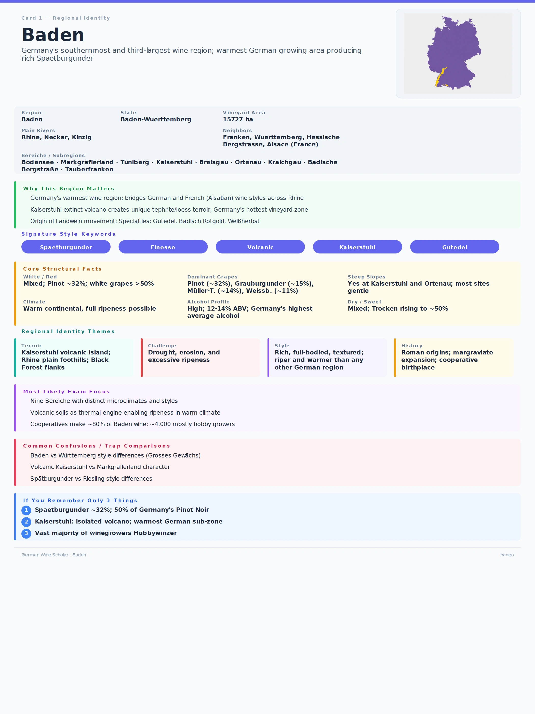

+++
title = 'GWS #2: Baden'
date = 2026-08-01T18:45:03+08:00
draft = false
categories = ["Wein",]
featuredImage = "/images/baden.webp"
tags = ["Wein", "Zertifizierung"]

+++

So wie Franken als Kernland des deutschen Silvaners gilt, lässt sich Ähnliches über Badens Verhältnis zum Spätburgunder (Pinot Noir) sagen. Schließlich gehörte Baden zu den ersten deutschen Anbaugebieten, die diese Rebsorte kultivierten, und ist bis heute Deutschlands größter Erzeuger: Rund die Hälfte des in Deutschland produzierten Spätburgunders stammt aus Baden.

Baden zählt mit knapp 15.000 ha Rebfläche zu den größten Weinbaugebieten Deutschlands und erstreckt sich über rund 400 km von Norden nach Süden. Es reicht von Tauberfranken im Norden bis zum Bodensee und zur Schweizer Grenze im Süden, während sich große Teile seiner mittleren und südlichen Abschnitte entlang des Rheins gegenüber dem Elsass erstrecken. Baden ist eine Region der Kontraste, geprägt von zahlreichen unterschiedlichen Bodentypen, Mikroklimata und Weinstilen – von den leichten, klaren Weinen des Bodensees bis zu den opulenten, strukturierten Pinots aus dem vulkanischen Amphitheater des Kaiserstuhls.

Baden gehört zu den wärmsten und sonnigsten Weinbaugebieten Deutschlands. Dennoch werden seine einzelnen Bereiche von einer bemerkenswert vielfältigen Geografie geprägt: dem geschützten Oberrheingraben, eingerahmt von den Vogesen und dem Schwarzwald; dem Vulkanmassiv des Kaiserstuhls; warmer Luft, die durch die Burgundische Pforte, auch Belforter Pforte genannt, in die Region strömt; sowie dem Einfluss des Bodensees und der Föhnwinde im äußersten Süden.

Tauchen wir also direkt in diese faszinierende Region ein, die für das weinbauliche Erbe der Markgrafen, ihre wechselvolle Geschichte und ihren bis heute lebendigen Innovationsgeist bekannt ist.

# Baden in Zahlen

# Ein kurzer historischer Überblick

* **1. Jahrhundert**: Römische Herrschaft, früheste Nachweise für Weinbau rund um den Bodensee
* **6. Jahrhundert**: Erste Belege für Weinbau im Gebiet des heutigen Baden
* **12. Jahrhundert**: Die Markgrafen herrschen über Baden und spielen eine entscheidende Rolle bei der Entwicklung des Weinbaus
* **16. Jahrhundert**: Der Deutsche Bauernkrieg (1524–1525) und weitere politische Unruhen beeinträchtigen den Weinbau in der gesamten Region
* **17. Jahrhundert**: Der Dreißigjährige Krieg (1618–1648) führt zu weiterer Zerstörung und einem starken Bevölkerungsrückgang
* **18. Jahrhundert**: Wiederaufbau der Weinberge unter Markgraf Karl Friedrich, der anordnete, ausschließlich Südhänge zu bestocken, und außerdem den Gutedel im Markgräflerland sowie den Riesling am Klingelberg bei Durbach einführte
* **19. Jahrhundert**: 1881 wird in Hagnau die erste Winzergenossenschaft gegründet; Badischer Wein wird weiterhin überwiegend lokal konsumiert
* **20. Jahrhundert**: Elbling und Gutedel stehen im Vordergrund; die Flurbereinigungen der 1960er- und 1970er-Jahre führen zur Zerschneidung traditioneller Lagen und zu Qualitätseinbußen; die Thermovinifikation begünstigt einfache, fruchtbetonte Rotweine
* **21. Jahrhundert**: Erzeuger wie Hanspeter Ziereisen treiben eine Bewegung voran, hochwertige Weine als *Landwein* zu vermarkten, und tragen erfolgreich dazu bei, das Ansehen dieser Kategorie zu verändern. Landwein wird zunehmend als Synonym für handwerklich geprägte Weine verstanden (ähnlich zu den *Super Tuscans* in Italien)
* **Heute**: Die Region verbindet eine starke Genossenschaftstradition mit einer wachsenden Zahl terroirgeprägter und konsequent qualitätsorientierter Erzeuger

# Prägende Rebsorten und Stilistik

Fast 50 verschiedene Rebsorten werden in Baden angebaut. Angesichts des Rufs der Region, einige der besten Spätburgunder Deutschlands hervorzubringen, könnte man vermuten, dass rote Sorten überwiegen. Tatsächlich entfällt jedoch der größere Teil der Rebfläche auf weiße Rebsorten.

Die führende weiße Rebsorte ist der **Grauburgunder**, der rund 15 % der gesamten Rebfläche ausmacht. Er eignet sich hervorragend für Badens warmes, vergleichsweise trockenes Klima und wird meist zu würzigen, straffen und körperreichen Weinen ausgebaut. Daneben finden sich auch üppigere edelsüße Varianten aus botrytisierten Trauben. Manche Erzeuger setzen auf moderaten Holzausbau, um zusätzliche Textur und Komplexität zu erzielen.

**Müller-Thurgau** ist mit einem Anteil von rund 14 % an der Rebfläche fast ebenso stark vertreten wie Grauburgunder. Das liegt zum einen an seiner Widerstandsfähigkeit und seiner Ertragsfähigkeit, zum anderen daran, dass er hier einige seiner besten deutschen Ausprägungen hervorbringt, insbesondere am Bodensee. Das kühlere Klima und die höheren Lagen im Alpenvorland können frische, fruchtbetonte Weine mit milder Säure und feinen floralen oder muskatartigen Aromen hervorbringen.

Mit rund 11 % belegt der **Weißburgunder** den dritten Platz unter Badens weißen Rebsorten. Er gedeiht auf den Löss-, Vulkan- und Kalkböden der Region und kann ein breites Spektrum hervorbringen: von frischen, präzisen Weinen bis hin zu dichten, körperreichen und im Holz ausgebauten Exemplaren.

Der **Gutedel**, auf den rund 7 % der Rebfläche entfallen, ist eine der ältesten und speziellsten Rebsorten Badens, insbesondere im *Bereich* Markgräflerland. In anderen Teilen Deutschlands ist er kaum verbreitet, spielt jedoch in der Schweiz und in Teilen Frankreichs eine deutlich größere Rolle, wo er als *Chasselas* beziehungsweise im Schweizer Kanton Wallis als *Fendant* bekannt ist. Er kann sowohl unkomplizierte, leicht zugängliche Weine als auch strukturiertere und lagerfähige Exemplare hervorbringen. Die Weine sind meist alkoholarm, mild in der Säure und aromatisch eher zurückhaltend. Ein sorgfältiger Ausbau kann jedoch Noten von Nüssen, weißen Blüten und mineralische Anklänge zum Vorschein bringen.

Auch wenn **Riesling** nur eine vergleichsweise kleine Fläche einnimmt (genau genommen 6 %), bringt Baden einige herausragende Weine hervor, vor allem in der Ortenau, am Kaiserstuhl und im Kraichgau. Je nach Boden, Höhenlage und Exposition reicht das Spektrum von reifen und opulenten bis zu straffen, mineralischen und kargen Weinen. In der Ortenau wird Riesling traditionell auch als *Klingelberger* bezeichnet.

Baden gehörte 1956 zu den ersten deutschen Anbaugebieten, die **Chardonnay** einführten, und war die erste Region, die Chardonnay als Großes Gewächs zuließ. Seitdem hat die Rebsorte in Baden stetig an Bedeutung gewonnen. Das wärmere Klima ermöglicht eine zuverlässige Reife, ohne dass die Weine dabei an Struktur verlieren.

**Silvaner** nahm in Baden einst eine deutlich größere Rebfläche ein, ist seither jedoch kontinuierlich zurückgegangen. Heute findet er sich nur noch in vereinzelten Parzellen, insbesondere am Kaiserstuhl, wo er zurückhaltende, erdige Weine mit dezenter Frucht und moderater Säure hervorbringen kann.

Die roten Rebsorten führt der **Spätburgunder** mit rund 32 % der gesamten Rebfläche unangefochten an. Baden ist Deutschlands größtes und zugleich eines seiner traditionsreichsten Anbaugebiete für diese Rebsorte. Sie gedeiht hier im warmen Klima, bei reichlicher Sonneneinstrahlung und auf vielfältigen Böden aus Vulkangestein, Kalk, Löss, Granit und glazialen Ablagerungen. Stilistisch reicht das Spektrum von blassen, feingliedrigen und rotfruchtigen Weinen bis hin zu farbintensiven, strukturierten Exemplaren, die im Holz reifen. Die besten werden aufgrund ihrer Finesse, Komplexität und Fähigkeit, ihr *Terroir* zum Ausdruck zu bringen, häufig mit burgundischen Weinen verglichen.

**Lemberger** – auch als Blaufränkisch bekannt – spielt lediglich eine Nebenrolle, ist im Kraichgau und an der Badischen Bergstraße jedoch für Große Gewächse zugelassen. Die spätreifende, dunkelschalige Rebsorte bringt frische, strukturierte Weine mit Aromen von Kirschen, Brombeeren und Pfeffer hervor.

Der **Tauberschwarz** schließlich ist eine lokale Rebsorte aus Tauberfranken, die im 16. Jahrhundert nach Baden gelangte und damit zu den ältesten der Region zählt. Die widerstandsfähige, früh reifende und dünnschalige Traube bringt blasse, leichte Weine mit Noten von roten Früchten, Kräutern und Gewürzen hervor. Sie ist allerdings anfällig für Botrytis und kann sich im Anbau als anspruchsvoll erweisen.

Diese regionale Eigenständigkeit spiegelt sich auch in den Rebsorten wider, die der VDP in Baden derzeit für Weine aus VDP.GROSSER LAGE zulässt:

* Riesling
* Weißburgunder
* Grauburgunder
* Chardonnay
* Spätburgunder
* Lemberger

Wie in vielen deutschen Anbaugebieten ist die Betriebsstruktur auch in Baden überwiegend kleinteilig; zahlreiche Flächen werden von *Hobbywinzern* bewirtschaftet. Genossenschaften prägen die Weinlandschaft, wobei der **Badische Winzerkeller** zu den größten zählt. Darüber hinaus gehört Baden zu den drei bedeutendsten deutschen Erzeugerregionen für *Sekt*, der hier besonders häufig aus Burgundersorten bereitet wird.

Die Region bringt mehrere charakteristische Weinstile hervor, darunter **Badisch Rotgold**, eine Form des *Rotlings*, bei der Grauburgunder- und Spätburgundertrauben oder deren Moste vor der Gärung miteinander kombiniert werden. Grauburgunder muss dabei mindestens 51 % des Verschnitts ausmachen, während Spätburgunder höchstens 49 % beitragen darf. Die resultierenden Weine sind meist blassrosa bis hellrot und präsentieren sich in der Regel fruchtig, weich und zugänglich.

Daneben finden sich auch Beispiele für **Weißherbst**, einen Rosé aus einer einzigen roten Rebsorte und mindestens 95 % hell gekeltertem Most. In Baden wird er meist aus Spätburgunder erzeugt und präsentiert sich in der Regel leicht, fruchtbetont und trocken bis halbtrocken.

Badens Weine lassen sich weniger über einen einheitlichen Regionalstil als über die außergewöhnliche geografische Spannweite des Anbaugebiets verstehen. Die wärmeren mittleren und südlichen Bereiche bringen meist reifere und körperreichere Weine hervor, insbesondere aus der Burgunderfamilie. Der Bodensee und einige der nördlichen Teilgebiete liefern dagegen leichtere, frischere und zurückhaltendere Ausprägungen. Hochwertige Weiß- und Rotweine können im Holz reifen, doch auch Edelstahl, große traditionelle Holzfässer und ein längeres Hefelager spielen eine wichtige Rolle.

Gerade diese Vielfalt macht Baden aus: Innerhalb eines einzigen Anbaugebiets entstehen feingliedrige Weine vom Bodensee, kraftvolle vulkanische Pinots, mineralische Rieslinge, subtile Gutedel und zunehmend ambitionierte Chardonnays.

Und damit endet unser kurzer Streifzug durch Deutschlands südlichstes Weinbaugebiet. Ich hoffe, der Beitrag war informativ, und wir sehen uns im nächsten Artikel wieder.

# Karteikarte zur Wiederholung

