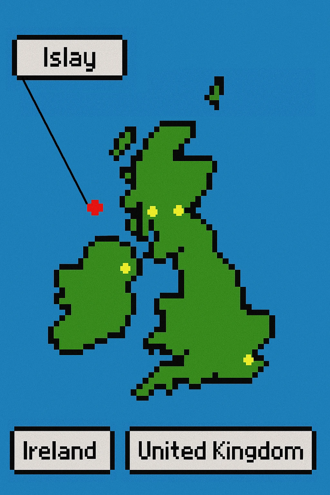
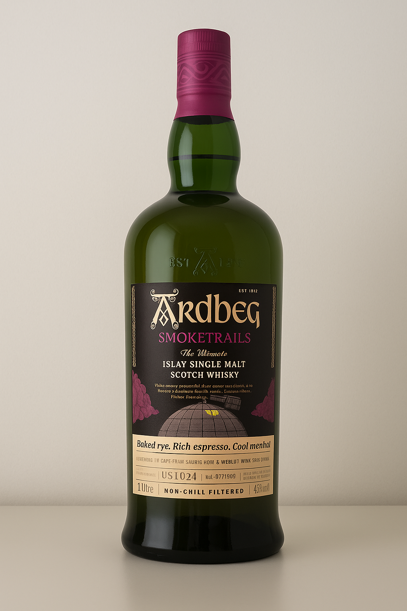
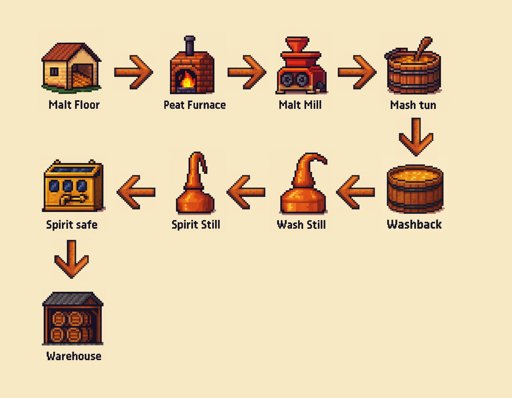
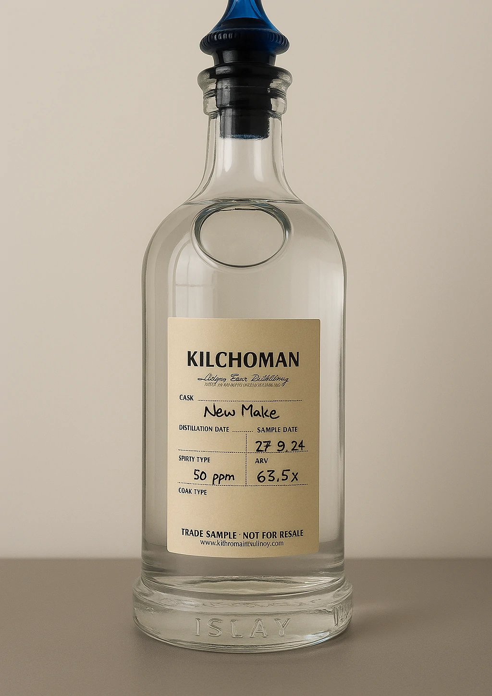

+++
title = 'Eine kleine Reise durch das Fèis Ìle Festival 2025 – Teil 1: Wie Whisky entsteht'
date = 2025-06-02T20:45:03+08:00
draft = false
categories = ["wine","recommendation"]
featuredImage = "/images/whisky1.webp"
tags = ["wine", "basics"]
+++

Heute stellen wir den Wein einmal ins Regal und widmen uns einem anderen edlen Tropfen: dem Whisky. Genauer gesagt, nehme ich euch mit nach **Islay** – einer kleinen Insel westlich von Glasgow, die berühmt ist für ihre raue Schönheit und ihren torfigen Whisky. Ich hatte das Glück, ein paar unvergessliche Tage auf dieser magischen Insel zu verbringen – und das pünktlich zum Fèis Ìle Whisky-Festival, zu dem Liebhaber des rauchigen Elixirs aus aller Welt pilgern, auf der Suche nach dem perfekten Schluck.

## Whisky & Wein

Auch wenn sich Herstellungsverfahren, Alkoholgehalt und Geschmacksprofile deutlich unterscheiden, haben Wein und Whisky mehr gemeinsam, als man zunächst meinen könnte. Beide nutzen die Fermentation, um ihre Grundzutaten in aromatische, komplexe Flüssigkeiten zu verwandeln, und beide reifen in Fässern, um Tiefe und Charakter zu entwickeln. Während Whisky traditionell in ehemaligen Bourbon- oder Sherryfässern ausgebaut wurde, ist das Spektrum heute deutlich breiter: Während Bourbon- und Sherryfässer sich immer noch großer Beliebtheit erfreuen, experimentieren viele Brennereien mit Fässern aus Tequila-, Mezcal-, Cognac- oder Calvados-Reifungen. Auch ausgediente Weinfässer finden immer häufiger Verwendung – so lagert Bruichladdich seinen 2010er Whisky in alten Amarone-Fässern, Kilchoman reift sein Muscatel Single Cask in frischen Muskatellerfässern, und Ardbeg brachte gerade die dritte Edition seiner Smoketrails-Serie heraus, die in Fässern reifte, in denen zuvor kostbarer Napa Valley Cabernet Sauvignon lagerte!

# Eine kurze Einführung in die (schottische) Whiskyherstellung

## Von der Gerste zum Malz

Beim Wein beginnt alles mit der Traube, beim Whisky mit der Gerste. Diese wird angebaut, geerntet und entweder direkt zur Brennerei geliefert oder in spezialisierte Mälzereien geschickt. Heute mälzen nur noch wenige Brennereien selbst – spezialisierte Firmen können das wirtschaftlicher und in größerem Maßstab übernehmen. Interessant: Ein Großteil der auf Islay angebauten Gerste wird zur Mälzung aufs Festland geschickt und kommt erst danach wieder auf die Insel zur Fermentation und Destillation zurück. Nur wenige Brennereien wie **Kilchoman** und **Bowmore** mälzen noch *einen Teil* ihrer Gerste vor Ort – und das auf traditionelle Weise am Boden, dem sogenannten **Malting Floor** (Malzboden). **Lagavulin** und **Caol Ila** beziehen ihr Malz von Port Ellen Maltings, der einzigen industriellen Mälzerei der Insel, die wie die beiden Destillerien zum Diageo Konzern gehört.

Das Mälzen selbst ist recht simpel: Die Gerste darf etwa drei Tage lang keimen. Dabei entstehen Enzyme, die später nötig sind, um die Stärke in vergärbaren Zucker umzuwandeln, den die Hefe schließlich zu Alkohol verarbeitet. Danach wird die Keimung gestoppt (schließlich wollen wir nicht, dass die Samen komplett sprießen), indem man das Korn in einem **Kiln** (Darrboden) trocknet. So entsteht das sogenannte Malz, das anschließend vermahlen wird.

Viele Islay-Whiskys sind bekannt für ihre torfigen, rauchigen und medizinischen Aromen – dies war traditionell deshalb, weil die Insel über große Torfvorkommen verfügt, mit dem früher sowohl Häuser als auch Brennereien beheizt wurden. Beim Darren des Malzes über dem Torffeuer ging der Rauch ins Korn über und mit ihm die charakteritischen Geschmacksnoten. Heute wird der Malz meist mit Heißluft getrocknet und nur eine kleine Menge Torf wird zum Aromatisieren verwendet – ähnlich wie beim Räuchern von Lachs oder BBQ-Fleisch. Das spart Torf und ist umweltfreundlicher.

## Malerisches Mahlen

Das Mahlen ist ein weiteres faszinierendes Kapitel in der Whiskyproduktion. Auf Islay findet man in den meisten Destillerien eine alte, gut gepflegte aber antik-anmutende Malzmühle vor, welche von einer von zwei Firmen stammt: *Robert Boby Ltd.* und *Porteus*. Viele dieser Maschinen sind über 70 Jahre alt – und laufen dank konstanter Wartung noch immer rund wie am ersten Tag. Eine (nicht ganz so) lustige Randnotiz: Beide Hersteller sind in Konkurs gegangen, weil ihre Maschinen zu gut waren – niemand musste je eine neue kaufen. Das nennt man echte Qualität!

In der Mühle wird das Malz zu **Schrot** – einem groben Mehl – vermahlen, das aus drei Bestandteilen besteht:
- Spelzen (die Schale)
- Grütze (mittlere Partikel)
- Mehl (feines Pulver)

## Maische, Würze & Wash

Der Schrot erinnert optisch stark an Haferflocken oder Müsli – und schmeckt auch fast so. Er wird in den **Maischebottich** geschüttet und mit heißem Wasser (zunächst bei etwa 62°C, in späteren Phasen noch heißer) vermengt, um die Enzyme zu aktivieren und die Stärke aufzuspalten – der sogenannte **Maischvorgang**. Die entstehende Flüssigkeit, die **Würze** (eng. *wort*), wird vom Treber getrennt und in große Gärbottiche aus Holz oder Edelstahl – die **Washbacks** – gepumpt, in welche dann die Hefe hinzugefügt wird.

Die Fermentation dauert bis zu drei Tage und ergibt ein gelbliches, bierähnliches Getränk – den **Wash** – das intensiv nach Brot, Brioche, Hefe und jungem Apfelwein riecht. Man kann es sich als ein rauchiges Bier mit etwa 9 % Vol. vorstellen – sehr hefelastig, aber charaktervoll und mit viel Potential.

Nun wird der Wash über Rohre in den Brennraum geleitet, wo zwei glänzende Brennblasen aus Kupfer auf ihren Einsatz warten: die **Wash Still** und die **Spirit Still**. Zuerst geht es in die Wash Still, wo Alkohol von festen Bestandteilen getrennt und auf etwa 19–25 % Vol. konzentriert wird. Darauf folgt der zweite Brand in der Spirit Still, welche den Alkoholgehalt nochmals erhöht. Die Form dieser Brennblasen hat enormen Einfluss auf das spätere Mundgefühl und den Charakter des Whiskys – jede Destillerie wählt gezielt die Form für diese Behältnisse, die für ihren individuellen Whiskystil am meisten zuträglich ist. Am Ende dieser Destillation entsteht ein klarer Rohbrand mit etwa 62–70 % Vol. Alkohol, mit intensiven Malznoten und, falls Torf zum Aromatisieren verwendet wurde, rauchigem Biss, salziger Brise und medizinischen Noten. Dieser wird im sogenannten Brandtresor (eng. spirit safe) aufgefangen.

## Die Magie der Reifung

Technisch gesehen *könnte* man den Rohbrand jetzt schon trinken – aber es wäre eher eine Skizze als ein fertiges Gemälde. Der Alkohol ist scharf, der Geschmack noch unausgereift und es fehlt die Tiefe und Komplexität, die wir von einem guten Tropfen erwarten. Gut trainierte Nasen werden dennoch in der Lage sein, eine vage Vermutung über den Ursprung zu äußern, denn die DNA des fertigen Whiskeys ist durchaus schon enthalten. Um ein rundes Endprodukt zu entwickeln bedarf es – ähnlich wie bei vielen qualitativ-hochwertigen Weinen – einer ausgedehnten Reifezeit. Auf Islay kommen meist Ex-Bourbonfässer zum Einsatz, aber auch Sherry, Pedro Ximénez, Portwein, andere Spirituosen oder neue Eichenfässer (virgin oak) sind beliebt. Die Fässer verleihen dem Destillat zusätzliche Aromen – von Vanille, Schokolade, Kaffee bis hin zu Leder und Erde – und helfen, den Alkohol harmonisch einzubinden.

Ein Teil des Whiskys verflüchtigt sich jedes Jahr – der sogenannte *Angel’s Share* ("Engelsanteil"). Der Clou auf Islay: Dank des kühlen, feuchten Klimas verlieren die Whiskys bei ihrer Lagerung dort nur etwa 0,5-1% Volumen pro Jahr. Zum Vergleich: In anderen Regionen kann der Verlust bis zu 30% betragen – da bleibt vom „flüssigen Gold“ nicht mehr viel übrig.

Die Reifezeit variiert stark – meist zwischen 5 und 16 Jahren, seltener auch 30 Jahre oder mehr. Manche Whiskys reifen durchgehend in einem Fasstyp, andere wechseln (z. B. Erstlagerung in Refill- und PX-/Oloroso-Fässern, danach Finish in kolumbianischer Eiche – wie der Caol Ila Fèis Ìle 2025, ein 8-jähriger Single Malt mit floralem Bouquet, würzigem Profil und komplexem Rauch bei 55,8 % Vol.). Fässer werden in der Regel zwei- bis dreimal verwendet – mit jedem Mal geben sie weniger Geschmack an den Whisky ab (*Second/Third Refill*). Die finale Aromatik hängt also vom Fasstyp (bzw. Fasstypen), der Reifedauer, dem „Alter“ des Fasses und natürlich vom Rohbrand selbst ab.

Die moderne Popularität von Whisky führt dabei zu einer kuriosen Entwicklung: Weil die Nachfrage nach Whisky viel höher ist als nach Sherry, produzieren *manche* Sherry-Hersteller eigens Fässer mit minderwertigem Sherry, nur um diese später an die Whiskybranche zu verkaufen – der Sherry wird dann weggeschüttet!

Bei der Whiskyherstellung verfolgt jede Brennerei eine eigene Philosophie: Manche setzen auf konstante Rohbrände und formen den Stil ausschließlich über Fasswahl und Reifung. Andere tüfteln an *Malztyp*, *Torfgehalt*, *Gärdauer* oder der *Füllmenge von Washbacks und Stills* – für Whiskyabfüllungen mit individueller Handschrift und einzigartigen Geschmack.

# Ab ins Glas

Am Ende wird der nun fertige Whisky abgefüllt – doch auch hier sind Entscheidungen gefragt: Kommt er in Fassstärke (*Cask Strength*) in die Flasche oder wird er mit Wasser auf Trinkstärke gebracht um ihn zugänglicher zu machen? Wird ein einzelnes Fass abgefüllt (*Single Cask*) oder eine Mischung (*Blend*) aus mehreren Fässern erzeugt? Letzteres ist Standard, wenn es sich um das Kernsortiment des Herstellers handelt, denn so kann ein gleichbleibendes Geschmacksbild gewährleistet werden. Sondereditionen dagegen kommen oft direkt aus einem einzigen Fass und tragen oft auch die genaue Fassnummer auf dem Etikett.

Und damit ist er vollendet – der bernsteinfarbene Zaubertrank, bereit für Flasche und Glas. Ich hoffe, dieser kleine Ausflug in die Welt des Whiskys hat euch gefallen – bleibt dran für Teil 2, in dem wir die Destillerien von Islay und ihre individuellen Stile näher unter die Lupe nehmen.