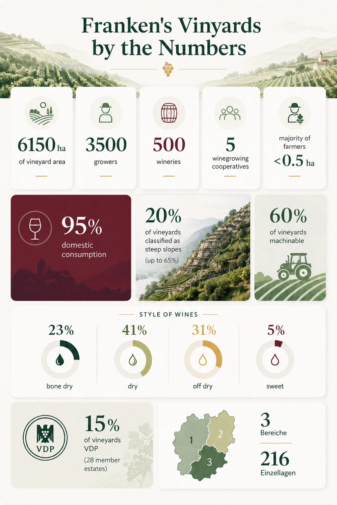

+++
title = 'GWS #1: Franken'
date = 2026-07-26T18:45:03+08:00
draft = false
categories = ["wine",]
featuredImage = "/images/franken.webp"
tags = ["Wein", "Zertifizierung"]

+++

Da ich mich derzeit durch das German-Wine-Scholar-Programm arbeite, möchte ich eine neue Artikelreihe beginnen, in der ich die einzelnen Regionen vorstelle und ausgewählte Notizen und Zusammenfassungen aus meinem Studium teile.

Heute befassen wir uns mit Franken. Das Anbaugebiet liegt im Nordwesten Bayerns und konzentriert sich vor allem auf das Maintal. Im Südwesten grenzt es an die Weinregionen Baden und Württemberg. Obwohl Franken politisch zu Bayern gehört, besitzt die Region eine ausgeprägte kulturelle und regionale Identität, die sich in ihren Dialekten, Traditionen und natürlich auch ihren Weinen widerspiegelt.

# Franken in Zahlen

# Ein kurzer historischer Überblick

* **8. Jahrhundert**: Die frühesten Aufzeichnungen über den fränkischen Weinbau stammen aus dieser Zeit. Der **Würzburger Stein** zählt zu den ersten urkundlich erwähnten Weinbergen.
* **8.–16. Jahrhundert**: Der Weinbau wird vor allem von der Kirche und den Klöstern vorangetrieben. Die Zeit vom 12. bis zum 16. Jahrhundert gilt als Frankens Blütephase, in der die Rebfläche ihren historischen Höchststand erreicht.
* **17. Jahrhundert**: Die großflächigen Verwüstungen des Dreißigjährigen Krieges (1618–1648) führen dazu, dass rund 75 % der Weinberge aufgegeben werden. Kurz darauf, im Jahr 1659, wird Silvaner eingeführt, der sich dank seiner Wuchskraft und kürzeren Vegetationsperiode rasch großer Beliebtheit erfreut.
* **18. Jahrhundert**: Franken erlebt eine neue Blütezeit, insbesondere im Raum Würzburg.
* **19. Jahrhundert**: Die Säkularisierung während der napoleonischen Epoche und Erbpraktiken wie die *Realteilung* führen zu einer immer stärkeren Zersplitterung der Weinberge. Reblaus, Mehltau, Wirtschaftskrisen und die fortschreitende Industrialisierung dezimieren die fränkische Weinlandschaft erneut.
* **20. Jahrhundert**: 1913 hält Müller-Thurgau Einzug in Franken und verbreitet sich schnell aufgrund seines unkomplizierten Anbaus, seiner Anpassungsfähigkeit und seiner hohen Erträge. In den 1950er-Jahren erreicht die Region einen historischen Tiefpunkt, beginnt sich jedoch in den 1960er- und 1970er-Jahren dank der *Flurbereinigung*, des Einsatzes modernerer Technik und veränderter Verbrauchergewohnheiten wieder zu erholen.
* **Heute**: Der Fokus richtet sich zunehmend auf Qualität und einen klaren Ausdruck des Terroirs. Gleichzeitig gewinnen Naturweine und Weine mit minimalen Eingriffen an Sichtbarkeit.

# Charakteristische Rebsorten und Weinstile

Es ist kein Geheimnis, dass Franken weithin als Heimat des Silvaners gilt. Entsprechend wenig überrascht es, dass der weitaus größte Teil der Rebfläche mit weißen Sorten bepflanzt ist – rund 80 %.

Mit einem Anteil von etwa 25 % liegt **Silvaner** an der Spitze und nimmt damit einen größeren Teil der regionalen Rebfläche ein als in jedem anderen deutschen Anbaugebiet. Die robuste Sorte ist insbesondere gegenüber den in Franken häufigen Spätfrösten widerstandsfähig, reift mittelspät und gedeiht besonders gut auf den wasserspeichernden Muschelkalk- und Keuperböden, die das Maindreieck beziehungsweise den Steigerwald prägen. Hochwertige Exemplare können zudem ein bemerkenswertes Reifepotenzial besitzen.

An zweiter Stelle folgt **Müller-Thurgau** mit einem Anteil von 22 % an der gesamten Rebfläche. Seine Zuverlässigkeit, Anpassungsfähigkeit und hohen Erträge machen ihn besonders geeignet für unkomplizierte, leicht zugängliche Weine mit milder Säure, die häufig von floralen Noten geprägt sind.

Zu den weiteren wichtigen weißen Sorten zählen **Bacchus** (12 %), **Riesling** (5,5 %), **Chardonnay** und **Rieslaner**, eine Kreuzung aus Riesling und Silvaner, die überwiegend für süße Weine verwendet wird.

Bei den roten Sorten sind vor allem **Domina** (4,8 %), eine robuste und krankheitsresistente Kreuzung aus Portugieser und Spätburgunder, sowie **Spätburgunder** (Pinot Noir) mit 4,5 % hervorzuheben. Letzterer gedeiht besonders gut auf den im Mainviereck verbreiteten Buntsandsteinböden und bringt in Churfranken dank steiler Terrassenlagen und warmer Mikroklimata Weine von Weltklasse hervor.

Dies spiegelt sich auch in den Rebsorten wider, die der VDP in Franken für VDP.GROSSE GEWÄCHSE (GG) zulässt:

* Riesling
* Silvaner
* Weißburgunder
* Spätburgunder

Charakteristisch für Franken ist die historisch gewachsene Vorliebe für trockene Weine. Für "knochentrockene" Weine (weniger als 4 g/l Restzucker) existiert sogar eine eigene Bezeichnung: *fränkisch trocken*. Bei Weißweinen liegt der traditionelle Schwerpunkt darauf, durch die sorgfältige Wahl des Lesezeitpunkts und eine kühle Vergärung eine natürliche, unverfälschte Aromatik und hohe Komplexität zu bewahren. Spätburgunder zeigt sich mit moderaten Tanninen und ausgewogener Frucht; für den Ausbau kommen sowohl Holz als auch Edelstahl häufig zum Einsatz.

Ein weiteres unverwechselbares Merkmal Frankens ist die berühmte **Bocksbeutelflasche**, die häufig als sichtbares Zeichen für einen besonders traditionsverbundenen Weinstil dient und auch im Titelbild dieses Artikels zu sehen ist. Innerhalb Deutschlands ist diese geschützte Flaschenform Franken und bestimmten Teilen Badens vorbehalten. Fränkische Weine, die im Bocksbeutel abgefüllt werden dürfen, müssen zudem bestimmte Ertrags- und sensorische Qualitätsanforderungen erfüllen.

Ich hoffe, diese kurze Einführung war interessant und hat vielleicht etwas Interesse an dieser international eher weniger bekannten Weinregion geweckt. Weitere Artikel rund um den German Wine Scholar werden folgen, in denen ich weitere eigenständige Regionalstile und verborgene Schätze vorstelle.

# Lernkarte zur Wiederholung

