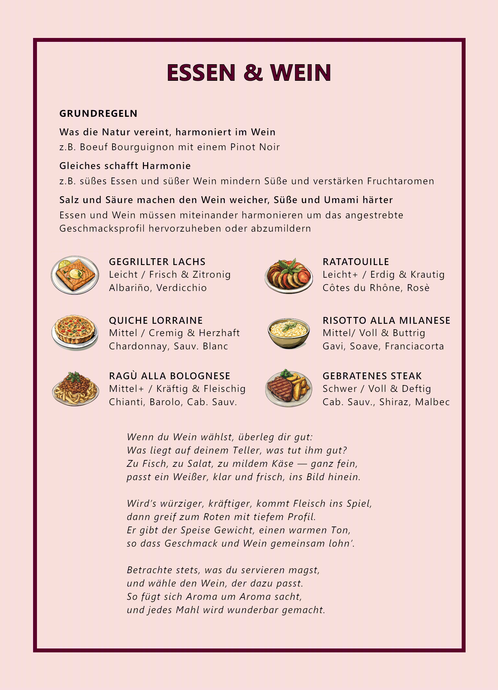

+++
title = 'Essen und Wein - Grundlagen'
date = 2024-11-24T20:50:03+08:00
draft = false
categories = ["Wein"]
featuredImage = "/images/wine_and_food_pairing.webp"
tags = ["Wein", "Grundlagen"]
+++

Ein Glas Wein für sich genommen kann schon ein wunderbares Erlebnis sein, doch erst in Kombination mit dem passenden Gericht entfaltet sich sein volles Potenzial. Eine durchdachte Paarung lässt den Wein die Aromen des Essens hervorheben, während das Gericht den Wein bereichert – eine harmonische Verbindung, die sich wie ein inniger Tanz zweier perfekt aufeinander abgestimmter Partner anfühlt.

# Die Grundlagen der Speisen- und Weinbegleitung
Die Theorie der Kombinationen beginnt bei den Aromen auf unserer Zunge, den Bestandteilen des Weins und ihren Wechselwirkungen. Wir können salzig, süß, sauer, bitter und umami (herzhaft) schmecken – all diese Wahrnehmungen finden sich auch im Wein wieder:
- **Süße**: Zu finden in Weinen mit Restzucker, wie Moscato oder Spätlese-Rieslinge
- **Salzigkeit**: Zwar schmeckt Wein nicht direkt salzig, doch manche „mineralischen“ Weine – etwa Chablis oder Albariño – können an salzhaltige oder maritime Noten erinnern. Ob das auf den Boden, Meeresbrisen oder andere Ursachen zurückzuführen ist, ist wissenschaftlich nicht eindeutig geklärt
- **Säure**: Resultiert aus der Weinsäure und verleiht Frische. Sie kann reichhaltige, fette Speisen auflockern. Stellen Sie sich etwa die knackige Säure eines Sauvignon Blanc in Kombination mit Ziegenkäse vor
- **Bitterkeit**: Häufig durch Verbindungen aus Traubenschalen, Stielen oder Holzfassreifung geprägt. Sie kommt eher in tanninbetonten Rotweinen wie Nebbiolo oder Cabernet Sauvignon vor. Manche Weine (wie z.B. Dolcetto) sind auch für einen leicht bitteren Nachgeschmack bekannt
- **Umami**: Entsteht im Wein auf natürliche Weise durch Aminosäuren, die sich aus Traube, Terroir oder önologischen Techniken wie der malolaktischen Gärung (MLF) ergeben. Gereifte Champagner etwa weisen oft eine umami-betonte, herzhaft-würzige Note auf

Darüber hinaus beeinflussen weitere Weineigenschaften die Wechselwirkung mit Speisen:
- **Alkoholgehalt**: Beeinflusst das Mundgefühl und das Gewicht bzw. die Schwere des Weins. Höherer Alkoholgehalt kann Schärfe in Speisen verstärken – ein wichtiger Aspekt, wenn Sie pikante Gerichte servieren
- **Körper**: Das Gesamtgewicht und die Fülle des Weins am Gaumen. Leichte Gerichte passen besser zu leichten Weinen, gehaltvolle Speisen zu kräftigeren Weinen
- **Tannine**: Tannine reagieren mit Proteinen und Fetten und mildern so die Adstringenz des Weins. Deshalb passen tanninreiche Weine wie Barolo oder Bordeaux so gut zu Steak oder cremigen Käsesorten

Wie helfen uns all diese Faktoren bei der Wahl des perfekten Weins zum Essen? Auch wenn es noch viel mehr Faktoren zu bedenken gibt, können wir zumindest erste Anhaltspunkte geben, indem wir die Kunst der Kombination auf drei einfache, einsteigerfreundliche Regeln herunterbrechen.

# Drei einfache Regeln für die perfekte Weinbegleitung

## 1. Was die Natur vereint, harmoniert im Wein
Weine und Gerichte aus derselben Region ergänzen sich oft besonders gut, da sie sich über die Zeit gemeinsam entwickelt haben. Ein toskanischer Chianti harmoniert beispielsweise hervorragend mit Tomatensaucen, weil die Säure und die erdigen Noten des lokalen Weins die würzig-saure Küche wunderbar unterstützen. Das geteilte Terroir – Bodenbeschaffenheit, Klima und traditionelle Landwirtschaft – schafft dabei oft eine natürliche Harmonie.
## 2. Gleiches schafft Harmonie
Diese Regel ist ein praktischer Merksatz: Wenn gleiche Aromen aufeinandertreffen, verbessern sie das Gericht sowie den Wein. Ein süßer Dessertwein wie Sauternes in Kombination mit einem süßen Dessert lässt die Süße im Wein geringer erscheinen, wodurch seine Fruchtaromen stärker hervortreten. Ebenso funktioniert ein säurebetonter Wein wie Verdicchio hervorragend mit einem säuerlichen Gericht wie Ceviche: Die Säuren von Wein und Speise mildern sich gegenseitig ab, was ein harmonischeres, ausgewogeneres Geschmackserlebnis ergibt.

*Achtung*: Diese Regel gilt nicht für Bitterkeit. Bittere Speisen mit bitteren Weinen zu kombinieren, kann die Bitterkeit unangenehm verstärken.

## 3. Salz und Säure machen den Wein *weicher*, Süße und Umami *härter*
Salz und Säure im Essen können die Wahrnehmung bestimmter Weineigenschaften mildern, sodass der Wein runder und ausgewogener schmeckt. Salz verringert etwa die spürbare Bitterkeit und Adstringenz von Tanninen. Säuerliche Gerichte können die Weinsäure mildern, wodurch Fruchtigkeit und Körper des Weins deutlicher hervortreten und er insgesamt angenehmer wirkt.Auf der anderen Seite können süße und umami-betonte Speisen den Wein „härter“ erscheinen lassen, indem sie seine Bitterkeit, Säure und Adstringenz hervorheben. Solche Speisen können zudem den Körper, die Süße und die Fruchtigkeit des Weins in den Hintergrund drängen, was ihn karger oder strenger wirken lässt.

