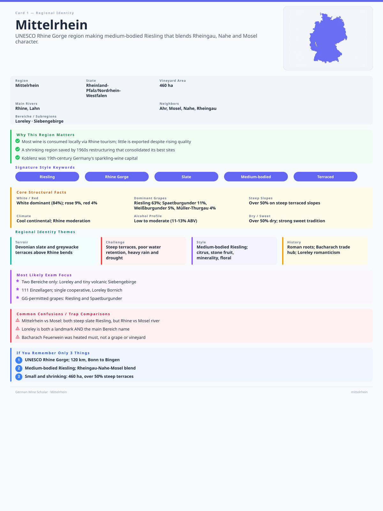

+++
title = 'GWS #4: Mittelrhein'
date = 2026-08-29T18:45:03+08:00
draft = false
categories = ["wine",]
featuredImage = "/images/mittelrhein.webp"
tags = ["wine", "certification"]

+++

Selbst für Liebhaber deutscher Weine dürfte es angesichts der außergewöhnlich kleinen Anbaufläche nicht leicht sein, eine Flasche vom **Mittelrhein** zu finden: Mit gerade einmal 439 ha Rebfläche ist er derzeit Deutschlands kleinstes Weinanbaugebiet. Eigentlich schade, denn die Landschaft ist überaus eindrucksvoll: Der mächtige Rhein drängt unermüdlich talwärts, flankiert von steilen, terrassierten Weinbergen, während mittelalterliche Burgen und malerische kleine Ortschaften seinen Lauf säumen. Dieser Anblick beflügelte im Zeitalter der Romantik die Fantasie so manches Künstlers und fand seinen Widerhall gleichermaßen in Gemälden, Gedichten und Erzählungen.

Dies bietet uns allerdings schon ein erstes Indiz dafür, warum die Rebfläche heute nur noch etwa ein Fünftel ihres Höchststands um 1900 beträgt: Die Steillagen können zwar hervorragende Weine hervorbringen und bieten gegenüber flachen Lagen einige Vorteile, zugleich ist ihre Bewirtschaftung jedoch arbeitsintensiv und bringt eigene Herausforderungen mit sich, darunter Erosion und die schwierige Wasserversorgung, besonders in Zeiten des Klimawandels. Historisch gewann die Region an Bedeutung, weil der Rhein im Mittelalter eine der wichtigsten Verkehrsadern darstellte. Mit der Industrialisierung, Reblaus und anderen Schädlingen sowie veränderten Märkten setzte jedoch ein Niedergang ein.

Dennoch hat die Region einige interessante Weine zu bieten. Einst berühmt für ihren *Feuerwein*, widmet sie sich heute vor allem dem Riesling, der ebenso wie Weißburgunder, Spätburgunder und Müller-Thurgau gut an die Schieferböden und das überwiegend kontinentale Klima der Region angepasst ist. Der Rhein wirkt temperaturausgleichend und reflektiert zusätzliche Wärme in die Weinberge, während die umliegenden Höhenzüge, darunter der Hunsrück im Westen und der Taunus im Osten, das enge Tal abschirmen. So können die Trauben selbst dort ausreifen, wo die nördlichen Ausläufer der Region über den 50. Breitengrad hinausreichen.

# Mittelrhein in Zahlen

# Ein kurzer historischer Überblick

- **1. Jahrhundert**: Die Römer führen den Weinbau ein; mit dem Ende der römischen Herrschaft wird der Weinbau weitgehend eingestellt
- **7. Jahrhundert**: Der Bischof von Köln trägt maßgeblich dazu bei, den Weinbau am Mittelrhein wiederzubeleben
- **11.–14. Jahrhundert**: Unterstützt durch Klöster und andere kirchliche Grundbesitzer breitet sich der Weinbau entlang des Rheins deutlich aus; terrassierte Weinberge entwickeln sich zu einem wichtigen Merkmal der Region
- **13. Jahrhundert**: Bacharach entwickelt sich zu einem bedeutenden Zentrum für Weinhandel und Warenumschlag; 1254 tritt die Stadt dem Rheinischen Städtebund bei, der Sicherheit und Handel entlang des Rheins fördert
- **15.–19. Jahrhundert**: Bacharach ist für seinen *Feuerwein* berühmt, bei dessen Herstellung der Most oder der teilweise vergorene Wein erhitzt wird, um die Gärung zu beschleunigen und einen kräftigeren, süßeren Stil zu erzeugen. Exportiert wird er insbesondere nach Großbritannien und in die Niederlande
- **19. Jahrhundert**: Koblenz entwickelt sich zu einem bedeutenden Zentrum der Schaumweinproduktion und weist zeitweise die höchste Zahl an *Sektkellereien* in Deutschland auf; zugleich ziehen die Loreley-Sage und die Rheinromantik Künstler und Reisende in die Region
- **20. Jahrhundert**: Nachdem der Weinbau zunächst floriert und die Region für ihre hochwertigen Weine bekannt ist, führen Reblaus und veränderte Verbraucherpräferenzen zu einer Degression; später verdrängt die Massenproduktion zunehmend die traditionelle Weinbereitung, sodass nach dem Zweiten Weltkrieg vor allem Massenweine hergestellt werden
- **Heute**: Kleinbetriebliche Strukturen dominieren weiterhin; ab den 1960er-Jahren verbessert die Flurbereinigung die Bewirtschaftbarkeit vieler Steillagen, auch wenn die gesamte Rebfläche der Region weiter zurückgeht

# Prägende Rebsorten und Stilistik

**Riesling** dominiert am Mittelrhein und macht rund 63 % der gesamten Rebfläche aus. Stilistisch erinnert er an Rieslinge aus Rheingau, Nahe und Mosel und vereint dabei Merkmale aller drei Regionen: Die Weine haben meist einen mittleren Körper und zeigen Aromen von Zitrus- und Steinobst, ergänzt durch mineralische und florale Noten. Zwar werden sowohl trockene als auch süße Varianten erzeugt, doch gerade restsüße Rieslinge gehören zu den besonderen Stärken der Region – von *feinherb* bis hin zur *Trockenbeerenauslese*.

**Spätburgunder** steht an zweiter Stelle und nimmt rund 11 % der gesamten Rebfläche ein. Die lange Vegetationsperiode bringt saftige, geschmeidige Pinots mit mittlerem Körper hervor, die dank der höher gelegenen Weinberge ihre ausgeprägte Säure bewahren können.

Die **Weißburgunder** der Region sind für ihr Zusammenspiel von Pfirsich- und Blütenaromen, moderate Säure und eine cremige Textur bekannt.

Zum Zeitpunkt der Veröffentlichung dieses Artikels führt die Datenbank des VDP vier Weingüter für die Region auf. Diese dürfen VDP.GROSSES GEWÄCHS (GG) aus den folgenden Rebsorten erzeugen:

- Riesling
- Spätburgunder

Falls ihr einmal in der Region seid, kann ich einen Besuch nur wärmstens empfehlen, insbesondere an der majestätischen Loreley. Doch selbst wenn es euch nicht dorthin verschlägt, gelingt es den Weinen der Region, zumindest einen Teil ihrer Magie und Schönheit einzufangen – einen Versuch sind sie definitiv wert!

# Karteikarte zur Wiederholung

