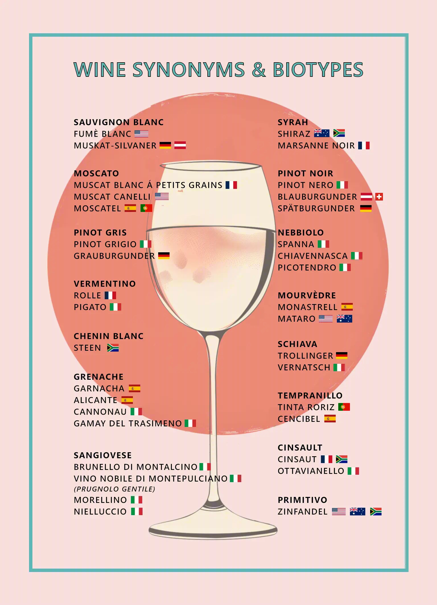

+++
title = 'Weinsynonyme'
date = 2024-11-20T12:50:03+08:00
draft = false
categories = ["wine","recommendation"]
featuredImage = "/images/wine_synonyms.webp"
tags = ["wine"]
+++

Haben Sie schon einmal zwei verschiedene Weine probiert und waren sich sicher, dass sie aus derselben Rebsorte hergestellt wurden? Nun, vielleicht lagen Sie genau richtig! Viele Rebsorten haben in unterschiedlichen Regionen verschiedene Namen, und manche weisen sogar leichte genetische Abweichungen auf, die als Biotypen bekannt sind.

Ein Synonym ist einfach ein anderer, regionaler Name für dieselbe Rebsorte – genetisch identisch, aber je nach Anbaugebiet anders bezeichnet.

Ein Biotyp hingegen bezieht sich auf eine Variante der Rebsorte mit subtilen genetischen Unterschieden oder Variationen in ihrer Zusammensetzung, ihrem Verhalten oder ihrer Anpassungsfähigkeit. Diese Unterschiede entstehen oft durch natürliche Mutationen oder Umwelteinflüsse, sind aber nicht so ausgeprägt, dass sie als völlig neue Sorte gelten könnten.

Beispiele für **Synonyme** (also unterschiedliche Namen für dieselbe Rebsorte) sind:
- Blauburgunder oder Spätburgunder für Pinot Noir
- Shiraz für Syrah

Beispiele für **Biotypen** (also lokale Varianten derselben Rebsorte) sind:
- Brunello di Montalcino ist ein Biotyp von Sangiovese
- Pigato ist ein Biotyp von Vermentino

Noch unsicher? Schauen Sie sich die Infografik unten an!

