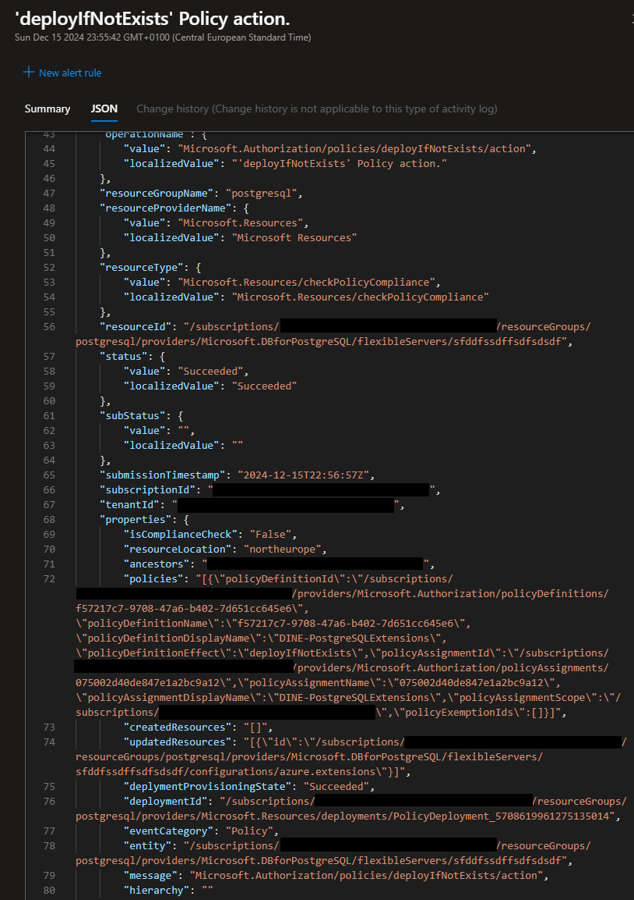

+++
title = 'Advanced Azure Policy Techniques #1: Extend Arrays Using DINE'
date = 2024-12-15T18:45:03+08:00
draft = false
categories = ["technology"]
featuredImage = "/images/azure_policy_1.webp"
tags = ["azure"]


+++

This is the first post of a series showing some more advanced Azure Policy techniques that might not be featured so frequently, but can be very useful if the situation requires it.

Have you noticed that if you use a DINE policy to update a property on an existing resource where the property type is an array, it will overwrite the existing array with the one that you configured in the DINE policy? That behavior makes sense if we look at what a DINE policy is supposed to do - update a resource using a deployment template.

However what if you want to **update** an array rather than overwrite it? Examples of where this behavior could be desired:
- on a PostgreSQL flexible server, update the list of extensions that you want to allow (i.e. whitelist)
- on any resource with an IP based network whitelist, update the whitelist without removing already configured settings
- if you want to add tags to a resource (although note that you can also use **Modify** policies for that, rather than DINE)

So now that we have seen some use cases, how can we update properties that are collections rather than single values? The short answer is: **Chained deployments** utilizing the fact that deployments are able to have **outputs**.

As you can see on the PostgreSQL flexible server extension update below, we are using two deployments within the DINE policy, one that retrieves the resources without updating it (but outputting the current resource information) and one that will take that information and update the resource. The idea here is that we want to add the pgaudit extension to the list of extensions already being whitelisted. 

```
{
    "properties": {
        "displayName": "DINE-UpdateExtensions",
        "description": "Deploy if not exist, add pgaudit to flexible server extensions",
        "parameters": {
            "effect": {
                "type": "String",
                "allowedValues": [
                    "auditIfNotExists", 
                    "deployIfNotExists"
                ]
            }
        },
        "policyRule": {
            "if": {
                "allOf": [
                    {
                        "field": "type",
                        "equals": "Microsoft.DBforPostgreSQL/flexibleServers"
                    },
                    {
                        "field": "Microsoft.DBforPostgreSQL/flexibleServers/state",
                        "equals": "Ready"
                    }
                ]
            },
            "then": {
                "effect": "[parameters('effect')]",
                "details": {
                    "type": "Microsoft.DBforPostgreSQL/flexibleServers/configurations",
                    "name": "azure.extensions",
                    "existenceCondition": {
                        "field": "Microsoft.DBforPostgreSQL/flexibleServers/configurations/value",
                        "contains": "pgaudit"
                    },
                    "deployment": {
                        "properties": {
                            "mode": "incremental",
                            "parameters": {
                                "resourceName": {
                                    "value": "[field('fullName')]"
                                },
                                "resourceGroupName": {
                                    "value": "[resourceGroup().name]"
                                }
                            },
                            "template": {
                                "$schema": "https://schema.management.azure.com/schemas/2015-01-01/deploymentTemplate.json#",
                                "contentVersion": "1.0.0.0",
                                "parameters": {
                                    "resourceName": {
                                        "type": "string",
                                        "defaultValue": "[field('fullName')]"
                                    },
                                    "resourceGroupName": {
                                        "type": "string",
                                        "defaultValue": "[resourceGroup().name]"
                                    }
                                },
                                "variables": {
                                    "deploymentGetName": "[concat('PGExtensions-Get-', parameters('resourceName'))]",
                                    "deploymentUpdateName": "[concat('PGExtensions-Update-', parameters('resourceName'))]"
                                },
                                "resources": [
                                    {
                                        "type": "Microsoft.Resources/deployments",
                                        "apiVersion": "2020-06-01",
                                        "name": "[variables('deploymentGetName')]",
                                        "properties": {
                                            "mode": "Incremental",
                                            "template": {
                                                "$schema": "https://schema.management.azure.com/schemas/2015-01-01/deploymentTemplate.json#",
                                                "contentVersion": "1.0.0.0",
                                                "resources": [],
                                                "outputs": {
                                                    "serverExtensions": {
                                                        "type": "object",
                                                        "value": "[reference(resourceId(parameters('resourceGroupName'), 'Microsoft.DBforPostgreSQL/flexibleServers/configurations', parameters('resourceName'), 'azure.extensions'), '2021-06-01', 'Full')]"
                                                    }
                                                }
                                            }
                                        }
                                    },
                                    {
                                        "type": "Microsoft.Resources/deployments",
                                        "apiVersion": "2020-06-01",
                                        "name": "[variables('deploymentUpdateName')]",
                                        "properties": {
                                            "mode": "Incremental",
                                            "expressionEvaluationOptions": {
                                                "scope": "inner"
                                            },
                                            "parameters": {
                                                "extensions": {
                                                    "value": "[reference(variables('deploymentGetName')).outputs.serverExtensions.value.properties.value]"
                                                },
                                                "serverName": {
                                                    "value": "[parameters('resourceName')]"
                                                }
                                            },
                                            "template": {
                                                "$schema": "https://schema.management.azure.com/schemas/2015-01-01/deploymentTemplate.json#",
                                                "contentVersion": "1.0.0.0",
                                                "resources": [
                                                    {
                                                        "type": "Microsoft.DBforPostgreSQL/flexibleServers/configurations",
                                                        "apiVersion": "2021-06-01",
                                                        "name": "[concat(parameters('serverName'), '/azure.extensions')]",
                                                        "properties": {
                                                            "value": "[concat(parameters('extensions'), ',pgaudit')]",
                                                            "source": "user-override"
                                                        }
                                                    }
                                                ],
                                                "parameters": {
                                                    "extensions": {
                                                        "type": "string"
                                                    },
                                                    "serverName": {
                                                        "type": "string"
                                                    }
                                                },
                                                "outputs": {}
                                            }
                                        }
                                    }
                                ]
                            }
                        }
                    }
                }
            }
        }
    }
}


```

For this example I created a fresh server and activated the pgcrypto extension. As you an see this is the only extension currently allowed:


Then I created a new policy definition based on the template above and assigned it to my subscription (and associating it with an UAMI that has Contributor rights to the PostgreSQL flexible server). After creating a remediation tasks, we can see the policy took effect and now the pgaudit extension has been added to the whitelist as well:



I hope this article was useful to you, see you next time!
