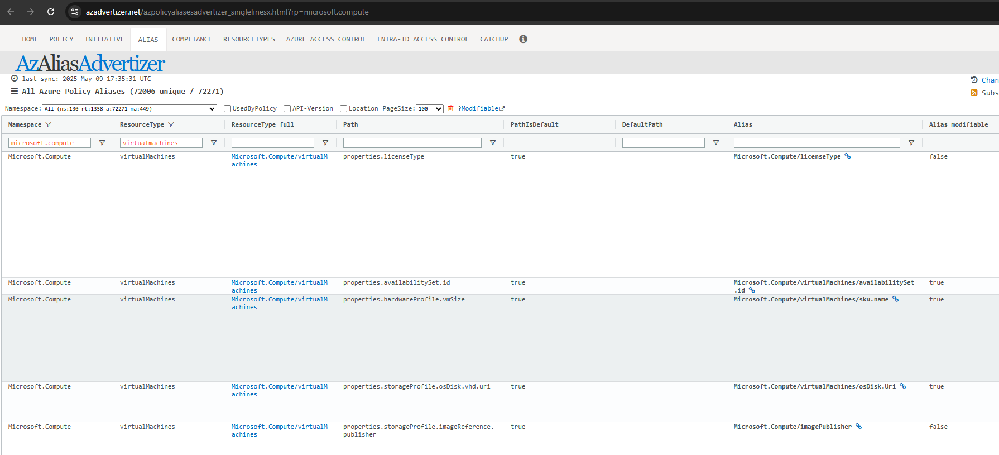

+++
title = 'Advanced Azure Policy Techniques #3: Of Policy Endpoints and Subresources'
date = 2025-05-12T12:50:03+08:00
draft = false
categories = ["technology","recommendation"]
featuredImage = "/images/azure_policy_3.webp"
tags = ["azure"]

+++

In the third edition to the series, I would like to explain how we can actually determine when a policy *can* or *should* be used to achieve our goal.

First, let's recall how Azure Policy works: By interacting with the Azure Resource Manager (ARM) API. This already shows us the first limitation: We will not be able to use a policy to restrict the behavior of an Azure resource or service *if* the level that we want to restrict is not accessible via the ARM API. This includes for example:
- data plane restrictions (e.g. preventing user or schema changes on databases like MSSQL or PostgreSQL)
- OS level restrictions (e.g. preventing the manual creation of root users)

A practical illustration here is that we can use a (DeployIfNotExists) policy to whitelist the pg_audit extension on Azure PostgreSQL databases, but we cannot activate the extension on the database level - for that a database operation is needed (i.e. someone with sufficient rights logging in and executing "CREATE EXTENSION pg_audit"). What is possible is to use a DINE policy to add another admin account to the admin account collection, which does trigger the creation of the account on the Azure PostgreSQL database).

So to paraphrase Arthur Conan Doyle's Sherlock Holmes *"If we eliminate the impossible, whatever remains, however unlikely, must be the truth"* - does it mean everything the sun of the ARM API touches can be restricted by policy? Actually, as it turns out,  **no**. 

Not all resources, endpoints or resource properties are created equal. A first differentiation would be that of resources and subresources. While resources can exist on their own, **subresources cannot** - their lifecycle is tightly bound to that of their parent resource. This has consequences for targeting them with policies: Some sub (or child) resources can be targeted (though you usually also need to reference the parent resource, so that the Azure API can find it), while others cannot. For example IP configurations or resource tags can be targeted.
Another dimension is the resource itself - not all properties are targetable and some can only be targeted by certain policies and not others. Finally we also need to consider dependencies - some changes we want to achieve might be too complex for policy use cases, as they require steps on multiple resources being executed in a specific sequence for example. 

So now that we have the theory out of the way, what does that mean for us practically? How should we approach the design of a new policy?
1. Check if there is already a [built-in policy](https://learn.microsoft.com/en-us/azure/governance/policy/samples/built-in-policies) or template in the [official repo](https://github.com/Azure/azure-policy) that covers our use case as well as [azadvertizer](https://www.azadvertizer.net) (which is not an official Microsoft resource but an independent website)
2. Use a search engine to research (or an AI like Copilot to help you with the research) to see if a policy that fits your requirements was already created and documented by someone else
3. If you have not found a template during coursery research, that means we have to build it ourselves. For that it's best to start with the official Azure ARM documentation and API documentation for the resource, in our example let's assume a Virtual Machine. Review these pages see what properties are *potentially* exposed and how the resource is structured.
4. Now that we know more about the resource definition, we need to check what properties we can actually target with policies. For that we navigate to [azadvertizer](https://www.azadvertizer.net). This website is incredibly useful as it shows policy and initiative definitions but also lists **aliases**. So for example if we go to the [alias](https://www.azadvertizer.net/azpolicyaliasesadvertizer_singlelinesx.html?rp=microsoft.compute) section and filter for **Namespace: Microsoft.Compute** and **ResourcType:virtualMachines** we can see all properties, paths and aliases as well as additional information:

5. Now that we know the resource structure, we know the paths and we know if it is modifiable (i.e. can be targeted by a policy with *modify* effect), we need to answer the following questions:
  - Is it possible to achieve our goal with a policy (i.e. are the resource / resource paths available to the policy engine?)?
  - Which policy effect do we need to select to reach our goals (Deny? Modify? DeployIfNotExists?)?
  - How do we need to structure our policy (e.g. if we target a child resource, we need to reference the parent resource first, the child second)?
6. Based on how we answered the questions, we can then either start from scratch or what I recommend, from a copy of a policy targeting the same resource type - this way we can copy the beginning part and overall structure and only need to amend conditions and effects. Of course you can also let AI help you generate the template, though be prepared for hallucinations - best is to feed it all the information you collected during your research (so what properties can be changed and how the structure looks like), which dramatically increases the likelihood of the AI providing you with sensible answers.
7. Deploy the policy, assign it and create a standard test plan that contains the test cases you want to execute (remember you need *at least* a case targeting a newly created resource and an update to an **preexisting** resource!):
  - **Context**: Scope and business case for the change (i.e. value), description of changes
  - **Prerequisite**: For example Contributor rights to an Azure subscription as well as ensuring the policy is assigned to that subscription
  - **Steps to reproduce**: What steps need to be followed in order to be able to reproduce the test case
  - **Expected behavior**: The chain of events you expect to see, e.g. policy blocks resource creation (Deny) or updates resource (Modify, DeployIfNotExist)
  - **Actual behavior**: The behavior you actually observed after executing the test case
  - **Test status**: Result of test, usually either PASS or FAIL
  - **Test evidence**: Evidences such as screenshots or activity log exports
  
Remember that you can manually trigger Azure policy remediations, but make sure to tick the box that "refreshes the resource state" before execution, or the policy (if DINE) might not trigger for the resource that you want to test it for. You can also target a specific subscription if you want to limit the scope. Allow up to 10 minutes for the policy to be executed (-> check the activity logs) and the compliance state to be updated.

And voilà, you've just created a new policy from scratch and tested it (hopefully) thoroughly. Great job!
