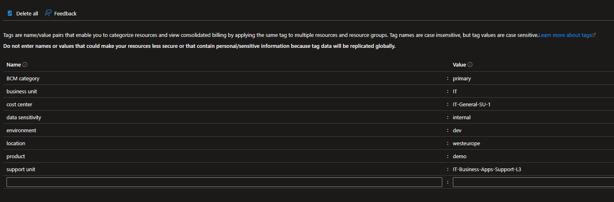

+++
title = 'Advanced Azure Policy Techniques #4: Targeting policies using scopes and tags'
date = 2025-08-07T18:45:03+08:00
draft = false
categories = ["technology","recommendation"]
featuredImage = "/images/azure-policy-4.webp"
tags = ["azure"]


+++

Hello again! Today, I want to shine a light on a powerful but often overlooked Azure Policy mechanism: resource tags. While widely available, they're rarely used to their full potential, especially when it comes to policy scoping. What do Azure resource tags have to do with policies you might ask - the short answer is that since tags can be described as both meta and child resources that are available on every Azure resource and service offering, this makes them a prime candidate for laser-focused policy scoping. 

In fact we can (and have to) use policies twofold for this to work: On the one hand to enforce a predetermined set of mandatory tags and allowed tag values and on the other hand to scope policies in accordance with these tag mappings.

But why do we need this technique in the first place when we can already scope policies on management group, subscription and resource group level and also define exclusions for specified resource groups or resources? If we recap, we have - at the moment of writing - the following options to restrict the area of effect of a policy:

- **Scope**: management group, subscription, resource group
- **Exclusions**: list of resource groups or resources the policy will ignore
- **Resource selectors:** additional filters for resourceType(s), resourceLocation(s) or resourceWithoutLocation (i.e. proxy resources)
- **Policy rule**: Resourcetype, location and other exposed properties

So as we can see, we have an extensive set of levers and knobs with which we can restrict the target area of our policy. A closer look at the options also shows us that we can tackle exclusion and resource selectors in the policy rule itself, however it is easier to assign and review policies when using these dedicated fields. 

Let’s consider a real-world scenario: We want to create a policy that disables access key based authentication for storage accounts but only for subscriptions that are considered "production", for applications processing and storing confidential data, however our HR app needs to be excluded tactically  ...  how do you set the scope? Of course we could use nested management groups, but in this kind of multi-dimensional challenge, these would be difficult to maintain and too rigid for our requirements.

Tags give us a convenient way to provide an additional layer of scoping without the need to manually adopt the scope or change the composition of management groups, which ideally should reflect the organization's structure and therefore remain relatively stable. It also allows us to easily roll-out changes, something I will be exploring in greater detail in a future post. For example, you could roll out a v2 of a policy scoped only to subscriptions tagged as "dev", while keeping v1 active everywhere else -  this provides a simple yet effective and low-risk approach on how to deploy changes through your environments. 

If that all sounded a bit too vague, don't worry, I'll walk you through a practical example. Let's pay another visit to our dear old friend, Fabricorp. The client tells us they're launching a joint venture with ACME Inc., requiring a new, independent Azure environment. We are to set up the tenant and initial subscriptions, and, more importantly, also design and configure the security and compliance baseline.

# Step 1: Determine tagging strategy

Of course setting up a new environment (i.e. Azure tenant, subscriptions, networking, security, monitoring, etc.) is a complex endeavor and there is a lot of good, comprehensive documentation out there, for example the [Microsoft Cloud Adoption Framework for Azure]([Microsoft Cloud Adoption Framework for Azure — Cloud Adoption Framework | Microsoft Learn](https://learn.microsoft.com/en-us/azure/cloud-adoption-framework/)), so I will not go into greater detail here but instead focus on the methodical usage of Azure Resource Tags. 

Assigning tags to our resources and metaresources (such as resource groups and subscriptions) allows us to categorize them across multiple dimensions. 

Example use cases:

- **environment**: What environment the service belongs to e.g. dev, test, staging, prod
- **application / product association**: e.g. sales application, CRM, HR tools
- **business unit / OE:** Which BU owns the resources / is responsible for them, e.g. sales, HR, IT
- **emergency contacts / responsible operations team**: Who to contact in case of issues, i.e. a mailbox, teams channel or support group to which problems should be reported 
- **cost center / billing code**: Where should costs internally be allocated to?
- **data sensitivity:** Data confidentiality categories, such as public, internal, confidential, secret
- **BCM information**: Primary / secondary / tertiary site, active or passive and other relevant data
- **location(s)**: (primary) location of resources or location(s) of virtual networks, that are available in the resource group or subscriptions. This can be important in case you assign RBAC roles to your users on sub or resource group level and centrally manage your networks, using for example a hub-and-spoke design pattern. 

This is what a resource group could look like when a tagging strategy is enforced:


# Step 2: Create policies to enforce tagging strategy

Once we have defined the composition of our tagging strategy, we need to make sure that this strategy is applied consistently. There are multiple facets to the implementation:

- Document the mandatory tags as part of your overall cloud setup in the relevant documents or internal documentation pages

- Update internal IaC templates (such as ARM, Bicep or Terraform) and CI/CD deployment pipelines to set these tags were suitable. This is especially pivotal for subscription automation pipelines (if present)

- Create policies to enforce (1) no resource can be created without the mandatory tags present and that the standardized tags have a valid, allowed value (deny) and (2) that mandatory tags are inherit if not set deliberately (modify)

## Denying the creation of resources without mandatory tags

We can use a policy like the one below to prevent the creation of any resource group or resource without a valid tag or with a tag value that we do not allow (for example if we have only "dev" and "prod" environments, we should not allow any other value to ensure a uniform estate).

```
{
  "properties": {
    "displayName": "Deny-RGMissingEnvTag",
    "description": "Prevents the creation of a resource group without a valid environment tag",
    "parameters": {
      "allowedEnvValues": {
        "type": "Array",
        "metadata": {
          "displayName": "allowedEnvValues",
          "description": "List of acceptable values for the environment tag"
        }
      }
    },
    "policyRule": {
      "if": {
        "allOf": [
          {
            "field": "type",
            "equals": "Microsoft.Resources/subscriptions/resourceGroups"
          },
          {
            "not": {
              "field": "tags['environment']",
              "in": "[parameters('allowedEnvValues')]"
            }
          }
        ]
      },
      "then": {
        "effect": "deny"
      }
    },
    "versions": [
      "1.0.0"
    ]
  }
}
```

## Inheriting tags from subscription to resource group (or resource group to resource)

The next step is to establish inheritance from the subscription level. This is an optional step and it should be noted that this whole setup only works if we can ensure that unauthorized personnel cannot change the tags on subscription level. Ideally you allow the creation of new subscriptions only programmatically (e.g. through self-service subscription automation pipelines using blueprints, deployment stacks or individual IaC templates) and to selected, authorized personnel (i.e. Ops/SREs). Establishing tag inheritance means we simplify deployment operations for the application teams, as they don't have to specify the mandatory tags we defined, but instead these are inherited from the subscription layer when feasible. You can achieve this with a policy template like the one below:

```
{
  "properties": {
    "displayName": "Modify-InheritTagFromSubToRG",
    "description": "Enforces inheritance of tags from subscription to resource groups",
    "parameters": {
      "nameOfTag": {
        "type": "String",
        "metadata": {
          "displayName": "nameOfTag",
          "description": "Name of target tag, e.g. environment"
        }
      }
    },
    "policyRule": {
      "if": {
        "anyOf": [
          {
            "allOf": [
              {
                "field": "type",
                "equals": "Microsoft.Resources/subscriptions/resourceGroups"
              },
              {
                "field": "[concat('tags[', parameters('nameOfTag'), ']')]",
                "exists": false
              }
            ]
          },
          {
            "allOf": [
              {
                "field": "type",
                "equals": "Microsoft.Resources/subscriptions/resourceGroups"
              },
              {
                "value": "[resourceGroup().tags[parameters('nameOfTag')]]",
                "notEquals": "[subscription().tags[parameters('nameOfTag')]]"
              }
            ]
          }
        ]
      },
      "then": {
        "effect": "modify",
        "details": {
          "conflictEffect": "audit",
          "roleDefinitionIds": [
            "providers/microsoft.authorization/roleDefinitions/b24988ac-6180-42a0-ab88-20f7382dd24c"
          ],
          "operations": [
            {
              "operation": "addOrReplace",
              "field": "[concat('tags[', parameters('nameOfTag'), ']')]",
              "value": "[subscription().tags[parameters('nameOfTag')]]"
            }
          ]
        }
      }
    },
    "versions": [
      "1.0.0"
    ]
  }
}
```

# Step 3: Use tagging strategy to scope policies

Finally after having defined and enforced our obligatory tags and setup inheritance, we can now use these tags to scope policies we create. For example, we can define that we do not want to allow public access to blobs in storage accounts if they are deployed in any non-dev environment, while for dev we allow it since our internal guidelines only approve the usage of public data (public document or synthetic test data for example) in the dev environment. 

```
{
  "properties": {
    "displayName": "Deny-SAPublicAccessNonDev",
    "policyType": "Custom",
    "mode": "All",
    "description": "Denies public access on storage accounts unless the environment tag is explicitly set to 'dev'.",
    "metadata": {
      "version": "1.0.0",
      "category": "Storage"
    },
    "policyRule": {
      "if": {
        "allOf": [
          {
            "field": "type",
            "equals": "Microsoft.Storage/storageAccounts"
          },
          {
            "field": "tags['environment']",
            "notEquals": "dev"
          },
          {
            "field": "Microsoft.Storage/storageAccounts/allowBlobPublicAccess",
            "equals": true
          }
        ]
      },
      "then": {
        "effect": "deny"
      }
    }
  }
}
```

But like I said, we could easily extend this template and filter based on any number of tags, such as data sensitivity, product, OE or other specialized tags. And that's basically the short version of how we can use policies to implement a cogent, comprehensive tagging strategy **and** use the tags to target our policies more accurately. Stay tuned for the next post where I'll go deeper into how we can version and continuously deploy policies in a complex enterprise environment.
