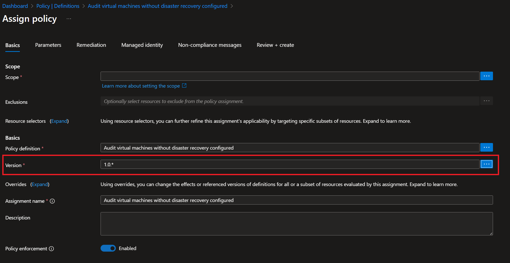
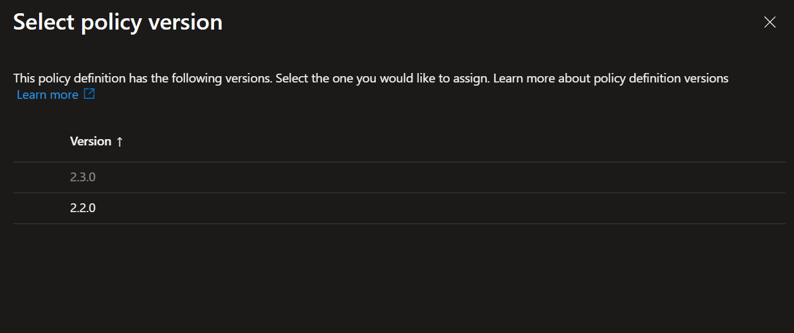

+++
title = 'Advanced Azure Policy Techniques #5: Versioning and rollout'
date = 2026-01-20T18:45:03+08:00
draft = false
categories = ["technology","recommendation"]
featuredImage = "/images/azure-policy-5.webp"
tags = ["azure"]

+++

Once you have set up your policy estate, I'm afraid the work doesn't quite stop. While you have (hopefully) a solid set of initiatives, policies and assigments that ensure all components meet your minimum security and compliance baseline, new developments will require your vigilance and adaptations to your policies – driven by new threats, new cloud offerings, or changes to the structure of your cloud resources and services. 

If you are using *built-in* policies, you're in luck, Microsoft will take care of maintenance and updates, as they are part of Microsoft's *secure by default* paradigm. Of course your resources belong to you, so while Microsoft will periodically review and adapt these policies, they are versioned too and applying a new version is up to you, since otherwise changes to the policy definition could cause problems for your resources (e.g. by enforcing TLS 1.3 when your legacy application might only support TLS 1.2). 

Especially *DINE* policies that deploy changes, or *Deny* policies preventing a non-compliant resource from being updated, would be very detrimental if rolled out automatically without warning and validation on your side. Azure does allow you to optionally choose to automatically enroll for minor version changes when assigning a built-in initiative, so updates are applied without any action required from your side.  So how do built-in policies handle versioning and rollout?

# Azure Policy Built-in Versioning

Since July 2024, Azure built-in policy initiatives and individual policy definitions have a version field, which is usable via the GUI or the API. If there are multiple versions available for the policy, it will list all options and allow you to choose as well as decide whether you want automated minor version policy updates and whether you would like to update. Minor version changes should not contain any breaking changes and are generally safe to apply, while major versions should be vetted before assignment.

In practice, all you need to do is specify the version when assigning the policy:

If multiple versions are available, the dialogue will show you all supported versions:

And as mentioned, you can optionally enroll for automatically applying minor version changes as well as specify whether preview versions should be included:

While most actively maintained built-in policies now expose versioning metadata, **not every legacy policy definition currently offers multiple selectable versions**.

For more information, you can refer to the [official announcement](https://techcommunity.microsoft.com/blog/azuregovernanceandmanagementblog/public-preview-announcement-azure-policy-built-in-versioning/4186105) or this short [video demonstration](https://www.youtube.com/watch?v=eejdoDgofZ8).

# Custom Policy Versioning

Of course built-in policies are only one part of the equation – more than likely you'll also be using custom policies. So how do we deal with versioning those?

Unlike built-in policies, Azure Policy does not enforce or interpret semantic versions for custom definitions, which forces us to think of an alternative approach.

First of all we need to ensure that we know which versions of our policies exist. We could do this inside the policy itself, e.g. in the comment field or using a custom tag, since policy names do not have to be unique. But I would discourage this approach as it makes it difficult to spot different versions on first glance. A simple alternative is to just make the version (or at least major version) part of the policy name, such as **Deny-SAPublicAccess-V1**. If you envision a lot of different versions, you can also extend your naming convention to include minor and patch versions, e.g. **Deny-SAPublicAccess-V1.1**. 

If you want to keep your environment even simpler, you could also adopt a blue/green-style approach. In this model, your currently active policy remains **Deny-SAPublicAccess**, while the updated version is introduced as **Deny-SAPublicAccess-New**. Once testing and rollout are complete, the original definition is updated with the validated content, and the temporary policy can be unassigned or removed until the next iteration.

*Important note:  Make sure to keep your policy estate clean, i.e. minimize the number of policy definitions and assignments. The more policies you have, the slower operations (such as loading the list of your policies) can take and the more cluttered your environment looks. So only keep those policies that are currently actively assigned or will be assigned soon.*

Another word of advice here is to always deploy policies via CI/CD pipelines using infrastructure as code (IaC) templates for the policies itself, i.e. ARM or Bicep. Following the approach above with using naming convention based versioning and cleaning up unused policies only works if we keep the policy definitions and assignments in a repository, as this will allow us to see the different previous policy versions and the changes between them – thus maintaining a rigorous audit trail.

Secondly, we need to ensure that the different policy versions are assigned in a non-overlapping fashion. To understand how policies can be scoped, please refer to my [previous blog article]() on that subject.

# Policy Version Upgrade Rollout

For the actual rollout we just need to *marry* our naming approach with our scoping technique: 

1. First we deploy our new policy definition, e.g. **Deny-SAPublicAccess-V2**

2. We then ensure that the original policy, in our example **Deny-SAPublicAccess-V1**, is scoped so that it is not active for our development (or test) subscription(s)

3. Next we assign **Deny-SAPublicAccess-V2** in the opposite fashion, i.e. ensuring it is active for our development subscription(s), but not any other subscriptions

4. Now we can execute our test cases against the development subscription(s) for which we have scoped **Deny-SAPublicAccess-V2** and validate if our changes had the intended effect

5. After we tested, verified and documented our tests, we unassign policy **Deny-SAPublicAccess-V1** and update the policy assignment scope of **Deny-SAPublicAccess-V2** to cover all non-development subscriptions (i.e. the same scope as Deny-SAPublicAccess-V1). Optionally we can also delete the policy definition of our version 1.

And that is one possibility of how to create a straight-forward SDLC process for Azure policies. As a sidenote, it is also a good practice to describe the changes between versions in the comment field of the policy (or perhaps even better, to keep an internal, central documentation page of all your custom policies and their versions and add a link to the policy definition; this makes understanding what was changed and why the change was done much easier). 

I hope this article was useful to you and all the best for your next policy rollout.
