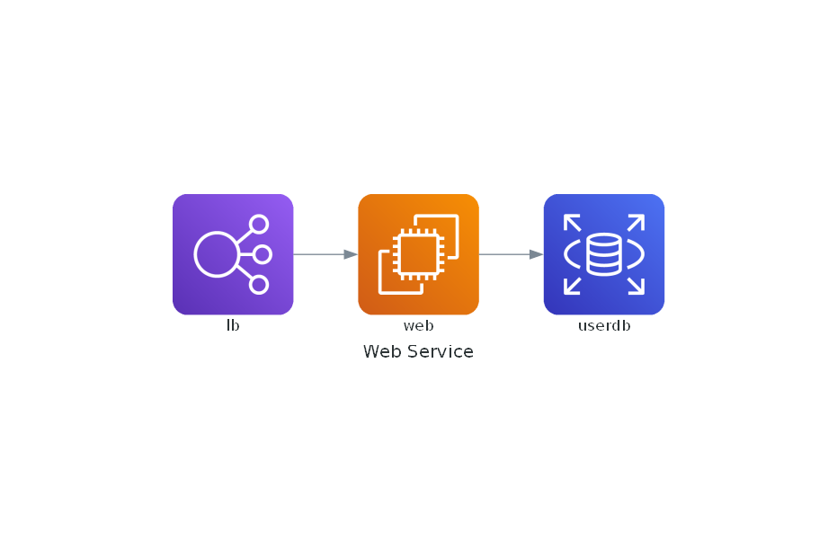
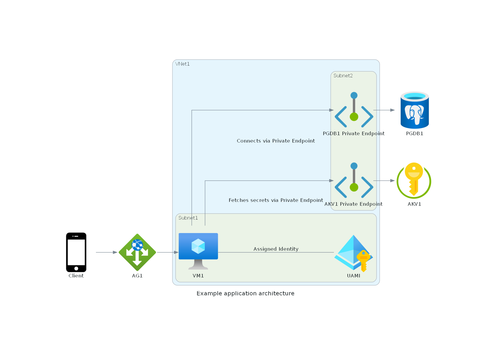

+++
title = 'Diagram as Code'
date = 2024-12-25T19:00:03+08:00
draft = false
categories = ["technology"]
featuredImage = "/images/diagram_as_code.webp"
tags = ["ai","copilot"]


+++

Communication is one of the key skills of any good solution architect. Not only should you be able to create sound, secure and performant software designs but you also need to be able to communicate these to stakeholders. 

To visualize these complex solutions, diagrams are a handy tool and there are a lot of different software offerings out there that help with this exact use case - most popular perhaps Microsoft Visio and Enterprise Architect. 

Although Visio is fairly workable, its UI can be cumbersome, and getting the diagrams to look *just right* can be a bit of a pain. So what to do if you are facing urgent deadlines but still want to create a visually appealing and clear visual representation of your design? Enter Mingrammer **Diagrams** and **ChatGPT**.

# Mingrammer Diagrams
## What is it and how does it compare to alternatives?
[Mingrammer Diagrams](https://diagrams.mingrammer.com/) is a python library that provides Diagrams as Code (DaC). This places it alongside **Mermaid.js** and **PlantUML**, which also allow the use of code or markup languages to define diagrams, which also allow you to use code/markup language to define diagrams.
The main differences between these tools are their syntax, the type of diagrams they support and the visuals they create (i.e. their visual elements, what kind of lines they use to connect the elements, colors, etc.). They all have their strength and weaknesses, but from personal experimentation, I prefer using Mermaid.js for use case and flow diagrams and Mingrammer diagrams for architecture / solution designs. 

I had three reasons for choosing Diagrams over the other tools:
- It has specific stencils for a lot of different cloud ecosystems, such as Azure, AWS or GCP, so you can create vendor specific diagrams rather than generic ones
- It is fairly easy to setup and use
- The DaC language is clear and condensed

## How can you use it?
Let's delve deeper. Mingrammer is fairly easy to set up. On Windows, ensure you have Python version 3.7 or above installed, along with Graphviz, which the Diagrams library uses to create graphics. So the instructions boil down to this:
1. Download [Graphviz](https://graphviz.gitlab.io/download/), extract the archive, and (if you don't export it to a standard program folder), add the location of the graphviz/bin path to the Windows *PATH* environment variable
2. Install the Python Diagrams library
```
py -m pip install diagrams
```
3. Create a new Diagrams Python file, e.g. example.py
```
# diagram.py
from diagrams import Diagram
from diagrams.aws.compute import EC2
from diagrams.aws.database import RDS
from diagrams.aws.network import ELB

with Diagram("Web Service", show=False):
    ELB("lb") >> EC2("web") >> RDS("userdb")
```

After that you only need to execute the file with Python, and you can see the created diagram image in the same folder.
```
py .\example.py
```



# ChatGPT
So now that we set up Diagrams, we have two options:
- learn the Diagram as Code language and create the images manually
- use a natural language prompt in ChatGPT so the AI helps us translate our requirements into code instead

Given that a good solution architect is always busy, let's opt for option 2 and get our mighty AI overlords to do the heavy lifting. 
Let's assume the following example:
- we have an **application** running on an **Azure Virtual Machine** called *VM1* (e.g. a Java application)
- the Virtual Machine has a **User Assigned Managed Identity (UAMI)** assigned to it
- the application connects to an **Azure PostgreSQL Flexible Server** database named *PGDB1* as data layer using the UAMI (which is added as EntraID admin on the flexible server)
- the VM is in *Subnet1* of our **Virtual Network** *VNet1*, the database has a **Private Endpoint** in *Subnet2*, also located in *VNet1*
- we have an **Application Gateway** *AG1* in front of *VM1* to enable access from outside our intranet
- the application uses its managed identity to fetch secrets from an **Azure Key Vault** *AKV1*

# Combining Diagrams and ChatGPT
Once we've documented our design, translating it into a ChatGPT prompt is straightforward. I will be using ChatGPT 4o for this example. We'll split the prompt into two parts, as ChatGPT may have difficulty getting all the class names correct. Reviewing it in a second step works better than combining the instructions into a single prompt.

## Prompt 1
```
I would like to use the python diagrams library to create an Azure solution architecture diagram. Please help me create suitable code. I would like to depict the following: 
- we have an **application** running on an **Azure Virtual Machine** called *VM1* (e.g. a Java application) 
- the Virtual Machine has a **User Assigned Managed Identity (UAMI)** assigned to it, which originates in Azure Active Directory
- the application connects to an **Azure PostgreSQL Flexible Server** database named *PGDB1* as data layer using the UAMI (which is added as EntraID admin on the flexible server) 
- the VM is in *Subnet1* of our **Virtual Network** *VNet1*, the database has a **Private Endpoint** in *Subnet2*, also located in *VNet1* 
- we have an **Application Gateway** *AG1* in front of *VM1* to enable access from outside our intranet 
- the application uses its managed identity to fetch secrets from an **Azure Key Vault** *AKV1*, which has a **Private Endpoint** in *Subnet2*
- show a client connecting to the application via AG1 from the public internet

As names for the elements, please only use the names I supplied, such as VM1 and AG1 without any additional words or descriptions. The name of the diagram should be *Example applicaton architecture*. Please ensure connections from resources go to private endpoints first if the target resource has a private endpoint associated with it.
```


## Prompt 2
```
Please check the exact class names for all resources as listed on the official diagrams.mingrammer site here: https://diagrams.mingrammer.com/docs/nodes/azure and https://diagrams.mingrammer.com/docs/nodes/generic . Do not generalize or pluralize. For example, use ApplicationGateway instead of ApplicationGateways. Be as detail oriented and precise as possible. Please correct any mistakes you find.
```

&nbsp;
Using these prompts, ChatGPT generated for me the following output:
```
from diagrams import Diagram, Cluster, Edge
from diagrams.azure.network import ApplicationGateway, VirtualNetworks, Subnets, PrivateEndpoint
from diagrams.azure.compute import VM
from diagrams.azure.database import DatabaseForPostgresqlServers
from diagrams.azure.security import KeyVaults
from diagrams.azure.identity import ManagedIdentities
from diagrams.generic.device import Mobile

with Diagram("Example application architecture", show=False):
    client = Mobile("Client")

    with Cluster("VNet1"):
        with Cluster("Subnet1"):
            vm1 = VM("VM1")
            uami = ManagedIdentities("UAMI")
            vm1 - Edge(label="Assigned Identity") - uami

        with Cluster("Subnet2"):
            pgdb1_endpoint = PrivateEndpoint("PGDB1 Private Endpoint")
            akv1_endpoint = PrivateEndpoint("AKV1 Private Endpoint")

    app_gateway = ApplicationGateway("AG1")
    database = DatabaseForPostgresqlServers("PGDB1")
    keyvault = KeyVaults("AKV1")

    client >> app_gateway >> vm1
    vm1 >> Edge(label="Connects via Private Endpoint") >> pgdb1_endpoint >> database
    vm1 >> Edge(label="Fetches secrets via Private Endpoint") >> akv1_endpoint >> keyvault
```

&nbsp;
Which after pasting the code into a Python file and executing it with Diagrams generates the following image:


Do note that the same input prompt does not necessarily produce the same output consistently and that sometimes the class names will still use wrong terms (e.g. plural instead of singular or ChatGPT will assume classes like "user" exists, even though they don't), but in this case you can just give the bot a small nudge and it should correct itself.

All in all the diagrams might not be quite as pretty as if produced manually using Visio or other tools, but for the amount of time needed, I would argue the results are quite excellent and can be readily adapted. An added bonus is that you also have a written description of the architecture handy, which is easier to store and share as well as great from an accessibility standpoint.

Happy diagramming!