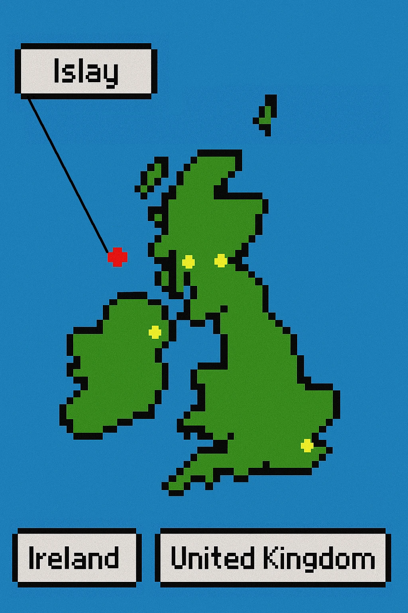
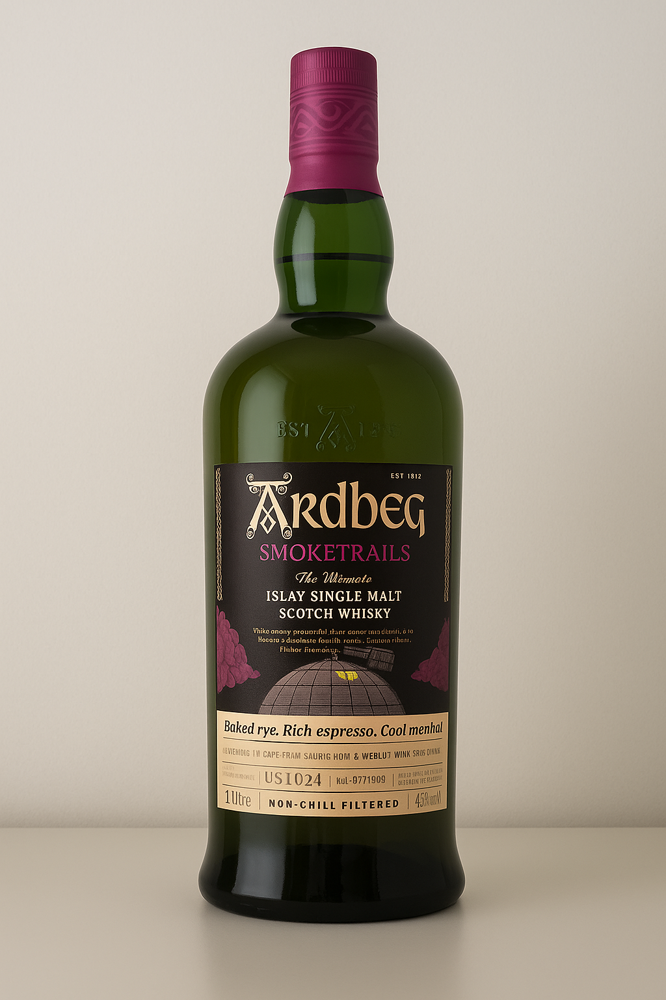
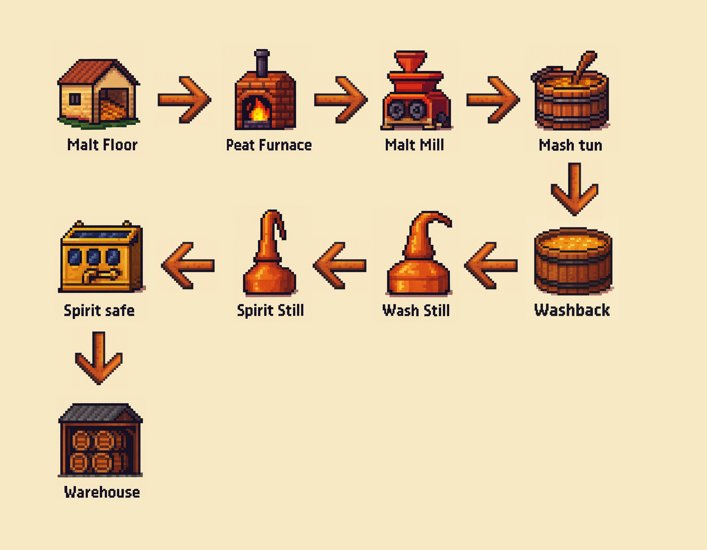
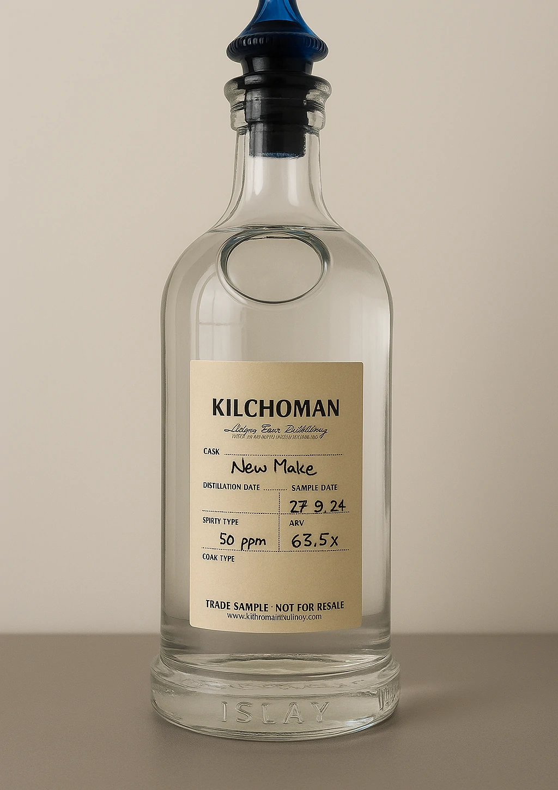

+++
title = 'A wee journey through Fèis Ìle 2025 - Part 1: Making whisky'
date = 2025-06-02T20:45:03+08:00
draft = false
categories = ["wine"]
featuredImage = "/images/whisky1.webp"
tags = ["wine", "basics"]
+++

Today, let’s step away from the world of wine and dive into another revered liquid: whisky. More specifically, I’d like to take you to Islay - a small Island west of Glasgow that is famous for its natural beauty and peated whisky. I had the chance to spend a few unforgettable days on this magical island, just in time for the **Fèis Ìle** whisky festival, that had connoisseurs of the peaty pour come from far and wide in pursuit of the perfect dram.

## Whisky and Wine

While production methods, alcohol and taste profiles differ significantly, whisky and wine might be closer than you'd think. Both make use of fermentation to transform their base ingredients in order to add aromas, depth and complexity and both use maturation in casks to further enhance and elevate the liquids. In fact, while whiskies were traditionally matured in bourbon or sherry casks (and the majority still are), today the field is much wider - many producers experiment with tequila, mezcal, cognac or calvados casks and repurposed  wine barrels are also employed at a higher rate - Bruichladdich for example uses old Amarone casks for the Bruichladdich 2010, Kilchoman matures its Muscatel Single Cask in fresh Muscat casks and Ardbeg just released the 3rd edition of its Smoketrails series which aged in barrels that previously contained precious Napa Valley Cabernet Sauvignon! 

# A short introduction into (Scottish) whisky making

## From Barley to Malt

For wine everything begins with the grape, for whisky it is the barley. Barley is cultivated, harvested, and then either delivered directly to distilleries or sent off to specialized malting plants. Today, few operations still carry out malting in-house, as it is more economical and scalable to leave that to specialized malting companies. Interestingly, much of the barley grown on Islay is still shipped to the mainland for malting before returning to the island for the fermentation and distillation. On Islay, only a few distilleries still malt some of their own barley on-site — such as Kilchoman and Bowmore, both of which maintain traditional floor maltings for part of their production. Lagavulin and Caol Ila, source their malt from Port Ellen Maltings, the island’s only industrial malting facility, which is owned by their parent company, Diageo. Malting itself is quite simple - the barley is left to germinate for about 3 days, which produces enzymes that are needed later in the process to convert starch into fermentable sugars, which the yeast will later consume to produce alcohol. 

Traditionally this meant putting the barley evenly on the ground of a warehouse (the malting floor), then after three days drying the barley to stop the germination (after all we don't want it to sprout completely) by drying it (in the "kiln") and then funnel the now "malted" barley - or *malt* into the mill. Many Islay whiskies are known for their peaty, smoky and medicinal aromas - this was traditionally due to the Island having an abundance of peat that was used for heating everything from houses to distilleries and when used for drying the malt, would impart the characteristic peat notes into the malt. Today the drying is mainly done using hot air and only a modest amount of peat is used to infuse the aroma into the malt by smoking it, similar to how salmon or BBQ meats are smoked, which requires less peat and is better for the environment.

The milling is another fascinating aspect. In Islay most distilleries have a malt mill produced by one of two companies: *Robert Boby Ltd.* and *Porteus*.  These machines are often over 70 years old and yet (with regular maintenance) they are still running flawlessly. A (not-so) fun fact: both companies eventually went out of business because their mills were too good - nobody ever needed to replace them. Now that’s real quality.

At any rate, the malt is ground by two sets of rolls into a coarse flour called grist, which has three main components:

- Husks (outer shell)
- Grits (middling particles)
- Flour (fine powder)

## Mash, Wort, and Wash

The grist looks remarkably similar to oatmeal or granola - and yes, it tastes like it too. It is then transported into a mash tun, where hot water (about 62°C initially, then hotter in subsequent stages) is sprinkled on it to activate the previously mentioned enzymes and break down the starch. The "wort" (the technical term for the resulting malt-water mixture minus the solids, which remain behind) is then sent via pipes into washbacks (huge containers either made of wood or steel), where yeast is added and the fermentation is started. Fermentation can take up to three days, resulting in a yellow, beer like liquid called the *wash* that exudes a strong smell reminiscent of bread, brioche, yeast and raw cider. Imagine it as a smoky beer with about 9% ABV - more yeast than finesse, but full of character and potential. The wash is then piped into the distillation room, home to two iconic copper stills: the **wash still** and the **spirit still**. The soon-to-be whisky goes first into the wash still, which separates the alcohol from the solids and increases the alcohol content to about 19-25% ABV. Afterwards the resulting substance is further refined in the spirit still. The shape of the stills has a huge effect on the later flavor profile and mouthfeel of the whisky, with different producers opting for distinctive shapes to achieve their signature style. After further distillation in the spirit still, we have a raw whisky, transparent in color with intense malty notes and when peated, an unmistakable touch of smoke, brine, and medicininal vapors, clocking in at around 62–70% strength, which is captured in the spirit safe. 

## The Magic of Maturation

At this stage, you *could* technically drink the whisky - but it would feel more like a rough sketch than a finished painting. The spirit is raw, high in alcohol, and lacks the depth and refinement we associate with a fine dram, although trained noses could probably still vaguely guess the distillery  it came from. To create the final product requires - similar to many high quality wines - an extended maturation period. Islay whiskies are often matured in ex-bourbon casks but sherry, Pedro Ximénez, port wine, wine and other spirits as well as "virgin oak" are common too. These vessels infuse the spirit with additional aromas, such as vanilla, chocolate, coffee, earth or leather, help integrate the alcohol and make the whisky more rounded. 

Each year, a portion of the whisky vanishes to the heavens - the so-called *angel’s share*. Yet here we find one of the strengths of Islay: Due to its climate, whisky stored on the island in traditional, non-climate-controlled warehouses loses only between 0.5-1% volume per year. Contrast that with other locations where a destiller claimed that he had once seen up to 30% evaporation in a single year - not too much liquid gold left after that.

Maturation can take from 5 years to 30 years or even longer, with between 5 and 16 years being the most common periods. Some bottlings age exclusively in a single barrel type, while others undergo maturation within various types of casks - for example the Caol Ila Fèis Ìle 2025 is an 8-year-old single malt aged in refill casks and Pedro Ximénez/Oloroso-seasoned casks, finished in new Colombian oak, resulting in a sweet and spicy profile with a floral bouquet and complex smoke notes at 55.8% ABV. Casks are commonly used up to 3 times, imparting fewer flavors each time to the whisky inside. Therefore the final product depends on the kind of barrel, maturation length, refill "age" of barrel and the base spirit. A curious twist: because whisky vastly outpaces sherry in demand, whisky producers are actually struggling to get their hands on used sherry casks - this leads to some sherry producers actually filling casks with lower quality sherry (which is discarded later on) just to sell the casks to destilleries! 

Each producer approaches their craft with their own philosophy: Some distill a consistent base spirit day in, day out, relying solely on cask selection and maturation to shape the final flavor profiles of their various expressions. Others take a more experimental route, adjusting variables like malt type, peat levels, fermentation time, or still or wash volume to craft releases with truly individual and characterful identities.

Finally the whisky is bottled - here too distillers need to make a choice - do they bottle directly (cask strength) or dilute the whisky with water? Do they bottle directly from one cask (single cask) or blend multiple casks, which impacts the final product, since each cask will have a slightly different flavor profile. Usually the core range will be a blend of different casks while while limited editions are often bottled from a single cask. 

And just like that, the amber nectar is ready for the bottle - and soon, your glass. I hope you’ve enjoyed this brief foray into the world of whisky — stay tuned for Part 2, where we’ll dive into the distilleries of Islay and explore their signature styles.
