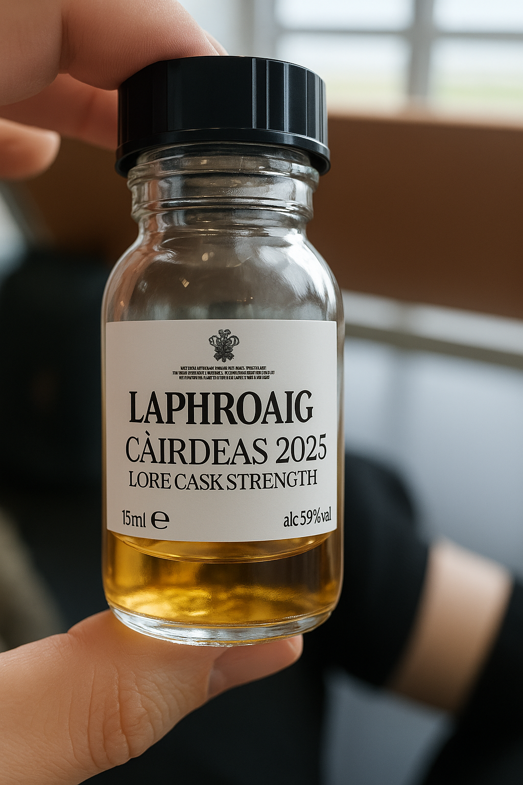
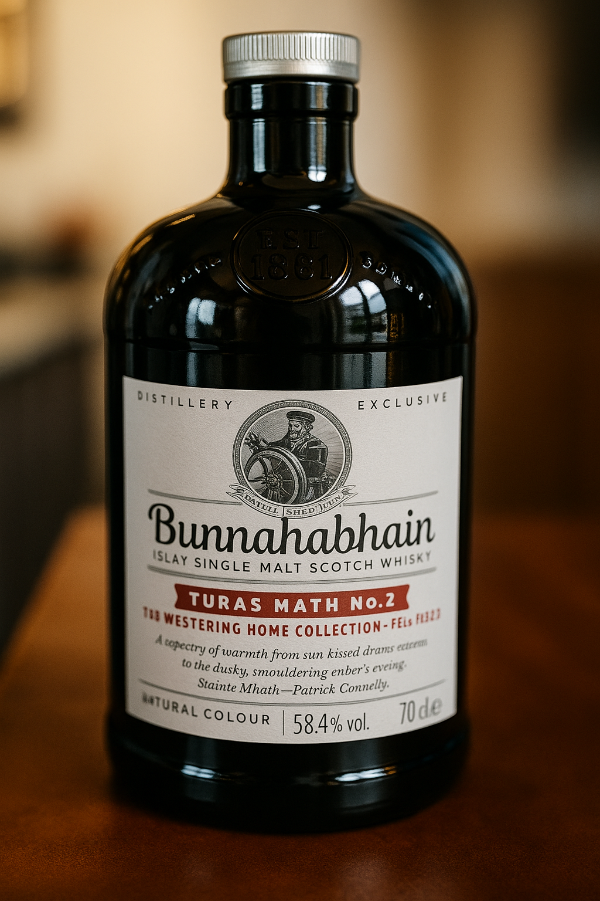

+++
title = 'A wee journey through Fèis Ìle 2025 — Part 2: The distilleries'
date = 2025-06-02T20:45:03+08:00
draft = true
categories = ["wine","recommendation"]
featuredImage = "/images/whisky2.webp"
tags = ["wine", "basics"]
+++

In my [previous post](https://mlangstrof.github.io/en/wine/a-wee-whisky-journey-1/), I set the stage for a deeper dive into Islay whisky by walking you through its production — highlighting the unique conditions, machinery, and techniques that give rise to this sublime spirit. Now that we've covered the ‘how,’ I’d love to take you on a short journey through Islay’s iconic distilleries — sharing personal impressions, curious facts, and perhaps helping you discover which house might best suit your palate

# Islay and its whisky

Chances are, the first thing to greet you on Islay — whether you arrive by sea or sky — will be brisk winds and perhaps a brief, involuntary shower. Set adrift from the Scottish mainland, the island is sculpted by unrelenting maritime gusts with little in the way of natural protection - while the inland features gentle hills and modest peaks, the coastal areas remain open, flat and exposed. The salty ocean air feels instantly refreshing and rejuvenating and is one of the key elements that imprint a distinctive character onto Islay’s whiskies. 

As you head inland, a landscape of luscious green fields unfolds, that reminded me instantly of the *Emerald Isle*. Our cab driver pointed out that Ireland is not only close by, but that on a clear day, you can even glimpse its coastline with the naked eye. In fact Islay is almost equidistant from Scotland and Ireland and its vegetation certainly reflects that. The vivid green is interspersed with brown spots, which are indicative of the peat that the island is known for - and another crucial aspect that shapes the character of the local whisky. Peat is a unique type of soil formed from partially decomposed plant matter, layered over time into dense, dark slabs that resemble dried earth. Due to the compression that happens over time while layer upon layer gets added to the top, it is quite energy dense and somewhere between wood and coal. Curiously, peat has little to no aroma on its own - its famously smoky character only emerges when it’s set alight. 

Of course the rugged, rural landscape wouldn't be complete without some livestock and you'll often see sheep and cows grazing on the meadows. Rumor has it, even the island’s livestock are whisky enthusiasts - they’re especially fond of *draff*, the protein- and fiber-rich barley residue left behind in the mash tun after mashing. It is rich in protein and fiber, but low in sugar, yet still retains a slightly sweetish taste that the animals rather enjoy. The island is also home to farms that grow hay, silage and barley, the latter being used primarily in the local whisky production. Move your gaze towards the open waters and you might see some fishing boats, catching crabs, lobsters, scallops, oysters or fish from the island's coast, delicacies which you are sure to find on the menu of the restaurants in Port Ellen, Bowmore or Port Charlotte. 

Only around 3,000 people call Islay home year-round, scattered among its villages, farms, and cottages - even fewer are actually born there and are thus allowed to call themselves Ìleach (pronounced *ilach*). The natives are very welcoming, friendly and humble, and even though their whisky has found worldwide acclaim, they still seem very much down to earth. I was pleasantly surprised that even though especially the bigger distilleries have their fixed catalog of whiskies, tours and tasting experiences, not everything is about money and you will often get more than you paid for. If you visit high-profile wineries, it can sometimes feel like an expensive, rushed and highly choreographed experience, far removed from any joy about the actual product. Islay felt more authentic and the inhabitants genuinely proud and excited about their Island and their spirits and eager to share their enthusiasm.

# The Fèis Ìle festival

[Fèis Ìle](https://feisile.co.uk/) (pronounced roughly  *fesh eel-uh*) is an annual celebration of Islay and its renowned distilleries, taking place during the last week of May. The origins of the festival date back to 1986, making next year (2026) its 40th anniversary. Over the festival’s ten-day run, each day spotlights a different distillery. Expect bustling courtyards brimming with food and drink stalls, live music on central stages, and exclusive behind-the-scenes tours. Many distilleries also offer immersive tasting experiences — from curated flights of rare casks to access to normally off-limits areas, cocktail workshops, blend-your-own classes, or informal meet-and-greets with the head distiller or distillery manager. 

Each distillery brings its own flair to the occasion — some, like Bruichladdich, host raucous, high-energy parties, while others, such as Laphroaig, favor a more laid-back, family-friendly atmosphere, complete with historic charm and even activities like archery. Beyond the distilleries, the festival committee organizes a wide range of events — from whisky tasting contests and music-and-dance performances to showcases by independent bottlers. There’s even room for non-whisky related fun, like fishing competitions or community bowling nights.

Most distillery days are open to all, often with no ticket required. However, special tastings and committee-run events do book out fast,  so be sure to reserve your spot well in advance.

# The distilleries of Islay

Islay is currently home to ten active distilleries, scattered across its wild and windswept terrain. On the southern coast lie **Ardbeg**, **Lagavulin**, **Laphroaig**, and the recently reopened **Port Ellen**; **Bowmore**, **Bruichladdich**, and **Kilchoman** anchor the island’s west, while **Caol Ila**, **Ardnahoe**, and **Bunnahabhain** are tucked along the northwestern shore. Two new sites — **Portintruan** near Port Ellen and **Laggan Bay** near the airport — are already under construction and slated to open soon. The island’s oldest distillery is Bowmore, named after Islay’s capital city, where it was founded shortly after the town itself in 1779. 

Intriguingly, many distilleries predate their official founding dates, having operated as illicit stills during the days when whisky production was outlawed. That’s why some sites feature hidden rock caverns — once used to stash barrels of moonshine during the prohibition era. According to local lore, some resourceful maltmen even diverted smoke from the kilns and stillhouses into the chimneys of nearby cottages, thus cleverly concealing the telltale signs of their forbidden craft.

## Laphroaig

Laphroaig is the first stop on the aptly named "three distillery walk, that you reach by leaving port ellen and heading east. If you arrive by plane, like I did, and are lucky enough to have a window seat, you can also spot the LAPHROAIG name in big black letters on a pristine white building, just off the island's southern shore. Perhaps you will even spot what might easily be the distillery's biggest fan - a dog belonging to one of the local families, that is often found strolling leisurely around the nearby beach, always on the lookout for someone willing to throw his stick. 

The producers location is certainly one of the most impressive in Islay with a large inside yard contrasted by brilliant white buildings and a direct view of the coast. When entering the visitor center, you'll find a snall museum just behind the gift shop, showcasing the various stages of the distillery's tumultuous history. It was founded in 1815 by Donald and Alexander Johnston and passed down within the family finally reaching Ian Hunter, a nephew of Sandy Johnston, who bought the land the distillery and farm stood on and focused on increasing Laphroaig's international recognition to push exports. He even succeeded in getting his whisky classified as medicine in north america - no doubt partially due to Laphroaig's unique medicinal aromas - thus circumventing the alcohol ban during the prohibition era. Ian Hunter died childless in 1954 and  was unable to find anyone in his extended family who he felt equipped to continue his vision of the company.  He therefore decided to leave it to his former secretary turned manager, Bessie Williamson, making Laphroaig the first distillery in Islay owned and lead by a woman.

Branded as “the most richly flavoured of all Scotch whiskies”, Laphroaig is famed for intense peat smoke, medicinal iodine, seaweed brine, and a creamy, oily mouthfeel  .

It uses heavily peated barley and distinctive tall pot stills with narrow necks designed to maximize reflux, resulting in a full-bodied yet refined spirit  .

Laphroaig is also known for its friends of laphroaig, beatiful oceanside visible from plane Fun Fact: Laphroaig fans can legally own a square foot of land on Islay—plus a dram each year if they register as "Friends of Laphroaig." Fancy land ownership? Here's your dram incentive.

Fun fact: Laphroaig is the only distillery officially approved by royalty, in this case former HRH The Prince Of Wales, King Charles III, who upon visiting Laphroaig and tasting their whisky granted the appointment

| Name           | Age      | Maturation       | Peat level | Alcohol | Aromas                                                                      |
| -------------- | -------- | ---------------- | ---------- | ------- | ----------------------------------------------------------------------------|
| Oak Select | NAS | Blend:Oloroso, ex-Bourbon, P.X.; virgin oak finish | ~40-45 ppm    | 40%  | earthy with sweet honey, peat smoke, seaweed, Marzipan  |
| 10 Year Old | 10 years | Ex-bourbon | ~40 ppm    | 40%   | Iodine, seaweed, medicinal smoke, peat, long dry finish                                      |
| 10 Year Old Sherry Oak Finish| 10 years | Ex-bourbon, Oloroso finish | ~40 ppm    | 48%   | Rich dried fruits, chocolate, smoked bacon, deep smoke|
| Quarter Cask | NAS (5-11 years)      | Ex-Bourbon + quarter-size oak cask finish | ~40 ppm     | 48%   | Creamy vanilla, medicinal, toasted oak, malt, boosted peat presence     |
| The Cask Lore | NAS (7-21 years) | Blend: Ex-Bourbon, refill, Oloroso, quarter casks           | ~40-45 ppm    | 48%   | Deep layers of smoke, spice, cocoa, brine                    |
| 18 Year Old | 25 years | Ex-bourbon       | ~40-45 ppm   | ~48%   | Mature peat with vanilla, spice, tobacco, leather, oily texture |
| 30 Year Old | 30 years | American oak + European ex-sherry        | ~40-45 ppm   | 45.8%   | Tropical fruits, lime zest, sea salt, gentle smouldering campfire smoke|

Laphroaig ten, quarter cask ... 

special editions
Special mention should be given to the Elements series

## Lagavulin

Edged in between Laphroaig and Ardbeg and crossed by a small creek lies the Lagavulin distillery, one of Islay's most renowned distilleries and personal favorite of actor Nick Offerman (incidentally it was also Ron Swanson's whiskey of choice, the role he played on the sitcom "Parks and Recreation" and heavily featured in the series). He was hardly the first to cherish their whiskies - Lagavulin has a long history, having been founded in 1816 by John Johnston on the site of an earlier illicit distilling operation (dating all the way back to 1742). The name derives from the Gaelic "Lag a’ Mhuilinn" meaning "hollow of the mill" 

Stepping inside their shop feels like traveling back in time - white wood panneled walls are juxtaposed by sage green racks and chestnut brown bookshelves lending a maritime flair. Stepping further into the building you'll find rooms dominated by solid maroon wood giving off an antique vibe but well maintained and radiating the kind of warmth that usually reserved to ancient pubs, like the ones in Edinburgh's old town. Another highlight was the distillery's bar, which overlooks one of the tasting rooms and offers a wide selection of distillery exclusives as well as mainland whiskies (though why you would go all the way to the distillery to taste non-Lagavulin whiskies I cannot answer). The barkeeper was very knowledgeable and in addition to the many excellent fixed tasting packages, was also happy to create a bespoke one just for us. The production tour was interesting and well structured but not particularly special, the tasting we had featured mainly their core range plus one jazz edition, with the distillery exclusive standing out to us. 
Small core range

Operates with two wash stills (11,000 L) and two spirit stills (~12,500 L), producing about 1.4–2.4 million L/year 

Ownership transitioned to Diageo

the distillery
history, location, impression

Peat level: malted to 35 ppm—a mid-range peat intensity for Islay 

Known for slow distillation: first pass ~5 hours, second ~9 hours, with wide cuts and minimal copper contact—resulting in heavier, oily spirit 

Flavor is marked by deep peat smoke, iodine, seaweed, and Lapsang Souchong-style notes, layered with spice, dried fruit, and coastal salinity

| Name                | Age              | Maturation       | Peat level | Alcohol                                  | Aromas                                         |
| ------------------- | ---------------- | ---------------- | ---------- | ---------------------------------------- | ---------------------------------------------- |
| 8 Year Old         | 8 years | refill European oak + American oak casks|  35 ppm     | 48% |  smoke, citrus, vanilla, and medium-bodied peat presence|
| 16 Year Old        | 16 years | ex-Bourbon           |  35 ppm    | 43%                                   | Peat smoke, iodine, gentle sweetness, sea-salt, vanilla, spice    |
| Distiller's Edition | NAS              | refill European oak + American oak casks, PX sherry |  35 ppm     | 43%        | Peat smoke with dark fruit, chocolate, sweet spice |

For most people, the Lagavulin 16 is the first whiskey of the producer they come into contact with - it's certainly their most iconic and most widely available rendition. <add description>. Originally made as a special edition but since then having found great acclaim has the Lagavulin 5 also joined the distillery's "main cast". It is ... Finally there is the Lagavulin distillery exclusive, which shares many aspects with the 16 years old but ...

Fun Fact: Their iconic 16‑Year‑Old sticks around so long because they ferment for a staggering 55 hours—longer than a Lord of the Rings marathon.

special editions
Variety of single casks, special editions for the jazz festival and feis ile.

## Ardbeg

the distillery

style

core range

| Name         | Age              | Maturation       | Peat level | Alcohol                                  | Aromas                                         |
| ------------ | ---------------- | ---------------- | ---------- | ---------------------------------------- | ---------------------------------------------- |
| Ardbeg TEN   | 10 years | Ex-Bourbon  | 45 ppm          | 46%      | smoke, brine, caramel chocolate                                                 |
| Wee Beastie  | 5 years              | Ex-Bourbon & Oloroso           | ~40 ppm     | 47.4%                       | chocolate, tar, savoury meats, black pepper, smoke   |
| An Oa        | NAS              | Bourbon, P.X. & virgin charred oak | ~50 ppm     | 46.6%                                    | peat, dark chocolate, aniseed, butterscotch, black pepper |
| Uigeadail    | NAS              | Ex-Bourbon & Oloroso  | ~50 ppm     | 54.2%                                    | smoke, walnuts, peat, caramel, malt, black pepper |
| Corryvreckan | NAS              | Ex-Bourbon & French oak | ~55 ppm     | 57.1%                                    | dark chocolate, blackcurrants muscovado sugar, cherries pine needles, sea spray|

special editions
Committee‑collab releases: Eureka! (2023, fan-developed blend PX & bourbon casks) 
Ardbeg Spectacular (2024 Day Release), Vintage Y2K 23 Y (2024), The Abyss 34 Y x Tradd Moore (2024), Smokiverse (2025 Day Release)

Fun Fact: In 2018, Ardbeg sent tiny vials of whisky to the ISS to study the effects of aging in space—so somewhere out there, an astronaut is enjoying space-aged smoke!

## Ardnahoe

the distillery

Ardnahoe is the new kid on the block, having only been founded in 2017 and opening in 2019 and aiming at bridging tradition and modernity. It is situated in the north-east corner of Islay near Port Askaig, between Bunnahabhain and Caol Ila, the distillery seemingly perched upon a ledge, offering a magnificent view over the Sound of Islay and Paps of Jura. The facilities offer a stark contrast to those of the incumbent producers, eschewing the traditional white stone and pitched slate roofs for geometric, almost brutalistic cement buildings crowned by grey metal roofs. 

Hidden inside the buildings are a 2.5 ton mash tun, four Oregon pine washbacks, one wash still (~13 000 L) and one spirit still (~11 000 L), providing a combined capacity  for up to 600 000 L/year. 

Even though we might need to wait a bit longer for new releases, many locals were already highly impressed by the distillery so far and were projecting a great future, so stay in the lookout, especially while early editions may still be comparatively cheap!

Peat levels range from 5 ppm (lightly peated) up to 40 ppm, with a focus on mid-range peat offering coastal richness at approachable intensity  .

Features unique worm-tub condensers (the only ones on Islay) and long lyne arms (7.5 m), which promote reflux and create a fuller, meaty mouthfeel  .

Typical maturation split: ~80% ex-bourbon American oak and 20% ex-European Oloroso sherry casks  .

| Name         | Age              | Maturation       | Peat level | Alcohol                                  | Aromas                                         |
| ------------ | ---------------- | ---------------- | ---------- | ---------------------------------------- | ---------------------------------------------- |
| Ardnahoe Inaugural Release   | 5 years | **Ex-bourbon** and ex-Oloroso sherry | ~40 ppm          | 50%      | shortbread, baked apple, coastal peat, custard, ginger, lemon zest |                                                |
| Bholsa  | NAS              | Ex-bourbon and **ex-Oloroso sherry** | ~40 ppm    | 50%                                    | red fruits, walnuts, orange zest, raisins, dates, peat   |
| Infinite Loch    | NAS              | **Ex-bourbon** and ex-Oloroso sherry | ~40 ppm    | 50%                                    | sea-spray, peat dark chocolate, menthol, fresh fruits, bonfire |
| Ardnahoe Society 2024       | 5 years              | ex-Oloroso and PX quarter casks | 40 ppm     | 59.1%                                    | dark chocolate, raisins, honey, malt, peat smoke  |

Signature Style	Coastal smoke, mid-peat, rich mouthfeel from worm-tubs and long lyne arms 
Inaugural Release	5 Y, 50%, 40 ppm, bourbon + Oloroso, tasting: salty caramel, custard, smoke 
Stillhouse Setup	1 wash & 1 spirit still, worm-tub condenser, 600k L capacity 

---

🔎 Why It Stands Out

1. First new Islay distillery since 2005, offering a fresh yet traditional approach  .

2. Worm-tub condensers deliver a meaty, textured spirit rare on Islay  .

3. Iconic setting, perched above the Sound of Islay with sweeping maritime views  .

style

core range

special editions

## Kilchoman

the distillery
Founded by Anthony Wills in 2005, Kilchoman became the first new distillery on Islay in over 120 years, starting production in December 2005, with the inaugural release arriving in 2009
Located on Rockside Farm in northwest Islay—Kilchoman is unique as an Islay farm distillery, growing around 30% of its barley on-site, malting it in-house (using traditional floor maltings), and handling distillation, maturation, and bottling all on one farm 

Fun Fact: As a farm-to-bottle distillery, Kilchoman grows barley, malts it onsite, and distills it—all on Islay. One day a guide joked, “If you get lost, just follow the barley to the bottle.”

| Name         | Age              | Maturation       | Peat level | Alcohol                                  | Aromas                                         |
| ------------ | ---------------- | ---------------- | ---------- | ---------------------------------------- | ---------------------------------------------- |
| Machir Bay   | NAS | **Ex-bourbon** & ex-Oloroso sherry | ~20-25 ppm          | 46%      | coastal peat, citrus zest, vanilla, honeyed malt, dried fruit, black pepper |                                                |
| Batch Strength  | NAS              | Red wine casks, ex-bourbon & ex-Oloroso sherry| ~50 ppm    | 57%       | like Machir Bay but richer smoke, butterscotch oak, dark fruits, oily mouthfeel   |
| Sanaig   | NAS              | **Sherry** & Ex-Bourbon | ~50 ppm    | 46%                                    | rich, fruity, balanced smoke with fig, berry, spice, caramel, and chocolate notes |
| Loch Gorm   | 10 years              | Ex-Oloroso | 50 ppm     | 46%                                    | honey custard, sticky toffee, roasted coffee, smoky figs, clove spice  |
| 100% Islay Range   | 5 years              | **Ex-bourbon** & ex-Oloroso sherry | 20 ppm     | 50%                                    | floral citrus, prune and apple, baked spice, subtle smoke |
| Kilchoman 16 Year Old  | 16 years              | **Ex-bourbon** & ex-Oloroso sherry | 50 ppm     | 50%                                    | oak spice, deep peat, dried fruit, coastal salinity  |

A true farm distillery, controlling everything from barley seed to bottling 
Uses long fermentation and small stills for a signature clean yet fruity spirit; the high PPM barley is often softened by their process 
Maintains consistent signature peat levels (~50 ppm) in its peated range, but also offers lighter, farm-only expressions (~20 ppm) for diversity 
Peat Levels (PPM):

Kilchoman uses its own lightly peated malt (~20 ppm) for its 100% Islay range, and imported heavily peated malt (~50 ppm from Port Ellen Maltings) for its signature releases 

Fermentation: Long ferments of around 84–90 hours, which add fruity complexity and soften phenolic intensity 

Distillation: Uses compact bold stills with tall necks and reflux bulbs to create a cleaner spirit and moderate carryover of peat compounds 

Primarily 1st-fill bourbon casks (~90%), supplemented with ex-Oloroso sherry for richer notes; casks are usually discarded after two fills to maintain oak potency 

core range

special editions
different casks

## Bruichladdich

the distillery

Founded in 1881 by the Harvey brothers, Bruichladdich was designed as a state-of-the-art distillery built from purpose-built stone rather than converting farm buildings, with tall slender stills for a purer spirit 
It was mothballed multiple times (1907–18, 1929–35, 1941–45, 1994–2000) until reopened in 2001 by Mark Reynier and Jim McEwan, prioritizing terroir, local barley, and experimentation over marketing clichés 
Acquired by Rémy Cointreau in 2012, the distillery today emphasizes Scottish provenance, working with farmers and even naming specific fields on packaging 

Fun Fact: Bruichladdich once distilled a 90% ABV whisky dubbed “perilous usquebaugh‑baul”—the Top Gear crew even used some to fuel a car!

| Name         | Age              | Maturation       | Peat level | Alcohol                                  | Aromas                                         |
| ------------ | ---------------- | ---------------- | ---------- | ---------------------------------------- | ---------------------------------------------- |
| The Classic Laddie   | 10 years | **Ex-bourbon**  | ~3-5 ppm          | 50%      | honey, floral cereals, citrus zest, tropical fruit, gentle oak, clean finish |                                                |
| Islay Barley  | 8 years              | **Ex-bourbon**, wine and sherry casks | ~3-5 ppm      | 50%                                    | grain-forward, orchard fruits, light spice, purity over peat   |
| Eighteen Aged Years     | 18 years              | **Ex-bourbon**, Sauternes & Port | ~3-5 ppm      | 50%                                    | rich body with honey, butterscotch, orange, tropical fruits, mellow oak |
| Port Charlotte 10      | 10 years              | **Ex-bourbon** & french wine casks | 40 ppm     | 50%                                    | honey, hazelnut, salted caramel and dry peat smoke  |
| Port Charlotte Islay Barley     | 7 years              | **Ex-bourbon**, virgin oak and wine casks | 40 ppm     | 50%                                    | malt, honey,vanilla, toffee, citrus, fruits, tobacco, BBQ smoke  |
| Octomore 15.1 | 5 years              | Ex-bourbon & re-charred ex-bourbon | 108 ppm    | 59.1%               | Raw peat, charred oak, smooth vanilla, ripe acidity  |
| Octomore 15.3 | 5 years              | Ex-bourbon & Oloroso | 307 ppm     | 61.3%                                 | Extreme peat, fruit acidity, oak depth  |

style
Bruichladdich is known for its unpeated, elegant, floral spirit—unusual on Islay—as their malt typically measures just 3–5 ppm, making it very light on smoke 
Spirit is derived from tall-narrow stills, long fermentation times, and traditional Victorian mash tun (gravity fed) for a refined, clean profile with cereal sweetness and citrus notes 
The distillery emphasizes varietal and vintage barley, often offering expressions like Islay Barley, Organic, and Bere Barley, which showcase terroir and vintage differences 
Purist unpeated style with barley transparency and elegance.
Terroir‑focused ethos, naming farm, field, and vintage in core bottlings.
Innovative experimentation, through Octomore and Port Charlotte, pushing peat to its limits without losing finesse.
Strong sense of identity and design, rejecting whisky clichés and embracing honesty and clarity both in spirit and presentation 

## Bowmore

the distillery
Established in 1779 by John P. Simson, Bowmore is the oldest licensed distillery on Islay and one of the oldest in Scotland 
The distillery sits in the village of Bowmore on the south-eastern shore of Loch Indaal. It draws water from the Laggan River, which contributes slight peat tones (~2 ppm) to the new spirit 
Runs a traditional floor maltings, providing around 30% of its malt — peat kilned to ~25 ppm — with the remainder from external maltsters 
Annual production sits at ~1.7–2 million liters, using two wash stills and two spirit stills 

In Skyfall, Bowmore 1964 is the whisky served in James Bond’s ancestral home. That is no accident: Bowmore has a long-standing partnership with Aston Martin, offering limited releases like “Black Bowmore DB5 1964” (a £50,000 collector’s piece housed inside a functioning Aston Martin engine block).

style
Bowmore’s whisky is medium-peated, typically around 25–30 ppm phenols — less intense than its southern Islay neighbors yet smoky enough to be distinct 
Flavor is characterized by the interplay of coastal peat smoke, Oloroso sherry sweetness, saline maritime notes, and a viscous, oily mouthfeel 
Maturation heavily features first-fill American oak barrels (~86%) and ~14% first-fill Oloroso sherry casks, creating balanced “smoky & sweet” profiles 
The legendary No. 1 Vaults is a historic below-sea-level cellar used for aging premium stock; its high humidity and salt air impart restrained evaporation (~1%) and unique maritime maturity to the whisky 

Peat levels (~25–30 ppm) offer a balanced smoke—lighter than Laphroaig or Ardbeg, but more assertive than Bruichladdich.
The No. 1 Vaults environment (below sea level, high humidity, salt air) shapes Bowmore’s signature texture and marine character with less spirit loss 
Bowmore maintains traditional floor malting, rare among Islay distilleries today, supporting terroir-rich barley-derived character 
Sherry finishing innovation—like the “Darkest,” Vault Edition, Mizunara oak, or Aston Martin Arc‑52—enhances complexity while staying rooted in maritime peat style.

Bowmore sits at the smoky-sweet intersection: moderate peat, expressive sherry, salted sea breeze, warm oak, and refined elegance—perfect for those seeking maritime smoke but with balance.

core range
| Name         | Age              | Maturation       | Peat level | Alcohol                                  | Aromas                                         |
| ------------ | ---------------- | ---------------- | ---------- | ---------------------------------------- | ---------------------------------------------- |
| 12 year  | 12 years | **Ex-bourbon** & sherry | ~25-30 ppm          | 40%      | smoldering campfire, candied citrus, salty seaweed, honey |                                                |
| 15 year  | 15 years              | **Ex-bourbon** and ex-Oloroso sherry | ~10-15 ppm    | 43%                                    | red fruits, walnuts, orange zest, raisins, dates, peat   |
| 18 year    | 18 years            | **Ex-bourbon** and ex-Oloroso sherry | ~25 ppm    | 43%                                    | intensified dried fruit, spice, iodine smoke, lush texture  |
| 25 year | 25 years              | **Ex-bourbon** & sherry  | ~30 ppm    | 43%                                   | elegant fruit cake, spices, refined smoke, silky maturity |

special editions
McLaren

## Caol Ila

the distillery
Fun Fact: The peat they use comes from the Castlehill bog—rightly named, because it gives their whisky a briny, “seaside bandage” character you can practically taste.

style

core range
| Name         | Age              | Maturation       | Peat level | Alcohol                                  | Aromas                                         |
| ------------ | ---------------- | ---------------- | ---------- | ---------------------------------------- | ---------------------------------------------- |
| 12 Year Old  | 12 years | Ex-bourbon | ~35 ppm          | 43%      | sweet grassy peat, coastal salt, liquorice, light toffee |                                                |
| 18 Year Old  | 18 years | Ex-bourbon | ~35 ppm    | 43%                                    | softer peat, richer fruit, honey, oak spice, longer finish  |
| Distiller’s Edition    | > 12 years | Ex-bourbon and ex-Moscatel | ~35 ppm    | 43%                                    | sea-spray, peat dark chocolate, menthol, fresh fruits, bonfire |
| 25 Year Old      | 25 years              | ex-Oloroso and PX quarter casks | ~35 ppm     | 43%                                    | vanilla, sea-salt, oak leather, smooth smoke  |

special editions

## Bunnahabhain

The journey to Bunnahabhain, nestled in Islay’s remote northeastern corner, winds along narrow, hilly roads framed by breathtaking scenery — until the view suddenly opens up to reveal the dramatic expanse of Bunnahabhain Bay, with the distillery perched at its edge. This spectacular view alone almost makes a visit worthwile. One of the first things to catch the eye is the iconic *helmsman* logo — a tribute to the hardy sailors who once braved the stormy Sound of Islay to deliver vital supplies. This emblem adorns the distillery buildings and bottles alike, and even lends its name the *Stiùireadair* edition. The sea clearly plays a major role for the destillery, leaving visible marks upon the historic white buildings and imparting a briny freshness to the whisky itself.

Bunnahabhain is one of the few Islay distilleries known primarily for unpeated whisky, featuring often aromas of dried fruits, roasted nuts, and subtle salinity. In recent years, they’ve also introduced a smaller range of peated expressions — such as the **Toiteach A‑Dhà** (Gaelic for *Smoky Two*) which sits at around 35 to 45 ppm. Their unpeated spirit is celebrated for its creamy texture and robust body while avoiding the intense smoke typical of Islay malt and thus offering a welcome reprieve for those less particular to the smoky and medicinal flavors the island's whiskies are known for. A typical taste profile includes hints of nuts, dried fruits, maritime salinity with a distinctive mouthfeel often described as rich and oily. Distillation occurs in the tallest stills on Islay, encouraging a lighter, more refined spirit as heavier compounds are left behind. Bunnahabhain favors sherry-seasoned casks for maturation, contributing to its signature fruity, nutty style. Some editions are also aged in coastal warehouses, where the sea air slowly adds a salty, maritime nuance.

Bunnahabhain core range consists of the following whiskies:

| Name           | Age      | Maturation       | Peat level | Alcohol | Aromas                                                                 |
| -------------- | -------- | ---------------- | ---------- | ------- | ---------------------------------------------------------------------- |
| 12 Year Whisky | 12 years | Bourbon & sherry | 2-4 ppm    | 46.3%   | sweet fruit, vanilla, nuts, subtle brine                               |
| Stiuireadair   | NAS      | Sherry           | 2-4 ppm    | 46.3%   | dried fruit, salted caramel, rich mouthfeel                            |
| Toiteach A‑Dhà | NAS      | Bourbon & sherry | 36 ppm     | 46.3%   | oaky, peppered peat, smoke, sweet sherry notes                         |
| 18 Year Whisky | 18 years | Sherry finish    | 2-4 ppm    | 46.3%   | dried fruit, spice, honey, salinity, thick & nutty                     |
| 25 Year Whisky | 25 years | Sherry           | 2-4 ppm    | 46.3%   | Roasted nuts, sweet berries, caramel, luxurious mouthfeel              |
| 30 Year Whisky | 30 years | Ex-sherry        | 2-4 ppm    | 46.3%   | Creamy berries, caramel, mature and elegant                            |
| 40 Year Whisky | 40 years | Sherry           | 2-4 ppm    | 41.9%   | Ultra-matured: tropic fruits, creamy sweetness, vanilla & toasted nuts |

Special editions and distillery exclusives are often significantly more experimental regarding the selection of casks, featuring different finishes like Roja, Amarone, Rum, PX and Amontillado, to give additional complexity to the whisky. 

For Fèis Ìle 2025 Bunnahabhain released not just a single bottle but instead a three bottle lineup, consistent of three editions: **Turas Math** (Gaelic for good journey) No.1, No.2 and No.3, together part of the **Westering Home Collection**, a series exploring the themes of return, journey and longing for Islay. Here too the main difference lies in the selection of casks and the aging duration: No. 1 is matured in Manzanilla and with Amarone cask finish, No. 2 was aged in ex-bourbon and finished in Palo Cortado sherry barrels and No. 3 finished in a rare Armagnac cask.

# Port Ellen

Port Ellen was something of a unicorn on our trip. Our self-imposed quest was simple: taste at least one dram from every Islay distillery. But Port Ellen proved a tough nut to crack. When we asked the bartender at the excellent Lochside Hotel in Bowmore whether he had anything from the long-defunct distillery, he gestured wearily toward an unassuming bottle locked behind glass. The price? £15,000. We smiled politely and graciously passed.

Originally founded as a malt mill in 1825, Port Ellen distilled whisky until 1930, when it shut down during the Great Depression. Its first revival lasted from 1967 to 1983, during which it expanded to four stills and added a large drum maltings, making it one of the island's primary barley suppliers. Since then it lay dormant, until Diageo decided to rebuild the site, officially reopening it in March 2024 as a carbon‑neutral, state‑of‑the‑art facility.

The reimagined distillery now houses two sets of copper stills: “Phoenix,” which follows the original design, and “Experimental,” a more adventurous arrangement aimed at innovation. In fact, the plans for the former were reverse-engineered from 40-year-old blueprints and decommissioned equipment to ensure the reborn whisky stays faithful to its smoky legacy. A newly engineered Ten‑Part Spirit Safe complements the system. Housed in a striking modernist structure with a large glass façade, the stills are even visible from outside.

When we passed by during Fèis Ìle week, the unmistakable scent of malt and peat hung in the air—a clear sign that Port Ellen had resumed production. If you’re hoping for a dram from the new make, though, you’ll need patience: Since the whisky needs to mature, the first official release isn’t expected to hit the market before 2032.

During its tenure the distillery was known as a pioneer and innovator: It was reportedly among the first to export single malts to North America (with some sources claiming as early as 1848) and one of the first adopters of the spirit safe. After its second closure, the whiskies reached somewhat of a cult status, finding widespread acclaim (and fetching staggering prices) thanks to their distinctive and complex peaty, leathery and citrus-rich profile. Diageo began annual official releases in 2001 using remaining casks (1978–79).

Independent bottlers added to the legend, releasing coveted editions like the 1979 37‑year‑old, the ethereal “Eidolon” 40‑year, and a 1983 32‑year—each greeted with rave reviews.

# A whisky for every palate
So now that we talked about the various houses and their signature style, where does that leave us? Which bottle should you choose next? Below you can find a short summary and directions:

<create an infographic based on the following input:
Peat
Smoke
Medicinal
Sweetness
Spice & Heat
Malt Character
Fruitiness
Body / Intensity
