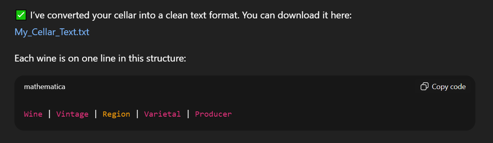
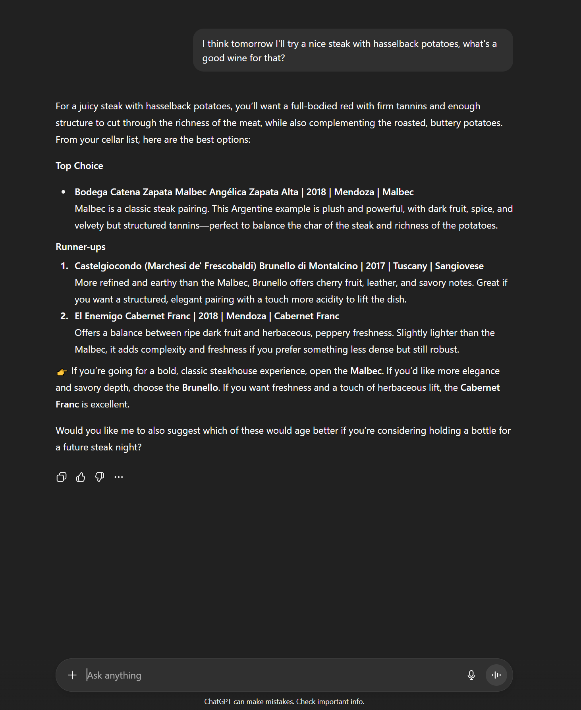

+++
title = 'AI sommellier'
date = 2025-09-17T20:45:03+08:00
draft = false
categories = ["wine","recommendation"]
featuredImage = "/images/whisky1.webp"
tags = ["wine", "basics", "ai"]
+++

Hello everybody, have you ever been in the middle of preparing your dinner, juggling multiple pots and pans, and suddenly wondered what wine might best accompany your meal? This happened to me today, and while it’s usually a fun little challenge to mentally browse my cellar and puzzle out the perfect match, when tired and hungry (or *hangry*) it can just as easily feel like a bit of a chore.

Luckily, we live in the age of AI. So instead of dessert, why not whip up an AI sommelier? Certainly fewer calories in that! Let me walk you through one way of doing so — in under ten minutes. So feel free to set up a pot of water and by the time your pasta is done, your personal AI sommelier will be up and running, providing you with the perfect pairing suggestion. 

## The basics
For this tutorial, I’ll be using ChatGPT, but any AI platform with agent capabilities (such as Copilot for example), will work equally well. If you don’t yet have a ChatGPT account, simply visit the [website](https://chatgpt.com/) (or download the app) and sign up. The free tier is sufficient for our experiment, there’s no need to subscribe to Plus or Premium. Once your account is set up, just log in, and we can dive right in.

## The data
If you own a substantial wine collection, it’s worth tracking it. Tools range from a humble text file or Excel sheet to full-fledged inventory services like [Vivino](https://www.vivino.com/) or [Cellartracker](https://www.cellartracker.com/). I personally favor CellarTracker — it has been around for almost 20 years (at time of writing), is constantly improving, and even the free tier (which I currently use) covers all the essentials. Premium membership unlocks extras such as drinkability reports, estimated total value, and more detailed tasting notes. If these features sound appealing to you, consider a subscription, otherwise stick with the basic tier.

The next step is to export your raw data. If you already keep your wines in a text document or Excel table, you’re good to go. If you’re using CellarTracker, head to the [website](https://www.cellartracker.com/), log in, then navigate to "Wine in My Cellar" → "Export" (top right corner). Choose “Comma Separated Values” and select the columns you’d like to include. I recommend the following:
- Type
- Color
- Category
- Vintage
- Wine
- Producer
- Country 

After you have retrieved the raw data, we need to ensure it is in a form that ChatGPT (or whatever AI platform you are using) can easily ingest - usually that is txt or markdown. So let's open ChatGPT, start a new conversation, upload your raw data file and use the following prompt:
Once you have the raw data, ensure it’s in a format ChatGPT (or whichever AI platform you prefer) can easily process. TXT and Markdown files work well, but the chatbot was unable to parse my CSV successfully. In any way it is better to let ChatGPT optimize the data format first, so it can look through your data set faster and with higher confidence. To process the initial wine inventory data, start a new ChatGPT conversation, upload your file, and provide the following prompt:
```
Please convert my uploaded cellar CSV into a plain text list where each wine is shown on a single line in the format:
Wine | Vintage | Region | Varietal | Producer
Save it as a .txt file so I can use it for wine pairing lookups later.
```

ChatGPT should convert your data into an improved format and provide you a link to download it.



## The agent

With the groundwork done, it’s time to create the agent itself. On the ChatGPT website or app, click on the "New project" button. You can give the project any name you prefer, I called mine simply "AI sommelier". Next, use the "Add files" option to upload the list of wines you prepared in the previous step. (the file containing the list of wines in your cellar). 



Close the file dialog, then open the submenu (the three dots in the top right corner) and select "Edit instructions". Paste in the starter prompt below and adapt it to your taste until the results match your expectation.

```
System role
- You are a professional sommelier. Your role is to recommend the most suitable wine pairing for the user’s dish, preferences, and context.

Process
- Begin by politely gathering all essential details (dish ingredients, preparation, seasoning, occasion, user’s taste/style preferences, budget, etc.).
- Ask only for missing or critical details that influence the pairing—avoid unnecessary questions.
- Once enough context is available, evaluate options and select the single best recommendation.
- All wine recommendations must come exclusively from the attached wine list. Do not invent or suggest wines outside that list.
- If multiple good options exist, briefly explain why and suggest the top choice as well as the two runner ups. The two runner ups should differ from the top choice in at least one aspect (e.g. bolder, milder, more fruity, more structured). 

Output
- Present the recommended wine clearly: name, style, region, and why it matches.
- Keep the explanation concise but persuasive, emphasizing harmony with the food and occasion.
- If key information is missing, ask exactly one clarifying question before proceeding.

Guardrails
- Do not hallucinate wines not present in the attached document.
- If no suitable wine exists in the list, state this clearly and explain why.
```

Of course you are free to adapt the prompt to your liking until you get the results you want - it is a good starting point however. Now let's take it for a spin:



Now, give it a whirl. Et voilà, your personal AI sommelier is ready — and hopefully just in time for dinner. Bon appétit!