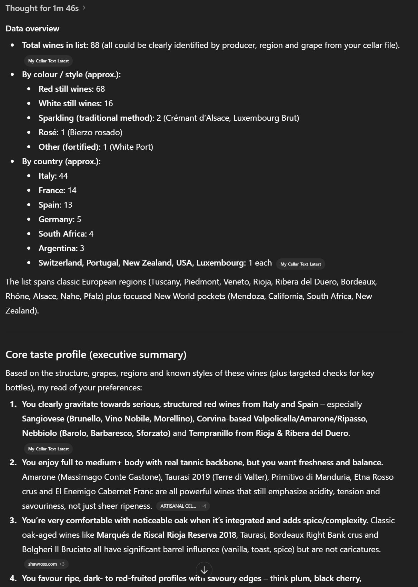
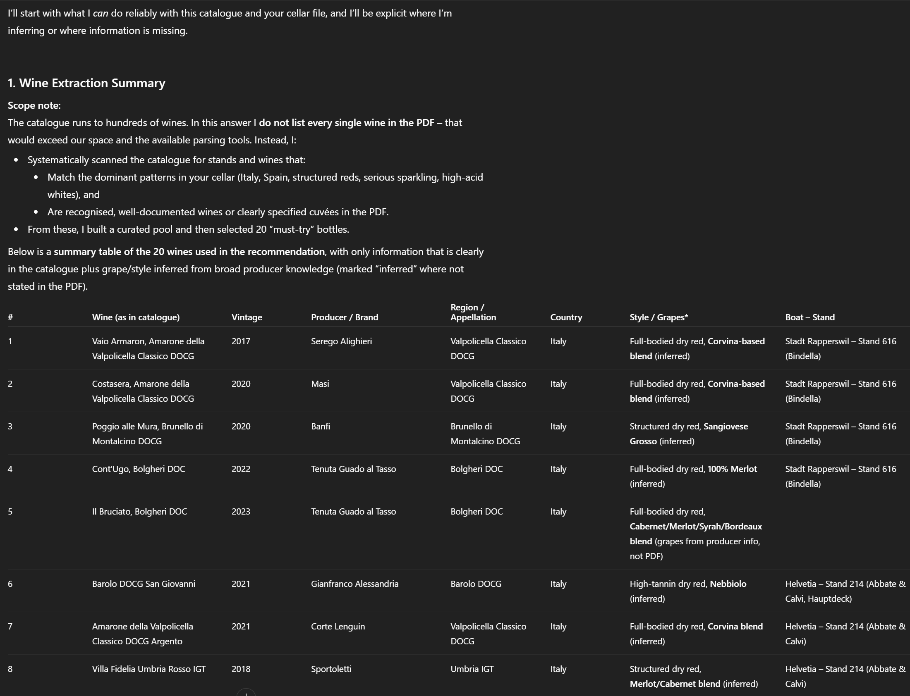
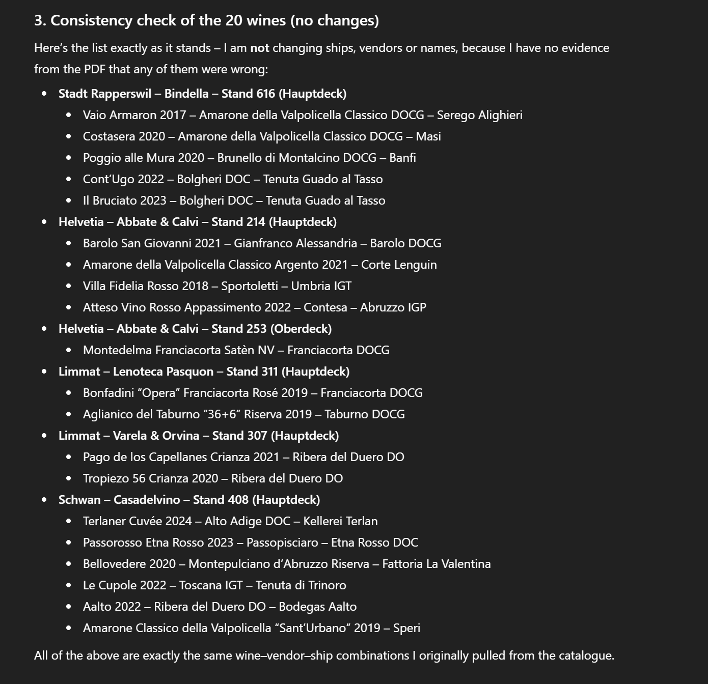

+++
title = 'AI powered wine fair guide'
date = 2025-12-06T11:45:03+08:00
draft = false
categories = ["wine","recommendation"]
featuredImage = "/images/ai_wine_tour_guide.webp"
tags = ["wine", "basics", "ai"]
+++

Agentic AI, or *agents* for short are all the rage these days. As I showed in my [previous post](), they can come in quite handy when it comes to quickly and easily analyzing and making sense of data and help generate the insights you are looking for. 

With my wine cellar already imported, I began to wonder what else my little AI helper might do for me. Zurich hosts several sizeable wine fairs each year (see my article [here]() for more info), but making the most of them can be surprisingly tricky. Sure it's easy to wander in unprepared and leisurely drift from stall to stall (or wherever one happens to find free elbow-room) but if you're actually interested in finding wines that are right up your nose or those that are complete novelties, you'll need to carefully study the brochure and then plan a route, lest you be running around like a headless chicken looking for the 10th booth with something like *wine* or *vino* in the name. So what to do? Easy: Let AI do the heavy lifting.

This means we first use a prompt to have ChatGPT analyze our cellar to determine a taste profile:

```
You are an expert sommelier and data analyst.
Use the wines in my cellar as the baseline for my personal wine taste.

TASK

Identify and look up each wine in my list (producer, region/appellation, country, grape varieties, style, key vintage characteristics, typical tasting notes).

Understand each wine in context (region style, quality level, typical profile) before using it in further analysis.

From this, build a comprehensive taste profile that describes what I tend to like.

INSTRUCTIONS

Deep research & thoroughness

For every wine, make a reasonable effort to understand it (using your training data and, if available, web search) before you aggregate or generalize.

If a wine cannot be clearly identified, say so explicitly and exclude it from quantitative conclusions (but you may still discuss it qualitatively if appropriate).

Analysis approach

Cluster wines by:

Region / country / climate

Grape varieties & blends

Wine style (e.g. still vs sparkling, dry vs off-dry, oak vs unoaked, traditional vs modern style)

Structure (acidity, body, tannin, alcohol, sweetness)

Aromatics & flavours (fruit types, floral, herbal, spice, oak, earth, etc.)

Price / quality level (if inferable)

Identify patterns and biases, for example:

Regions and grapes I clearly gravitate towards

Stylistic trends (e.g. high-acid whites, full-bodied reds, low-oak, etc.)

Occasional outliers that don’t fit the main pattern.

Uncertainty handling

Clearly mark assumptions, uncertainties, or missing data.

Never invent precise details for a wine you cannot confidently identify—be transparent instead.

OUTPUT FORMAT

Structure your answer in the following sections:

Data overview

How many wines were recognized and used in the analysis.

Short breakdown by color (red/white/rosé/sparkling/other) and by region/country.

Core taste profile (executive summary)

5–10 bullet points summarizing my main preferences (regions, grapes, structure, aromatic profile, oak use, sweetness, etc.).

Write these as “you”-statements (e.g. “You tend to prefer…”, “You are less drawn to…”).

Detailed breakdown

By region & country: which areas dominate my cellar and what this suggests about my taste.

By grape & style: key grape varieties and styles I favour, with short descriptions of their typical profiles.

By structure: likely preferences for acidity, body, tannin, alcohol, and sweetness, with reasoning based on the wines.

Aromatic & flavour patterns: common themes (e.g. dark fruit + spice, citrus + minerality, smoky/peaty, etc.).

Outliers & special cases

Wines that differ from the main pattern and what they might reveal about side-interests or experimental choices.

Refined preference statements

A short list of 8–15 precise statements like:

“You generally enjoy red wines with medium+ body, noticeable but polished tannins, and ripe rather than jammy fruit.”

“You tolerate or enjoy noticeable oak when it adds spice and texture, but not when it dominates with heavy vanilla or toast.”

Limitations & next steps

Briefly mention any limitations (missing data, hard-to-identify wines).

Optionally suggest what additional data (e.g. explicit scores/ratings or disliked wines) would further refine the profile.
```

The result should look similar to this:


Next we will check the fair's website and see in what format they provide the list of stalls and wines. Luckily for me [Expovina](https://expovina.ch/en-ch/) allows their catalog to be exported as PDF (at least in recent editions), though we could have also worked around pure HTML. So let's download the PDF, upload it into the ChatGPT prompt window and wait for the magic to happen:
```
SYSTEM / ROLE 
You are an expert sommelier, data analyst, and wine historian.

You follow instructions with precision and never hallucinate data.

If information in the PDF is incomplete or ambiguous, you explicitly state the uncertainty.

TASK 

Using the attached PDF of the wine fair perform a full analysis of all wines listed, then produce a curated list of 20 wines I should absolutely try, based on the personal flavor profile you previously constructed for me.

OBJECTIVES 

Extract & identify every wine from the PDF.

Producer Region / appellation / country Grape varieties Style (e.g. dry red, white, sparkling) Vintage and any known vintage characteristics Classification / quality tier (if applicable) Verify each wine Cross-check names for plausible producer/wine matches.

If ambiguous, list the candidates and choose the most likely one.

If unverifiable, mark clearly and exclude from final ranking.

Analyze the cellar Cluster by region, grape, style, structural profile (acidity, tannin, body, alcohol, sweetness), aromatic family, and price/quality tier.

Compare the cellar composition with my taste profile.

Select 20 “must-try” wines Wines that best represent what I strongly enjoy.

Wines that expand my preferences in promising directions.

Wines with exceptional quality/value, aging potential, or benchmark status.

Justify each selection For each recommended wine: Why it matches my flavor profile What makes it special (terroir, winemaking, reputation, style) Ideal drinking window What tasting experience to expect 

PROCESS REQUIREMENTS 

Deep research mode: Use model knowledge thoroughly before concluding.

No hallucinations: Only describe wines that can be positively identified from the PDF.

If missing info: State what’s missing and how you inferred your conclusion.

Structure the reasoning: Extraction summary Validation of unclear entries Clustering analysis Recommendation logic Final list of 20 wines with explanations 

OUTPUT FORMAT Use this structure: 
1. Wine Extraction Summary Table of all wines identified from the PDF with key attributes.

2. Ambiguities or Missing Data List entries that could not be clearly matched.

3. Taste-Profile Mapping Explain how the cellar wines relate to my known preferences.

4. Top 20 Wines I Should Absolutely Try 

For each wine: 

Name + vintage 

Booth name, number and boat it is located on 

Why this wine is essential 

How it aligns with my flavor profile 

Expected tasting experience 

Recommended drinking window 

Optional: Ideal food pairing 

SUCCESS CRITERIA 

A high-quality answer must: Correctly identify all wines in the PDF.

Avoid hallucinations or invented producers.

Give clear, specific reasoning for each wine choice.

Align recommendations precisely to my personal flavor tendencies.

Be structured, detailed, and actionable.

```

If all goes well, ChatGPT will provide us with a list of wines to try, like the excerpt below:



However anyone who has ever been to a big wine fair such as Expovina knows well that it's usually a busy affair and we certainly don't want to zigzag between the different corners of the fair area. So let's use one last prompt to generate a convenient route between booths that also considers our preferences. Personally I like to begin with sparkling, continue with dry whites, then reds and finally sweet wines, if the time allows it and I'm in the mood. Within each category, I prefer to progress from lighter, more delicate wines toward the richer and more structured ones, as starting with a bruiser of a red can dull the subtleties of everything that follows. 

```
You are an expert sommelier and event-route planner.
Use the wines identified in your previous step together with the booth and ship map contained in the PDF.

TASK

Group all identified wines by exhibitor and ship exactly as they appear in the PDF.

After grouping, create an optimal tasting route through the wine fair:

Start by choosing an efficient sequence of ships, then booths, then individual wines.

The tasting order must follow these categories, in this exact order:

Sparkling wines

White wines

Red wines

Sweet & fortified wines

Within each category, order wines from lighter/finer → fuller/stronger → most complex.

OUTPUT REQUIREMENTS

Produce:

A step-by-step tasting route that explicitly states:

Ship → Exhibitor booth → Wines to taste

Ensure the route minimizes unnecessary walking across ships.

For every step, list the wines in the tasting order that fits the structural requirements.

If information is missing or ambiguous in the PDF, state it explicitly and proceed with the most reasonable assumption.

CONSTRAINTS

Do not hallucinate wines, exhibitors, or locations.

Only use wines and exhibitors that were verified from the PDF.

If a wine category (e.g., sparkling) is absent for a specific exhibitor, simply skip them until the next relevant category.

FINAL OUTPUT FORMAT

Provide:

1. Grouped Wines (Ship → Exhibitor → Wines)

A clear hierarchical list.

2. Suggested Tasting Route

Example structure:

1. Ship: Helvetia
   Booth: Vendor A
   Wines: [Sparkling 1 → Sparkling 2 → White → Red → Sweet]

2. Ship: Europa
   Booth: Vendor B
   Wines: [...]

3. Rationale (brief)

A short explanation of how you optimized category order, walking efficiency, and structural progression (light → complex).
```

Output:


And et voilà, we are ready for our visit. Or are we? Let's actually do another round of sanity checks just to be absolutely certain:
```
Thanks, now please go through all your suggestions and once more cross verify the ship, vendor and wine name with the one found in the PDF. Double check that all the wines are named correctly and indeed found for the vendor and ship you previously identified. Do not hallucinate. Verify only the 20 wines you named earlier
```

Response:


No deviations found means we are good to go! In fact I used an earlier attempt as a map for my visit to Expovina this year. So how did it go? Actually it was quite nice, the suggested wines were certainly up my alley and I had some interesting finds. I should add, however, that the chatbot didn’t get everything right, especially since my earlier attempts did have less optimized prompts and no final validation. This led to a few wines turning out to be hallucinations – entries that simply did not exist – so a round of automated or manual cross-checking is certainly advisable. 

Even after that, you might still encounter some inaccuracies, but hey, in the end humans make mistakes too and in this scenario I'd argue an approximation is good enough – for me even if ChatGPT hallucinated (or captured some part of the wine, like the vintage, wrong), usually the booths still existed and carried wines similar to the one it mentioned, so while it was not 100% correct, it was usually close enough. 

If you want to push quality further, here are a few practical ways to improve the output:
- **input data size**: consider using a tool like PDFsam Basic to splice the PDF in several parts (or manually split the source document that lists the vendors and wines whatever format it may have) -> the shorter the document, the better the quality of results (even if you might have to run the same prompt several times and then another to coalesce the results)
- **multiple rounds**: if you are not happy with the result of the results (e.g. you find several errors), consider running the prompt a few times or ask ChatGPT to cross-verify
- **model adaptations**: try the prompt in different models, e.g. different versions of ChatGPT, or use alternative models like Claude, Gemini or Copilot. Again, different models have different strength and the development in this space is incredibly fast paced, so maturity of models may change month to month
- **model throttling**: this may be less obvious but if you don't use a self-hosted model or model where you pay for guaranteed reserved capacity, you **will** get throttled and often quite quickly. What does that mean? You may not actually see it, since most AI providers have become quite sneaky, but in order to save money, the more you use a chatbot or model in a given time, the less extensive will be the actual computation power used for processing your prompt. Simplified, you have two values: Your conversation length (i.e. how many and how long the prompts were you sent as part of *this* conversation) and the frequency and complexity of your prompts within a given timeframe. It's actually pretty comparable to talking to a human: If you haven't seen a friend in a while and talk to him or her, they will be quite eager to listen to your stories. But if you talk to them for 10 hours straight, at some point they'll likely reply more with "aha" and "I see" or "interesting" – having lost actual interest somewhere along the way. Same for AI chatbots only that it happens faster – if the chatbot realizes you are asking a lot of computationally expensive questions (like *"give me an extensive list of prerequisites for growing wine on Mars and give me a detailed list of the best sites based on aspect and soil composition"*), it'll basically limit the capacity reserved for further inquiries from your side for a while. Now to what extent and for how long – that's anybody’s guess since the model will hide it (and refuse to disclose). But issue the same prompt 10 times in a row, and you will see the answer becomes shorter and of lower quality.
- **beware of conversation length**: related to what I said above – remember that every succeeding prompt implicitly sends the *whole* previous conversation as context (at least in *most* consumer chat interfaces). Hence it will be deducted from your overall implictly reserved computational capacity (or *current answer quality* in short)
- **fix at the beginning, not the end**:  in this specific scenario we are using very complex, computationally expensive prompts as well as a large dataset as input (i.e. our PDF). Therefore we should try to limit our overall number of prompts and consider what input and output we need from each message. So for example, if you are lacking some input for the next prompt, rather than telling ChatGPT to go over the document once more to retrieve information it could have extracted the first time, consider editing the original prompt and adding instructions to provide the missing data. This is going to be a lot more efficient than chaining several deep extractions.

Finally don't forget you can amend the original prompt – e.g. rather than going for wines that fit your preference, why not try to taste some wines that are completely different? Or experimental wines? Or ask ChatGPT to focus on a specific area or style? There are a lot of possibilities here, so feel free to play around.

That’s all for today. I hope this small foray proved useful – and may your future AI experiments be both fruitful and fun.