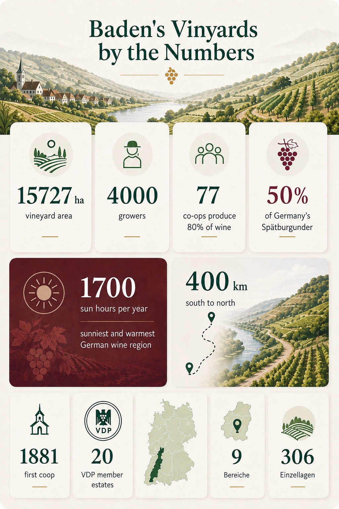
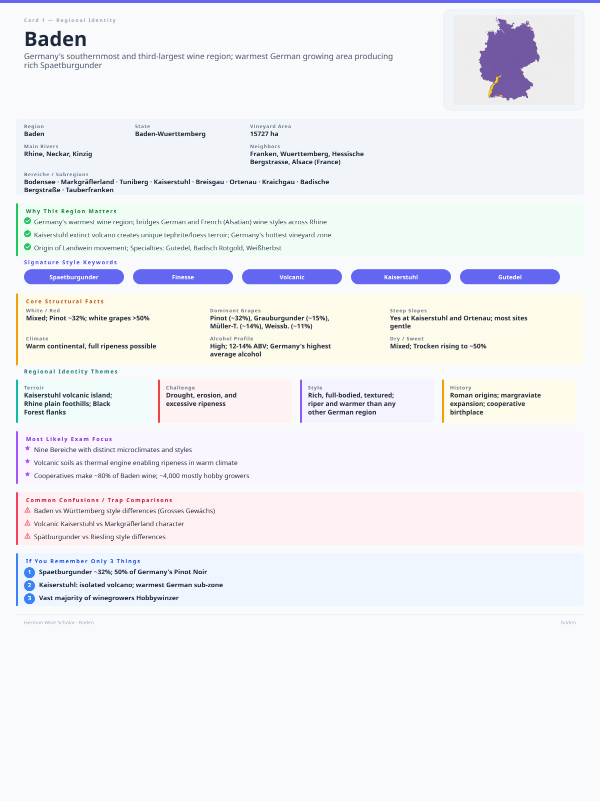

+++
title = 'GWS #2: Baden'
date = 2026-08-01T18:45:03+08:00
draft = false
categories = ["wine",]
featuredImage = "/images/baden.webp"
tags = ["wine", "certification"]

+++

Just as Franken is the heartland of German Silvaner, much the same could be said of Baden's relationship with Spätburgunder (Pinot Noir). After all, it was one of the first German regions to adopt the grape and remains the country's largest producer by volume, contributing about half of Germany's total Spätburgunder production.

Baden is one of Germany's largest wine regions, with almost 15,000 ha under vine, and stretches approximately 400 km from north to south. It reaches from Tauberfranken in the north to Lake Constance and the Swiss border in the south, while much of its central and southern section runs parallel to Alsace across the Rhine. It is a region of contrasts, featuring numerous distinct soil types, microclimates and wine styles – from the light, bright *lake-style* wines of the Bodensee (Lake Constance) to the opulent, structured Pinots of the volcanic amphitheater of the Kaiserstuhl.

It is one of Germany's warmest and sunniest wine regions, yet its individual areas are shaped by a remarkably varied geography: the sheltered Upper Rhine Rift, flanked by the Vosges and the Black Forest; the volcanic massif of the Kaiserstuhl; warm air entering through the Burgundian Gate, also known as the Belfort Gap; and the influence of Lake Constance and the Föhn winds in the far south.

So let's dive right into this fascinating region, known for the viticultural legacy of the Margraves, its tumultuous history and its enduring spirit of innovation.

# Baden in numbers

# A short history
* **1st century**: Earliest records of viticulture around the Bodensee
* **6th century**: First evidence of winemaking in the Baden area
* **12th century**:  Markgrafen (Margraves) rule Baden and play a key role in developing vineyards
* **16th century**:  The German Peasants' War (1524–1525) and wider political unrest disrupt viticulture across the region
* **17th century**:  The Thirty Years' War (1618–1648) causes further destruction and depopulation
* **18th century**: Recovery of vineyards under Margrave Karl Friedrich, who ordered only south-facing slopes to be planted and also introduced Gutedel to Markgräflerland and Riesling in Klingelberg (Durbach)
* **19th century**: The first wine cooperative is established in Hagnau in 1881; wine consumption remains primarily local
* **20th century**: Elbling and Gutedel are prioritized; *Flurbereinigung* in the 1960s and 1970s leads to fragmentation and decreases wine quality; thermovinification leads to simple, fruit-driven reds
* **21st century**: Producers such as Hanspeter Ziereisen drive a movement to label quality wines as *Landwein* and successfully change perceptions of them, positioning them as "artisanal" wines (similar to *Super Tuscans* in Italy)
* **Today**: The region combines a powerful cooperative tradition with a growing number of terroir-driven, quality-minded producers

# Signature grapes and style
Almost 50 different grape varieties are grown in Baden, and while one might be inclined to assume that red grapes dominate, given the region's fame for producing some of Germany's best Spätburgunders, white grapes actually account for the majority of the plantings.

The leading white variety is **Grauburgunder**, which makes up around 15% of the overall area under vine. It is well suited to Baden's warm, comparatively dry climate and is usually produced in a spicy, firm and full-bodied style, although richer, botrytized sweet wine variants can also be found. Some producers use oak to introduce additional texture and complexity.

**Müller-Thurgau** is almost as prevalent as Grauburgunder, accounting for around 14% of the vineyard area. This is partly due to its vigor and reliable yields, but also because it produces some of its best German expressions here, especially around the Bodensee. The cooler climate and higher elevations of the Alpine foothills can produce bright, fruit-forward wines with gentle acidity and delicate floral or muscat-like aromas.

At around 11%, **Weißburgunder** takes third place among Baden's white grapes. It performs well across the region's loess, volcanic and limestone soils and can produce anything from fresh, precise wines to dense, full-bodied examples aged in oak.

**Gutedel**, accounting for around 7% of plantings, is one of Baden's oldest and most distinctive varieties, particularly in the Markgräflerland *Bereich*. It is uncommon elsewhere in Germany but plays a more prominent role in Switzerland and parts of France, where it is known as Chasselas, or as Fendant in the Swiss canton of Valais. It can produce both easy-drinking wines and more structured, age-worthy examples. The resulting wines are commonly low in alcohol, gently acidic and relatively neutral in aroma, though careful élevage can reveal notes of nuts, white flowers and minerals.

Even though **Riesling** takes up only a comparatively small area (6% to be precise), Baden produces some outstanding examples, primarily around Ortenau, Kaiserstuhl and Kraichgau. Depending on the soil, elevation and orientation, the wines can range from ripe and opulent to taut, mineral and austere. In the Ortenau, Riesling is also traditionally known as *Klingelberger*.

Baden was among the first areas in Germany to introduce **Chardonnay** in 1956 and the first region to permit Chardonnay Grosses Gewächs (GG) wines. Since then it has become increasingly important in Baden, where the warmer climate allows it to achieve reliable ripeness without sacrificing structure.

**Silvaner** once enjoyed a much larger footprint in Baden but has since undergone a steady decline. It is now limited to scattered pockets, especially in the Kaiserstuhl, where it can produce restrained, earthy wines with gentle fruit and moderate acidity.

Among the red varieties, **Spätburgunder** unambiguously takes the crown, accounting for around 32% of the total vineyard area. Baden is Germany's largest and one of its most historic regions for Spätburgunder, which thrives in the warm climate, abundant sunshine and diverse soils of volcanic rock, limestone, loess, granite and glacial deposits. Styles range from pale, delicate and red-fruited wines to deeply colored, structured examples matured in oak. The best are often compared to Burgundy because of their finesse, complexity and capacity to express *terroir*.

**Lemberger** (also known as Blaufränkisch) plays only a minor role but is authorized for Grosses Gewächs in Kraichgau and Badische Bergstraße. It is a late-ripening, dark-skinned variety that produces refreshing, structured wines with aromas of cherry, blackberry and pepper. 

Finally, **Tauberschwarz** is a local variety of Tauberfranken, which was introduced to Baden in the 16th century and is therefore one of its oldest. The hardy, early-ripening, thin-skinned grape produces pale, light-bodied wines with red-fruit, herbal and spicy notes, although it is susceptible to botrytis and can be challenging to grow.

This regional identity is reflected in the grape varieties currently permitted by the VDP for Baden's VDP.GROSSE LAGE wines:

- Riesling
- Weißburgunder
- Grauburgunder
- Chardonnay
- Spätburgunder
- Lemberger

Like many German areas, Baden is made up primarily of small holdings (or *Hobbywinzer*), and cooperatives dominate the wine landscape, with **Badischer Winzerkeller** being among the largest. Apart from wine, the area is also among the top three regions producing *Sekt* (sparkling wine) in Germany, particularly from Pinot varieties.

The region produces several distinctive wine styles, including **Badisch Rotgold**, a type of *Rotling* made by combining Grauburgunder and Spätburgunder grapes or must before fermentation. Grauburgunder must account for at least 51% of the blend, while Spätburgunder may contribute no more than 49%. The resulting wines are usually pale pink to light red and tend to be fruity, soft and approachable.

We can also find examples of **Weißherbst**, a rosé made from a single red grape variety and at least 95% pale-pressed must. In Baden, it is most commonly produced from Spätburgunder and generally takes the form of a light-bodied, fruit-forward wine, ranging from dry to off-dry.

Rather than being defined by a single regional style, Baden's wines reflect its extraordinary geographic breadth. The warmer central and southern areas tend to produce riper, fuller-bodied wines, particularly from the Pinot family, while the Bodensee and some of the northern districts can deliver lighter, fresher and more restrained expressions. Premium white and red wines may be matured in oak, although stainless steel, large traditional casks and extended lees aging also play important roles.

This diversity is ultimately Baden's defining feature: it can produce delicate lake wines, powerful volcanic Pinots, mineral Rieslings, subtle Gutedels and increasingly ambitious Chardonnays, all within the boundaries of a single region.

And with that, our short excursion into Germany's southernmost wine region comes to an end. I hope you found it informative, and I'll see you in the next post.

# Recall flashcard
<<<<<<< HEAD

=======

>>>>>>> 50172e025146cb911f1b7349d7106a05872ebc93

