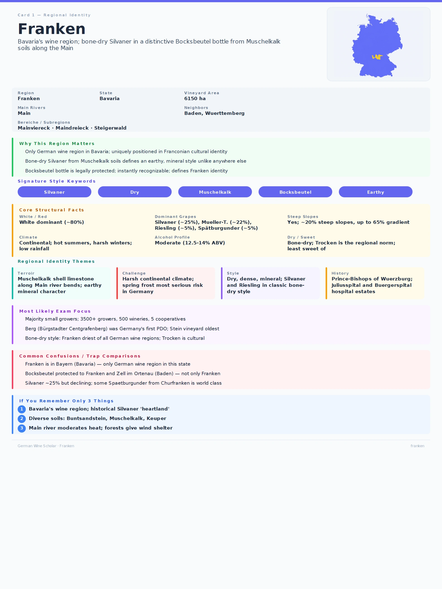

+++
title = 'GWS #1: Franken'
date = 2026-07-26T18:45:03+08:00
draft = false
categories = ["wine",]
featuredImage = "/images/franken.webp"
tags = ["wine", "certification"]

+++

Since I'm currently working through the German Wine Scholar program, I'd like to start a new series offering an overview of each region alongside selected notes and summaries from my studies.

Today I'd like to talk about Franken (Franconia). Franken is located in northwestern Bavaria and is centered primarily on the Main valley. To the southwest, it borders the wine regions of Baden and Württemberg. Although politically part of Bavaria, Franken has a strong cultural and regional identity of its own, reflected in its dialects, traditions and, naturally, its wines.

# Franken in numbers

# A short history
* **8th century**: Earliest records of Franken's viticulture with Würzburg's **Stein** vinyard being among the first mentioned. 
* **8th–16th centuries**: Winemaking was primarily driven by the Church and monasteries, with the period from the 12th to the 16th century representing a golden age during which the area under vine reached its historical peak.
* **17th century**:  Large-scale devastation caused by the Thirty Years’ War (1618–1648) led to roughly 75% of vineyards being abandoned; Silvaner was introduced shortly thereafter, in 1659, and quickly won favor due to its vigor and shorter growing cycle.
* **18th century**: Franken experienced a renewed period of prosperity, particularly around Würzburg.
* **19th century**:  Secularization during the Napoleonic era, together with inheritance practices such as **Realteilung**, contributed to the fragmentation of vineyards. Phylloxera, mildew, economic crises and increasing industrialization once again decimated Franken's vineyard landscape.
* **20th century**: Arrival of Müller-Thurgau (1913), widespread adoption due to ease of cultivation, adaptability and high yields. The region reached a historical low point in the 1950s but began to recover during the 1960s and 1970s due to **Flurbereinigung**, the adoption of newer technologies and changing consumer tastes.
* **Today**: A growing focus on quality and terroir expression, with natural and low-intervention wines gaining visibility.

# Signature grapes and style
It is no secret that Franken is commonly known as the heartland of Silvaner, so it will come as no surprise that the vast majority of its vineyard area is planted with white varieties (~80%). 

**Silvaner** leads with around 25%, accounting for a larger share of the region’s vineyard area than anywhere else in Germany. It is hardy (especially against the spring frosts Franken is prone to), medium-late ripening and thrives particularly on the water-retentive Muschelkalk and Keuper soils for which the Steigerwald and Maindreieck are known. High-quality examples can also be notably age-worthy.

**Müller-Thurgau** ranks second, accounting for 22% of total plantings. Its reliability, adaptability and high yields make it well suited to producing easy-drinking wines with mild acidity, often characterized by floral notes.

Other notable white varieties include **Bacchus** (12%), **Riesling** (5.5%), **Chardonnay** and **Rieslaner**, a cross between Riesling and Silvaner that is predominantly used for sweet wines.

Among the red varieties, we have **Domina** (4.8%), a robust, disease resistant cross between Portugieser and Spätburgunder and **Spätburgunder** (Pinot Noir), at 4.5%. The latter thrives particularly on the Buntsandstein soils commonly found in the Mainviereck and produces world-class expressions in Churfranken thanks to the combination of steep terraces and warm microclimates.

This is reflected in the grape varieties the VDP permits for Franken’s VDP.GROSSES GEWÄCHS (GG) wines:
- Riesling
- Silvaner
- Weißburgunder
- Spätburgunder

Characteristic of Franken is the historic preference for dry wines. There is even a special term that is used to denote bone-dry wines: *fränkisch trocken* (indicating <4g/L residual sugar). For white wines, the focus traditionally lies on preserving aromatic purity and complexity through careful harvest timing and cool fermentations. Spätburgunder wines show moderate tannins and balanced fruit, with both oak and stainless steel seeing frequent use.

Another feature that sets Franken apart is the famous **Bocksbeutel** bottle shape, which is often used to highlight a particular traditional wine style and can be seen in the article header. Within Germany, the protected bottle shape is reserved for Franken and certain parts of Baden. Qualifying Franken wines must also meet specific yield and sensory-quality requirements.

I hope this short exploration proved interesting and perhaps made you curious to learn more. Stay tuned for additional German Wine Scholar-related articles highlighting more distinctive regional styles and hidden gems.

# Recall flashcard

