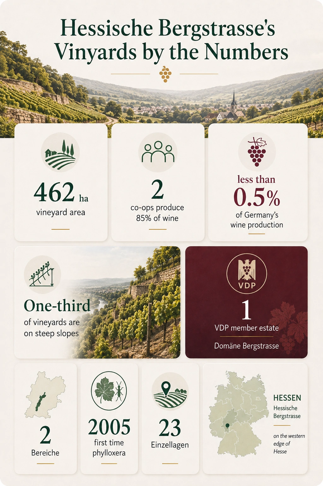
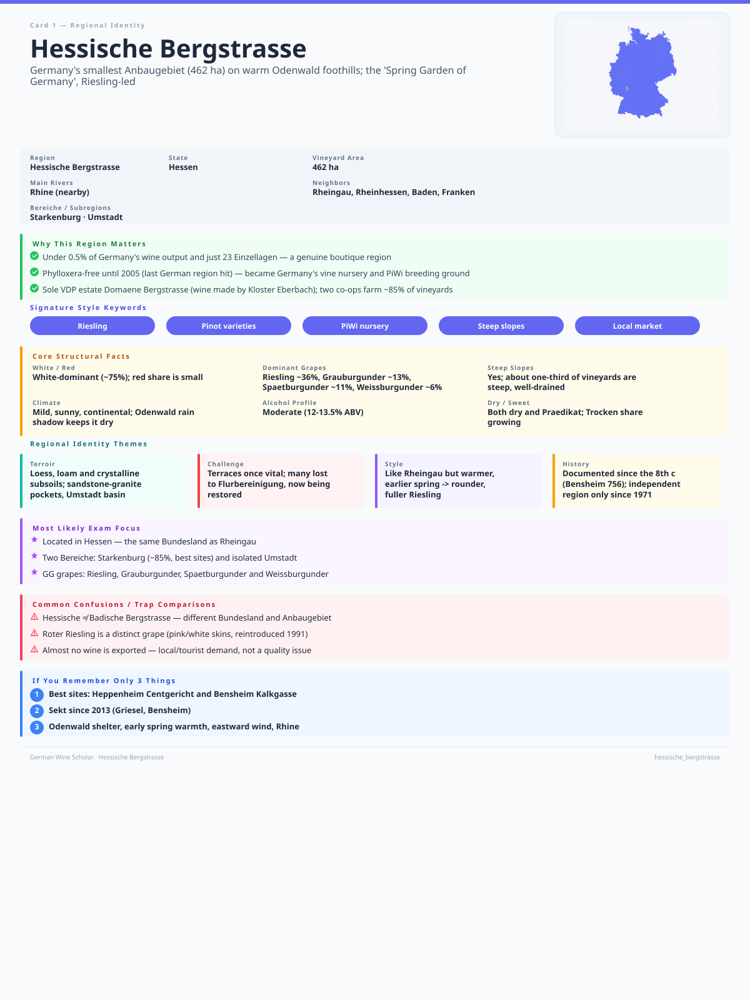

+++
title = 'GWS #3: Hessische Bergstrasse'
date = 2026-08-03T18:45:03+08:00
draft = false
categories = ["wine",]
featuredImage = "/images/hessische_bergstrasse.webp"
tags = ["wine", "certification"]

+++

The **Hessische Bergstrasse** is one of Germany's smallest wine regions, contesting the title with the **Mittelrhein** region and producing less than 0.5% of German wine. It is a continuation of the **Badische Bergstrasse**, extending northward through the foothills of the Odenwald Mountains along the eastern edge of the Rhine Plain, although keeping some distance from the Rhine itself.

The Bergstrasse originated as a Roman trade route, the *strata montana*, or "mountain road". Today, its wine industry is primarily characterized by state-owned and municipally owned estates, small producers, and two cooperatives, which account for about 80% of its production. Of its two *Bereiche*, **Starkenburg** and **Umstadt**, the former accounts for the vast majority of the regions output. Most wine is consumed locally, and exports are rare.

Even though the climate is largely continental at roughly 49° N, moist air moving eastward and warm air from the Rhine Plain exert a moderating influence. Together with the rain shadow provided by the Odenwald, they lead to warm springs and extended autumns, creating ideal conditions for fully ripening the Riesling that dominates the region.

# Hessische Bergstrasse in numbers

# A short history
* **8th century**: Earliest documented evidence of vineyards: Bensheim (756), Heppenheim (773), Umstadt (985)
* **14th-19th centuries**: Viticulture expands under rules of archbishops from Pfalz and Mainz
* **17th century**: Thirty Year War (1618-1648) causes a decline of viticulture due to resultant high taxes, poor harvests, and growing popularity of beer
* **19th century**: Division of the Bergstrasse into a northern section (Heppenheim to Darmstadt) and a southern section (Laudenbach to Heidelberg) in 1803
* **21st century**: Phylloxera is first detected in the Hessische Bergstrasse in 2005, with no major losses because most vines had already been grafted onto resistant rootstocks
* **Today**: Major center for vine propagation and a proving ground for PIWIs and revived heritage grape varieties

# Signature grapes and style

**Riesling** is the flagship variety of Hessische Bergstrasse and accounts for about 35% of the region's vineyard area. The wines are generally produced in a dry (trocken) style, combining ripe stone fruit, citrus and floral aromas with lively acidity. Thanks to the region's relatively warm climate, Rieslings tend to be slightly rounder and more approachable than those from cooler regions such as the Mosel, while still retaining freshness and a distinct mineral character, particularly on granite- and gneiss-derived soils.

**Grauburgunder** makes up around 13% of the area but is becoming increasingly important. Winemakers typically vinify it as a dry, medium- to full-bodied wine with moderate acidity, emphasizing ripe pear, yellow apple and subtle nutty notes. Careful yield management often produces wines with considerable concentration while maintaining balance and freshness.

**Weißburgunder** performs particularly well in the region's mild climate, including on its loess-loam soils. The wines are usually elegant and dry, with delicate aromas of apple, pear and white flowers, supported by a fine, restrained acidity. Many producers favor stainless steel fermentation to preserve freshness, although higher-quality examples may see partial maturation in large neutral oak casks or barriques to add texture without overwhelming the fruit.

Although it ranks only third, accounting for 11% of the total area under vine, Spätburgunder has become increasingly significant, **Spätburgunder** has become increasingly significant as the warm climate allows consistent ripening. The wines generally display bright cherry, raspberry and red currant fruit with moderate tannins and fresh acidity, often resembling a lighter, elegant Burgundian style rather than a powerful expression. Premium bottlings are frequently matured in French oak, producing greater complexity while preserving the grape's finesse.

The Hessische Bergstrasse is often used as a testing ground for the introduction of new varieties or the revival of old ones. A famous example is **Roter Riesling** (or Red Riesling), which was reintroduced in 1991 to preserve genetic diversity. This variety can have both pink and white-skinned berries, the former's extra pigmentation offering additional protection against sunburn. Compared to Riesling, it is also less susceptible to fungal diseases.

There is only one VDP estate in the region, Domäne Bergstrasse, which is permitted to produce the following VDP.GROSSES GEWÄCHS (GG) wines:
- Riesling
- Grauburgunder
- Spätburgunder
- Weißburgunder

That's it for this region. Though more could be said about it, given its small size, I prefer to keep this post brief and to the point.

# Recall flashcard

