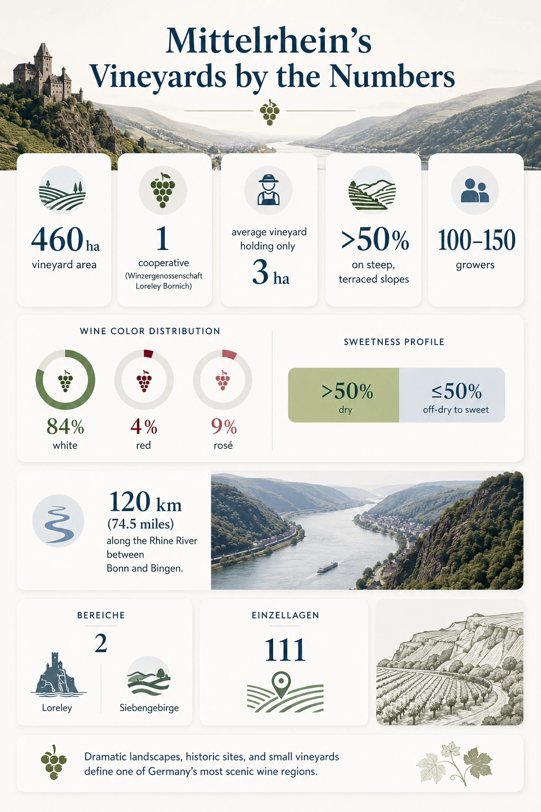

+++
title = 'GWS #4: Mittelrhein'
date = 2026-08-29T18:45:03+08:00
draft = false
categories = ["wine",]
featuredImage = "/images/mittelrhein.webp"
tags = ["wine", "certification"]

+++

Even as a connoisseur of German wines, you'd be hard-pressed to find a bottle from the **Mittelrhein** region given its extraordinarily small size; at just 439 ha under vine, it is currently Germany's smallest wine region. It's a pity, since the scenery is quite striking: the mighty Rhine tirelessly pushing downstream, embraced on its banks by steep, terraced vineyards, the route marked by castles and picturesque little villages. It is this sight that captured the imagination of many an artist in the age of Romanticism, echoes of which can be found in paintings, poems and stories alike.

However, that also gives us an indication of why the area under vine is a mere fifth of what it was at its peak around 1900: while the steep slopes can produce excellent wines and offer some advantages over plains, they are also labor-intensive and face their own challenges, such as erosion and the difficulty of irrigation. Historically, the region's importance rose due to the Rhine's position as a primary transportation route during the Middle Ages, but waned with industrialization, vine pests such as phylloxera and changing markets.

Nonetheless, the region has some interesting wines to offer. Once known for its famous *Feuerwein*, it is now mainly committed to Riesling, which, along with Weißburgunder, Spätburgunder, and Müller-Thurgau, is well adapted to the slate soils and largely continental climate of the area. The Rhine moderates temperatures and reflects additional warmth into the vineyards, while the surrounding highlands, including the Hunsrück to the west and Taunus to the east, help shelter the narrow valley, allowing grapes to ripen even though the northern limits of the region can extend beyond 50°N latitude.

# Mittelrhein in numbers

# A short history
* **1st century**: Romans introduce viticulture, which is largely abandoned after the demise of Roman reign
* **7th century**: Bishop of Cologne has major impact on reintroducing vine cultivation in Mittelrhein
* **11th-14th centuries**: Supported by monasteries and other ecclesiastical landowners, viticulture expands significantly along the Rhine, with terraced vineyards becoming an important feature of the region
* **13th century**: Bacharach develops into a major wine-trading and transshipment hub; in 1254 it joins the Rhenish League of Cities, which promotes security and commerce along the Rhine
* **15th-19th century**: Bacharach is famous for its *Feuerwein*, produced by heating the must of partially fermented wine to accelerate fermentation and produce a richer, sweeter style. It is exported particularly to Britain and the Netherlands.
* **19th century**: Koblenz becomes an important hub for sparkling wine production, leading Germany in number of *Sektkellereien*; meanwhile, the Loreley legend and Rhine Romanticism draw artists and travelers to the region
* **20th century**: After initially flourishing and earning renown for high-quality wines, phylloxera and shifting consumer preferences led to decline; subsequently mass production replaces traditional winemaking leading to primarily bulk production after World War II
* **Today**: Small-scale production remains dominant; restructuring beginning in the 1960s improved the viability of many steep vineyards, although the region's overall vineyard area continued to decline

# Signature grapes and style

**Riesling** dominates in Mittelrhein, accounting for about 63% of all grapes grown here. Its local style is reminiscent of Rheingau, Nahe and Mosel Rieslings, combining aspects of all three: Wines are usually medium-bodied, exhibiting aromas of citrus and stone fruit, accompanied by mineral and floral notes. While both dry and sweet styles are produced, sweet Rieslings are a particular strength of the region, ranging from *feinherb* wines all the way to *Trockenbeerenauslese*.

 **Spätburgunder** takes second place and makes up around 11% of the overall area under vine. The long season leads to juicy, supple Pinots that are medium-bodied and retain a high acidity thanks to elevated plantings.

**Weißburgunder** wines are known for their cocktail of peach and blossom aromas, moderate acidity and creamy texture.

As of the time of writing, the VDP database lists four estates for the region, which are permitted to produce the following VDP.GROSSES GEWÄCHS (GG) wines:
- Riesling
- Spätburgunder

If you are ever in the region, I can wholeheartedly recommend a visit, especially to the majestic Loreley. But even if you aren't, the region's wines manage to capture at least some of its magic and beauty, so give them a try!

# Recall flashcard

